<!--* caratula -->

<div align="center">

# ✨ Informe Trabajo Final ✨


## Universidad Peruana de Ciencias Aplicadas 🎓

<br><br>

Ingeniería de software - Periodo académico: 2025-02

**Sección:** 1798

**Docente:** Jorge Luis Mayta Guillermo

**StartUp:**  CulturizaTech

**Producto:** Teatrope

<br><br>

<div align="left">

~~~C#
string[] Integrantes() {
    return new string[] {
        "🧑‍💻 Alva Abanto, Luis Andres - u202310877",
        "👩‍💻 Sosa Soto, Oskar Rodrigo - u202212214",
        "👩‍💻 Varela Bustinza, Marcelo Alessandro - u202319668",
        "👩‍💻 Yalan Zhang, Angie Christina - u202312504",
        "👩‍💻 Lopez Acuña, Mario Joaquin - u202116250"
    };
}
~~~
<br><br>
<div align="center">
Agosto de 2025 🗓️
</div>

<div style="page-break-after: always;"></div>

## Registro de versiones del Informe

<table>
  <tr>
    <th>Version</th>
    <th>Fecha</th>
    <th>Autor</th>
    <th>Descripción de modificación </th>
  </tr>
  <tr>
    <td>TB1</td>
    <td>17/09/2025</td>
    <td>
      <ul> 
        <li>Alva Abanto, Luis Andres</li> 
        <li>Sosa Soto, Oskar Rodrigo</li> 
        <li>Varela Bustinza, Marcelo Alessandro </li>
        <li>Yalan Zhang, Angie Christina</li>
        <li>Lopez Acuña, Mario Joaquin</li>
      </ul>
    </td>
    <td> Se han incluído los siguientes capítulos:<br>
      <ul>
        <li>Capítulo I: Presentación</li>
        <li>Capítulo II: Requierements Development and Software Solution Design</li>
      </ul>
    </td>
  </tr>
  <tr>
    <td>TP1</td>
    <td>08/10/2025</td>
    <td>
      <ul> 
        <li>Alva Abanto, Luis Andres</li> 
        <li>Sosa Soto, Oskar Rodrigo</li> 
        <li>Varela Bustinza, Marcelo Alessandro </li>
        <li>Yalan Zhang, Angie Christina</li>
        <li>Lopez Acuña, Mario Joaquin</li>
      </ul>
    </td>
    <td> Se han incluído los siguientes capítulos:<br>
      <ul>
        <li>Capítulo III: Solution UI/UX Design</li>
        <li>Capítulo IV: Product Implementation & Validation (Sprint 1)</li>
      </ul>
    </td>
  </tr>
  <tr>
    <td>TB2</td>
    <td>12/11/2025</td>
    <td>
      <ul> 
        <li>Alva Abanto, Luis Andres</li> 
        <li>Sosa Soto, Oskar Rodrigo</li> 
        <li>Varela Bustinza, Marcelo Alessandro </li>
        <li>Yalan Zhang, Angie Christina</li>
        <li>Lopez Acuña, Mario Joaquin</li>
      </ul>
    </td>
    <td> Se han incluído los siguientes capítulos:<br>
      <ul>
        <li>Capítulo IV: Product Implementation & Validation (Sprint 2)</li>
        <li>Conclusiones</li>
        <li>Bibliografia</li>
      </ul>
    </td>
  </tr>
</table>

<div style="page-break-after: always;"></div>

## Project Report Collaboration Insights

En esta sección se documenta la colaboración del equipo en la elaboración del informe, mostrando evidencias gráficas de la actividad en GitHub y su coherencia con el registro de versiones.

URL del repositorio del Project Report en la organización de GitHub del equipo: 
- [https://github.com/teatrope/Project-Report](https://github.com/teatrope/Project-Report)

<br> 
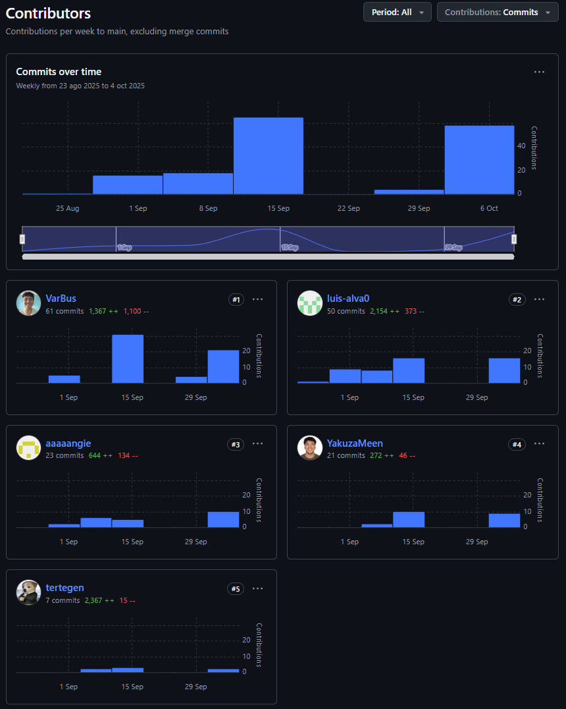

<div style="page-break-after: always;"></div>

## Contenido

<div align="center">
Tabla de contenidos
</div>

- Capítulo I: Presentación
    - 1.1 Startup profile
        - 1.1.1 Descripcion de la startup
        - 1.1.2 Perfiles de integrantes del equipo
    - 1.2 Solution Profile
        - 1.2.1 Antecedentes y problemática
        - 1.2.2 Lean UX Process 
            - 1.2.2.1 Lean UX Problem Statements
            - 1.2.2.2 Lean UX Assumptions
            - 1.2.2.3 Lean UX Hipothesis Statements
            - 1.2.2.4 Lean UX Canvas
    - 1.3 Segmentos Objetivo
- Capítulo II: Requirements Development and Software Solution Design
  - 2.1 Competidores
    - 2.1.1 Análisis competitivo
    - 2.1.2 Estrategias y tácticas frente a competidores
  - 2.2 Entrevistas
    - 2.2.1 Diseño de entrevistas
    - 2.2.2 Registro de entrevistas
    - 2.2.3 Análisis de entrevistas
  - 2.3 Needfinding
    - 2.3.1 User Personas
    - 2.3.2 User Task Matrix
    - 2.3.3 User Journey Mapping
    - 2.3.4 Empathy Mapping
    - 2.3.5 Ubiquitous Language
  - 2.4 Requirements specification
    - 2.4.1 User Stories
    - 2.4.2 Impact Mapping
    - 2.4.3 Product Backlog
  - 2.5 Strategic-Level Domain-Driven Design
    - 2.5.1 EventStorming
      - 2.5.1.1 Candidate Context Discovery 
      - 2.5.1.2 Domain Message Flows Modeling
      - 2.5.1.3 Bounded Context Canvases
    - 2.5.2 Context Mapping
    - 2.5.3 Software Architecture
      - 2.5.3.1 Software Architecture Context Level Diagrams
      - 2.5.3.2 Sofware Architecture Container Level Diagrams
      - 2.5.3.3 Software Architecture Deployment  Diagrams
  - 2.6 Tactical-Level Domain-Driven Design
    - 2.6.x Bounded Context: {Bounded Context Name}
      - 2.6.x.1 Domain Layer
      - 2.6.x.2 Interface Layer
      - 2.6.x.3 Application Layer
      - 2.6.x.4 Infrastructure Layer
      - 2.6.x.5 Bounded Context Software Architecture Component Level Diagrams
      - 2.6.x.6 Bounded Context Software Architecture Code Level Diagrams
        - 2.6.x.6.1 Bounded Context Domain Layer Class Diagrams
        - 2.6.x.6.2 Bounded Context Database Design Diagram
- Capítulo III: Solution UI/UX Design
  - 3.1 Product Design
    - 3.1.1 Style Guidelines
      - 3.1.1.1 General Style Guidenlines
    - 3.1.2 Information Architecture
      - 3.1.2.1 Organization Systems
      - 3.1.2.2 Labelling Systems
      - 3.1.2.3 SEO Tags and Meta Tags
      - 3.1.2.4 Searching Systems
      - 3.1.2.5 Navigation Systems
    - 3.1.3 Landing Page UI Design
      - 3.1.3.1 Landing Page Wireframe
      - 3.1.3.2 Landing Page Mock-up
    - 3.1.4 Mobile Applications UX/UI Design
      - 3.1.4.1 Mobile Applications Wireframes
      - 3.1.4.2 Mobile Applications Wireflow Diagrams
      - 3.1.4.3 Mobile Applications Mock-ups
      - 3.1.4.4 Mobile Applications User Flow Diagrams
      - 3.1.4.5 Mobile Applications Prototyping
- Capítulo IV: Product Implementation & Validation
  - 4.1 SoftWare Configuration Managment
    - 4.1.1 Software Development Environment Configuration
    - 4.1.2 Source Code Managment 
    - 4.1.3 Source Code Style Guide & Conventions
    - 4.1.4 Software Development Configuration
  - 4.2 Landing Page & Mobile Application Implementation
    - 4.2.1 Sprint n
      - 4.2.1.1 Sprint Planning n
      - 4.2.1.2 Sprint Backlog n
      - 4.2.1.3 Development Evidence for Sprint Review
      - 4.2.1.4 Testing Suite Evidence for Sprint Review
      - 4.2.1.5 Excecution Evidence for Sprint Review
      - 4.2.1.6 Services Documentation Evidence for Sprint Review
      - 4.2.1.7 Software Deployement Evidence for Sprint Review
      - 4.2.1.8 Team Collaboration Insights during Sprint
  - 4.3 Validation Interviews
    - 4.3.1 Diseño de Entrevistas
    - 4.3.2 Registro de Entrevistas
    - 4.3.3 Evaluaciones según heurísticas
- Conclusiones
  - Conclusiones y recomendaciones
  - Video App Validation
  - Video About the product
  - Video About the team
- Glosario
- Bibliografía
- Anexos

<div style="page-break-after: always;"></div>

## Student Outcome

ABET – EAC - Student Outcome 7 Criterio: La capacidad de adquirir y aplicar nuevos conocimientos según sea necesario, utilizando estrategias de aprendizaje apropiadas. 
<div>
<table>
  <thead>
    <tr>
      <th>Criterio específico</th>
      <th>Nombre</th>
      <th>Acciones realizadas</th>
      <th>Conclusiones</th>
    </tr>
  </thead>
  <tbody>
    <!-- Criterio 1 -->
    <tr>
      <td rowspan="5">Actualiza conceptos y conocimientos necesarios para su desarrollo profesional y en especial para su proyecto en soluciones de software.</td>
      <td>Luis Alva</td>
      <td>
        <strong>ℹ️ TB1:</strong><br>
        Para esta entrega tuve que investigar más acerca de Domain Driven Design aplicado a desarrollo móvil y clean architecture.  Este conocimiento fue clave para tomar decisiones más informadas sobre el diseño de arquitectura del proyecto.  
        <br>
        <strong>ℹ️ TP:</strong><br>
        Para esta entrega me centré en ampliar mis conocimientos sobre desarrollo backend, desarrollé la API aplicando arquitectura escalable y aprendí nuevos conceptos sobre el protocolo HTTP y la arquitectura REST. También me informé mejor acerca de Python y sus bibliotecas de desarrollo web, y apliqué conocimientos pasados de desarrollo frontend en la Landing Page. 
        <br>
        <strong>ℹ️ TB2:</strong><br>
        Para esta entrega amplié mis conocimeintos sobre el protocolo HTTP y sus mecanismos de seguridad basados en cabeceras como Cross-Origin Resource Sharing y tokens de autorización. Además, investigué acerca de las bibliotecas especializadas que se utilizan en el desarrollo móvil para consumir APIs y gestionar las peticiones. 
        <br>
        <strong>ℹ️ TF:</strong><br>
      </td>
      <td rowspan="5"> conclusiones</td>
    </tr>
    <tr>
      <td>Angie Yalán</td>
      <td>
        <strong>ℹ️ TB1: </strong><br>En el proyecto apliqué y actualicé conceptos de diseño centrado en el usuario mediante la elaboración de User Persona, User Task Matrix, Empathy Mapping y User Journey Mapping, lo que fortaleció mi capacidad para comprender necesidades reales y traducirlas en requisitos. Además, con el Tactical Level Domain Driven Design del bounded context de descubrimiento de eventos integré nuevas metodologías de modelado en ingeniería de software. Finalmente, en la edición de video de entrevistas reforcé habilidades técnicas y comunicativas aplicadas al proyecto.</strong><br>
        <br>
        <strong>ℹ️ TP:</strong><br>En esta entrega actualicé mis conocimientos en diseño UX/UI aplicando principios de usabilidad, accesibilidad y coherencia visual en el desarrollo de wireframes y mockups realizados en Figma. Este proceso me permitió fortalecer mis competencias en arquitectura de información y comprender la importancia de un Design System bien definido para garantizar una experiencia de usuario consistente.
        <br>
        <strong>ℹ️ TB2:</strong><br>
        <br>
        <strong>ℹ️ TF:</strong><br>
       <br>
      </td>
    </tr>
    <tr>
      <td>Oskar Sosa</td>
      <td>
        <strong>ℹ️ TB1:</strong>
      <br>
        Para esta TB1 me enfoqué en la fase inicial del proyecto, liderando el Strategic-Level Domain-Driven Design. A través de la aplicación de EventStorming, logré modelar el flujo de mensajes del dominio y realizar el descubrimiento de los contextos candidatos. Este proceso fue fundamental para definir la estructura del proyecto. Utilizando los Bounded Context Canvases, establecí los límites claros y las responsabilidades de cada componente, proporcionando una base sólida que guio las decisiones arquitectónicas del equipo.
        <br>
        <strong>ℹ️ TP:</strong>
          <br>
          Para esta entrega me enfoqué en diseñar la Arquitectura de Información de Teatrope y en aterrizarla con base de los mockups de la app. Definí modelos de organización jerárquico, secuencial, facetado y por relaciones para que el usuario llegue más rápido a Booking. Construí un Labelling System consistente navegación, filtros, CTAs y microcopy así priorizando claridad y accesibilidad. Además, redacté los SEO & Meta tags para Landing y Web App, entendiendo mejor su impacto en indexación y social previews. Diseñé los Searching Systems y formalicé los Navigation Systems. En el proceso reforcé criterios de usabilidad, consistencia semántica y arquitectura de contenido, y conecté decisiones de UI con métricas de descubrimiento y conversión.
        <br>
        <strong>ℹ️ TB2:</strong><br>
        <br>
        <strong>ℹ️ TF:</strong><br>
      </td>
    </tr>
    <tr>
      <td>Mario Lopez</td>
      <td>
        <strong>ℹ️ TB1:</strong><br> Participé activamente en la elaboración de los principales aportes para el desarrollo del proyecto, colaborando en la construcción del lenguaje ubicuo, la definición de historias de usuario y la creación del product backlog. Estas actividades facilitaron la identificación de las necesidades tanto de los consumidores de teatro como de los productores, permitiendo analizar los problemas actuales en la gestión de funciones y en la difusión de obras. Asimismo, contribuyeron a proponer soluciones digitales orientadas a mejorar la experiencia de los usuarios y optimizar la continuidad de los procesos, fortaleciendo mi aprendizaje en metodologías ágiles y en el diseño de soluciones de software centradas en el usuario.
</strong><br>
        <br>
        <strong>ℹ️ TP:</strong><br>
        Fortalecí mis conocimientos en planificación ágil y diseño de experiencia de usuario, participando activamente en la elaboración de los user flows, el prototipado web y móvil de la aplicación y la planificación del sprint. Estas actividades me permitieron comprender mejor la relación entre el diseño funcional y la ejecución técnica, aplicando buenas prácticas para estructurar procesos de desarrollo más organizados y centrados en las necesidades del usuario.
        <br>
        <strong>ℹ️ TB2:</strong><br>
        <br>
        <strong>ℹ️ TF:</strong><br>
      </td>
    </tr>
    <tr>
      <td>Marcelo Varela</td>
      <td>
        <strong>ℹ️ TB1: </strong><br>Actualicé conceptos de DDD y C4. En el proyecto definí el bounded context de Notifications & Recommendations (comandos/consultas, opt-in/opt-out, dedupe e integraciones). Además, realicé el análisis de competidores y el context mapping, reforzando la alineación negocio-arquitectura y la escalabilidad.</strong><br>
        <br>
        <strong>ℹ️ TP:</strong><br> Fortalecí mis conocimientos en planificación del Sprint 1 y backlog, aprendí a organizar las tareas técnicas y a usar buenas prácticas de deployment y testing, lo que mejoró la calidad y escalabilidad del proyecto.
        <br>
        <strong>ℹ️ TB2: </strong><br> Realicé y ejecuté el Sprint Planning 2, construí el Sprint Backlog 2 y avancé la app móvil en Flutter (pantallas clave, navegación, BLoC/estados y pruebas en emulador) junto con el progreso completo de la app en Kotlin/Jetpack Compose (flows de autenticación, navegación, theming y DI con Hilt). Dejé evidencia de desarrollo para el Sprint Review (historias cerradas con commits/PRs, APK debug y capturas) y evidencia de ejecución (burndown, avance vs. plan y registro de incidencias), mostrando aprendizaje aplicado y valor entregado.
        <br>
        <strong>ℹ️ TF:</strong><br>
      </td>
    </tr>
    <!-- Criterio 2 -->
    <tr>
      <td rowspan="6">Reconoce la necesidad del aprendizaje permanente para el desempeño profesional y el desarrollo de proyectos en soluciones de software.</td>
      <td>Luis Alva</td>
      <td>
        <strong>ℹ️ TB1:</strong><br>
        Para esta entrega me di cuenta que es fundamental el aprendizaje de nuevas arquitecturas, así como el profundizar en las que ya conocemos con el objetivo de tener un diseño eficiente y escalable. Esto nos ayudará a mejorar nuestras prácticas y crecer como profesionales. 
        <br>
        <strong>ℹ️ TP:</strong><br>
        Para esta entrega noté que me faltaba aprender sobre tecnologías DevOps y sobre métodos para desplegar y mantener aplicaciones. Comprendí que es importante el aprendizaje constante sobre esas cosas ya que es parte fundamental del desarrollo de software, y para el proyecto me centré en aprender a desplegar la Landing Page de manera estática y la API como un servicio web en conjunto con la base de datos. 
        <br>
        <strong>ℹ️ TB2:</strong><br>
        Esta entrega me ayudó a reconocer que actualmente existen muchas herramientas para el desarrollo de software y es importante estar al tanto de cada una de ellas, teniendo al menos un poco de conocimiento sobre sus casos de uso, requerimientos y diferencias sobre sus competidores. 
        <br>
        <strong>ℹ️ TF:</strong><br>
      </td>
      <td rowspan="6">Conclusiones</td>
    </tr>
    <tr>
      <td>Angie Yalán</td>
      <td>
        <strong>ℹ️ TB1:</strong><br>Las actividades realizadas me permitieron reconocer la importancia del aprendizaje continuo en ingeniería de software. La diseñada de entrevistas y herramientas como el Empathy Map y el User Journey Map evidenciaron la necesidad de actualizar métodos para captar la voz del usuario. Asimismo, el trabajo en Domain Driven Design reafirmó la importancia de explorar nuevas prácticas de arquitectura, consolidando la necesidad de mantener una actitud de aprendizaje permanente.</strong><br>
        <br>
        <strong>ℹ️ TP:</strong><br>En esta entrega reconocí la importancia del aprendizaje continuo en el desarrollo de soluciones de software, explorando nuevas herramientas y metodologías de diseño digital. A través de esta entrega, reforcé mi capacidad de adaptación a las tendencias actuales y consolidé una visión de mejora permanente para ofrecer productos tecnológicos más eficientes y centrados en el usuario.
        <br>
        <strong>ℹ️ TB2:</strong><br>
        <br>
        <strong>ℹ️ TF:</strong><br>
      </td>
    </tr>
    <tr>
      <td>Oskar Sosa</td>
      <td>
        <strong>ℹ️ TB1:</strong><br> Esta entrega me confirmó que la arquitectura de software es el cimiento de cualquier proyecto exitoso. A través de la aplicación del Domain-Driven Design, me di cuenta de que un diseño bien pensado y una comprensión profunda del dominio son cruciales para el rendimiento y la mantenibilidad a largo plazo. Este conocimiento es clave para mejorar mis prácticas y evolucionar como ingeniero, garantizando que mi trabajo no solo sea funcional, sino también robusto y escalable. </strong><br>
        <br>
        <strong>ℹ️ TP:</strong>
    <br>
    Esta entrega me confirmó que la Arquitectura de Información es clave para un producto usable y escalable. Al definir organización, labelling, SEO/meta, búsqueda y navegación en Teatrope, entendí cómo cada decisión reduce fricción y mejora conversión. Esto refuerza mis prácticas para diseñar soluciones claras, medibles y sostenibles.
        <br>
        <strong>ℹ️ TB2:</strong><br>
        <br>
        <strong>ℹ️ TF:</strong><br>
      </td>
    </tr>
    <tr>
      <td>Mario Lopez</td>
      <td>
        <strong>ℹ️ TB1: </strong><br>Durante el desarrollo del proyecto reconocí la importancia de mantener un aprendizaje constante para fortalecer mis capacidades en el ámbito del software. La investigación y aplicación de conceptos como el lenguaje ubicuo, las historias de usuario y el product backlog me permitieron ampliar mi conocimiento en metodologías ágiles y en el diseño de soluciones digitales. Este proceso evidenció que el aprendizaje permanente es esencial para adaptarse a los cambios tecnológicos, responder a las necesidades reales de consumidores y productores de teatro, y proponer mejoras continuas que aseguren el éxito y la sostenibilidad de los proyectos.</strong><br>
        <br>
        <strong>ℹ️ TP:</strong><br>
        Esta entrega me permitió comprender la importancia del aprendizaje continuo en el desarrollo de soluciones digitales. A través de la creación de user flows, el prototipado móvil y la planificación del sprint, fortalecí mis habilidades en diseño centrado en el usuario y metodologías ágiles. Reconocí que mantenerme actualizado en estas áreas es esencial para mejorar la experiencia del usuario y la eficiencia del equipo en futuros proyectos.
        <br>
        <strong>ℹ️ TB2:</strong><br>
        <br>
        <strong>ℹ️ TF:</strong><br>
      </td>
    </tr>
    <tr>
      <td>Marcelo Varela</td>
      <td>
        <strong>ℹ️ TB1: </strong><br>Para esta entrega, reconozco la necesidad de aprendizaje permanente y me enfoqué en consolidar DDD y C4: definí el bounded context de Notifications & Recommendations (comandos, opt-in/opt-out, dedupe, ACL e integraciones), realicé el context mapping y el análisis de competidores.</strong><br>
        <br>
        <strong>ℹ️ TP:</strong><br> Reconocí la importancia del aprendizaje continuo al investigar soluciones para el deployment, la corrección de tablas y la preparación de la demo y video de exposición, mejorando mi capacidad de adaptación a los retos del proyecto.
        <br>
        <strong>ℹ️ TB2:</strong><br> Reconozco y practico el aprendizaje continuo para sostener mi desempeño y la calidad de mis proyectos: cada sprint reviso novedades de Flutter y Kotlin/Compose, documento lecciones, ajusto el backlog y aplico lo aprendido en refactors, pruebas y mejoras de UX/rendimiento. Esta rutina me permite responder a cambios, cerrar historias con mayor calidad y entregar valor de forma consistente.
        <br>
        <strong>ℹ️ TF:</strong><br>
      </td>
    </tr>
  </tbody>
</table>
</div>

<div style="page-break-after: always;"></div>

## Objetivos SMART

En el siguiente cuadro se presentan los objetivos SMART de cada integrante del equipo ; donde cada objetivo debe ser específico, medible, alcanzable, relevante y con un tiempo definido.

| Estudiante | Objetivos                                                                                                                                                                                                                                                                                                                                                                                                                                                                                                                                                                                                                                                                                                                                                                                                                                                                                                                                                                                                                                                                                                                                                                                                                                                                                                                                                                                                                                          |
| ---------- |----------------------------------------------------------------------------------------------------------------------------------------------------------------------------------------------------------------------------------------------------------------------------------------------------------------------------------------------------------------------------------------------------------------------------------------------------------------------------------------------------------------------------------------------------------------------------------------------------------------------------------------------------------------------------------------------------------------------------------------------------------------------------------------------------------------------------------------------------------------------------------------------------------------------------------------------------------------------------------------------------------------------------------------------------------------------------------------------------------------------------------------------------------------------------------------------------------------------------------------------------------------------------------------------------------------------------------------------------------------------------------------------------------------------------------------------------|
| Alva Abanto, Luis Andres | **Objetivo 1:** Desarrollar una especialización en DevOps y automatización en un plazo de 8 meses después de la graduación. Para lograrlo, dedicaré al menos 6 horas semanales al aprendizaje de herramientas como Docker, Kubernetes, y CI/CD (usando Jenkins o GitHub Actions) a través de plataformas como Udemy, Coursera o Linux Academy. Completaré al menos 2 proyectos prácticos que integren pipelines de CI/CD y despliegue en la nube (AWS, Azure o GCP), añadiéndolos a mi portafolio para destacar mis habilidades en automatización y gestión de infraestructura, con el fin de posicionarme como candidato competitivo para roles de DevOps o ingeniero de software en empresas tecnológicas. <br><br> **Objetivo 2:** Objetivo 2: Crear una presencia profesional en línea y contribuir a comunidades técnicas en un plazo de 6 meses. Para ello, publicaré artículos técnicos o tutoriales en plataformas como Dev.to, Medium o un blog personal sobre temas relacionados con desarrollo de software, cloud o metodologías ágiles. Además, participaré activamente en al menos 2 comunidades técnicas (como foros de Stack Overflow, GitHub Discussions o eventos locales de tecnología) y contribuiré con al menos 1 mejora o corrección en un proyecto open-source relevante. Esto fortalecerá mi marca personal, aumentará mi visibilidad profesional y me permitirá establecer conexiones con otros profesionales del sector. |
| Sosa Soto, Oskar Rodrigo | **Objetivo 1:** Lograr la certificación PMP y Scrum Master en un plazo de 12 meses. Para alcanzar esta meta, me inscribiré en un curso de preparación para cada examen. Asistiré a un mínimo de 2 talleres prácticos sobre herramientas de gestión como Jira o Trello. Además, participaré como líder o miembro clave en 2 proyectos de software, aplicando activamente los principios de PMP y Scrum en mi rol. <br><br> **Objetivo 2:** Convertirme en un líder comunicativo y resolutivo en 9 meses. Me enfocaré en aprender y aplicar técnicas de escucha activa y retroalimentación constructiva. Me comprometo a organizar reuniones semanales de "check-in" con mi equipo para abordar desafíos y celebrar logros. También buscaré un mentor con experiencia en liderazgo de equipos de software para recibir orientación y comentarios sobre mi progreso.                                                                                                                                                                                                                                                                                                                                                                                                                                                                                                                                                                                  |
| Varela Bustinza, Marcelo Alessandro | **Objetivo 1:** Fortalecer mi perfil profesional en desarrollo de software y arquitectura en un plazo de 12 meses. Para ello, completaré al menos una certificación relevante (por ejemplo, Microsoft Azure Fundamentals o AWS Developer Associate), dedicando un mínimo de 5 horas semanales de estudio en plataformas como Udemy, Coursera o Microsoft Learn. Aplicaré los conocimientos obtenidos en 2 proyectos académicos o personales, documentando la arquitectura y buenas prácticas empleadas, con el fin de demostrar competencias técnicas en entornos empresariales y mejorar mi empleabilidad. **Objetivo 2:** Desarrollar y publicar al menos una aplicación móvil multiplataforma en un plazo de 9 meses. Para lograrlo, dedicaré 6 horas semanales al uso de frameworks como Flutter o React Native, implementando funcionalidades que integren APIs y bases de datos en la nube. Probaré la aplicación en dispositivos Android e iOS, la subiré a al menos una tienda (Google Play o App Store TestFlight) y recopilaré feedback de 20 usuarios para iterar sobre su diseño y funcionalidad. Esto me permitirá consolidar experiencia práctica en desarrollo móvil y enriquecer mi portafolio profesional.                                                                                                                                                                                                                        |
| Yalan Zhang, Angie Christina | **Objetivo 1:** Alcanzar una certificación internacional en arquitectura de software (ej. AWS Solutions Architect o equivalente) en un plazo máximo de 18 meses después de mi graduación, dedicando al menos 6 horas semanales de estudio y práctica, con el fin de fortalecer mis competencias en diseño de soluciones escalables y competitivas en el mercado laboral. <br><br> **Objetivo 2:** Participar en al menos 2 proyectos profesionales de desarrollo de software con enfoque en Domain Driven Design y UX Research durante los primeros 2 años posteriores a mi graduación, con el objetivo de consolidar experiencia práctica, ampliar mi portafolio y posicionarme como especialista en diseño de soluciones centradas en el usuario.                                                                                                                                                                                                                                                                                                                                                                                                                                                                                                                                                                                                                                                                                                |
| Lopez Acuña, Mario Joaquin | **Objetivo 1:** Desarrollar competencias en gestión de proyectos de software con metodologías ágiles y enfoques híbridos en un plazo de 10 meses. Para ello, completaré certificaciones en Scrum Master y fundamentos de PMP, dedicando al menos 5 horas semanales al estudio y aplicando los conocimientos en proyectos académicos y profesionales. Al finalizar, seré capaz de liderar equipos multidisciplinarios, gestionar cronogramas y recursos, y asegurar la entrega de valor en cada sprint. <br><br> **Objetivo 2:**  Fortalecer habilidades de liderazgo y comunicación gerencial en un plazo de 6 meses. Para lograrlo, participaré en al menos 3 talleres o cursos de liderazgo, inteligencia emocional o negociación, y aplicaré lo aprendido en las reuniones de equipo del proyecto actual. Además, implementaré retroalimentaciones quincenales con los integrantes del grupo para mejorar la coordinación, resolver conflictos y mantener la motivación. Al concluir, habré consolidado un estilo de liderazgo que promueva la colaboración y la eficiencia en el desarrollo de soluciones de software.                                                                                                                                                                                                                                                                                                                         |


<div style="page-break-after: always;"></div>

# Capítulo I: Presentación

## 1.1 Startup profile

### 1.1.1 Descripción de la startup

**Teatrope** es una plataforma que reúne a todos los teatros en Lima Metropolitana para difundir y promover las obras de teatro, teniendo como principal objetivo ofrecer información detallada como las fechas de función, disponibilidad, ubicación y datos acerca del teatro, información de los actores y directores, etc. La startup busca generar una plataforma "todo en uno" donde los consumidores del arte escénico puedan enterarse rápidamente y en un solo lugar de las obras en sus teatros favoritos. 

### 1.1.2 Perfiles de integrantes del equipo

| **Perfil**                                                                                                                                                                                                                                                                                                                                                                                                                                                                                                     | **Foto**                                                                       |
|----------------------------------------------------------------------------------------------------------------------------------------------------------------------------------------------------------------------------------------------------------------------------------------------------------------------------------------------------------------------------------------------------------------------------------------------------------------------------------------------------------------|--------------------------------------------------------------------------------|
| **Angie Yalán**<br>Mi nombre es Angie Yalán. Soy estudiante de la carrera Ingeniería de Software y tengo 19 años. Me considero una persona proactiva que le gustan nuevas experiencias y aprender cosas diferentes. Sigo en el proceso de mejora en cuanto a la programación y cuento con toda la iniciativa para ser cada día mejor en ello.                                                                                                                                                                  |   |
|**Luis Alva** <br> Mi nombre es Luis Alva, tengo 19 años y soy estudiante de la carrera de Ingeniería de Software. Me gusta el desarrollo ágil aplicando patrones de diseño y arquitectura escalable. Actualmente estoy aprendiendo Python y desarrollo móvil con Kotlin. Me destaco por mi capacidad para trabajar en equipo y compromiso con el equipo.  |   |
| **Oskar Sosa**<br> Mi nombre es Oskar Sosa, tengo 20 años y soy estudiante de la carrera de Ingeniería de Software. Actualmente me enfoco en tecnologías backend y móviles. Mi principal objetivo es crear aplicaciones robustas y escalables. Me especializo en el desarrollo con Java y Spring Boot para construir APIs y servicios, y estoy expandiendo mis habilidades al mundo del desarrollo móvil con Kotlin.                                                         |   | 
| **Mario Lopez**<br> Mi nombre es Mario Lopez, tengo 21 años y soy estudiante de la carrera de Ingeniería de Software. Actualmente estoy en séptimo ciclo de la carrera de Ingeniería de Software. Tengo conocimientos en varios lenguajes de programación principalmente en Python y Typescrip, me gusta trabajar en equipo tratando de aportar en lo que pueda y compartiendo mis conocimientos. Me interesa aprender sobre gerencia en proyectos de software.    |    
| **Marcelo Varela**<br>Mi nombre es Marcelo Varela. Soy un estudiante de la carrera de Ingeniería De Software, tengo 21 años y actualmente me encuentro cursando el séptimo ciclo de la carrera. Me caracterizo por ser una persona responsable, resiliente y proactiva, al cual le gusta aprender sobre tecnología y el desarrollo de software. Mi compromiso como miembro de este equipo es brindar mi apoyo y participación para enfrentar lo desafíos así como dar lo mejor de mí para el éxito de este proyecto. |  |


## 1.2 Solution profile

### 1.2.1 Antecedentes y problemática

En el contexto de la industria cultural en Perú, el consumo de artes escénicas como el teatro ha mostrado un crecimiento limitado en comparación con otras formas de entretenimiento. Según datos de la Encuesta Nacional de Programas Presupuestales (ENAPRES) 2023, solo el 7.9% de la población mayor de 14 años asistió al menos una vez a una función de teatro en el último año, con una frecuencia mayoritariamente ocasional (43.6% asiste una vez al año) y un predominio de eventos gratuitos (53.9%). En contraste, formas de entretenimiento como el cine o los conciertos registran tasas de participación más altas, con el consumo cultural audiovisual alcanzando cifras superiores en reportes regionales, donde el cine representa un 20-30% de la asistencia cultural en Latinoamérica, impulsado por plataformas digitales accesibles.

Actualmente, los consumidores de teatro en Lima Metropolitana se enteran de los nuevos estrenos principalmente a través de redes sociales o canales de difusión fragmentados, lo que obliga a revisar páginas web individuales de teatros para obtener información actualizada, como fechas de funciones, disponibilidad y detalles de producciones. Esta dispersión genera ineficiencias, como tiempos prolongados de búsqueda y desmotivación, llevando a que muchas personas prefieran alternativas con acceso más sencillo, como cine o conciertos, donde plataformas centralizadas facilitan la experiencia. Como resultado, se pierden oportunidades significativas para la industria del arte escénico, con un impacto económico estimado en millones de dólares anuales en pérdida de audiencia potencial, agravado por la baja descentralización de la infraestructura teatral y la dependencia de eventos gratuitos para atraer público. Esta problemática resalta la necesidad de soluciones digitales integradas que optimicen la difusión y fomenten un mayor engagement cultural.

#### ⁉️5“W”s + 2"H"'s

##### 🟡 WHAT (QUÉ)
 
- **¿Cual es el problema?**
    
    El problema es la pérdida de tiempo al investigar sobre las obras de teatro en Lima Metropolitana ya que uno se ve obligado a revisar cada teatro por separado. 

- **¿Qué consecuencias tiene?**

    El cliente pierde el interés y decide consumir otro tipo de entrenimiento dejando de lado el teatro.

##### 🟡 WHEN (CUANDO)

- **¿Cuando sucede el problema?**

    El problema ocurre cuando el cliente investiga sobre las obras de teatro, es decir, tiene la intención de asistir a un teatro para ver una obra. 

- **¿Cuando utiliza el cliente el producto?**

    El cliente utiliza el producto cuando investiga sobre las obras de teatro, encontrando toda la información que necesita sobre todos los teatros disponibles en el mismo lugar. 

##### 🟡 WHERE (DONDE)

- **¿Dónde se presenta el problema?**

    El problema tiene potencial para presentarse en cualquier lugar ya que lo tiene el usuario en sí. 

- **¿Dónde se usa el producto?**

    El producto se usaría en smartphones con sistema operativo android y acceso a internet. 

##### 🟡 WHO (QUIEN)

- **¿Quién tiene este problema?**

    Personas en general que quieren ver una obra de teatro e investigan sobre las obras en función y nuevos estrenos. 

- **¿Quién se beneficia del producto?**

    El producto beneficiaría tanto a los clientes como a las empresas, aumentando significativamente las ventas de entradas para obras de teatro a través de un método más eficiente de la difusión de información. 

##### 🟡 WHY (POR QUE)

- **¿Por qué ocurre el problema?**

    El problema ocurre porque no existe una plataforma que reúna las carteleras de los teatros, y es poco probable que las empresas mismas lo solucionen ya que se consideran unas a otras "competencia".

- **¿Por qué es importante automatizar?**

    La automatización mejora la eficiencia y beneficiaría significativamente al cliente y los teatros ya que indirectamente se reducirían costos en publicidad y marketing. 

##### 🟡 HOW (COMO)

- **¿Cómo soluciona el producto el problema?**

    La solución combina el desarrollo de una API y una aplicación mobile donde los teatros puedan publicar sus anuncios y los clientes puedan ver estos mismos. 

##### 🟡 HOW MUCH (CUANTO)

- **¿Cuánto mejora el producto la situación actual?**

    El uso de esta aplicación mobile mejora significativamente el tiempo que tardaría un usuario en investigar, considerando que actualmente el smartphone es el dispositivo que más se usa y al cual se tiene amplio acceso en Lima. 

### 1.2.2 Lean UX Process

#### 1.2.2.1 Lean UX Problem Statments

- **Objetivos actuales** 

    La industria teatral en Lima Metropolitana busca promover y difundir obras escénicas a través de múltiples teatros, ofreciendo entretenimiento cultural y generando ingresos mediante la venta de entradas a un público interesado en el arte escénico.

- **Problema identificado:** 
    
    Los consumidores de teatro enfrentan dificultades para acceder a información detallada y actualizada sobre obras, como fechas de funciones, disponibilidad, ubicaciones y detalles de actores y directores, lo que resulta en una pérdida de interés y menor asistencia a los eventos.

- **Solicitud de mejora:** 
    
    ¿Cómo mejorar la accesibilidad y centralización de la información sobre obras teatrales en Lima Metropolitana para aumentar la participación del público y la satisfacción tanto de los consumidores como de los teatros?

- **Dominio:**
    
    La industria teatral en Lima depende en gran medida de canales de comunicación fragmentados, como redes sociales y sitios web individuales de teatros, para llegar a su audiencia. La tendencia es el aumento del uso de smartphones para buscar entretenimiento, creciente interés en experiencias culturales auténticas y necesidad de plataformas digitales integradas para facilitar el acceso a la información. Nos enfocamos en los teatros de Lima Metropolitana y los consumidores de arte escénico interesados en obras teatrales.

- **Segmentos**

    Segmento 1: Consumidores de teatro. Personas entre 10 y 60 años, residentes en Lima Metropolitana, interesados en el arte escénico, que buscan información sobre obras de teatro y prefieren experiencias culturales locales.

    Segmento 2: Teatros y productores. Teatros y compañías teatrales en Lima Metropolitana que buscan aumentar la visibilidad de sus obras y la venta de entradas.

- **Puntos de dolor**

    Punto de dolor 1: Los consumidores pierden tiempo buscando información actualizada sobre obras de teatro, ya que deben revisar múltiples sitios web y redes sociales de teatros individuales.

    Punto de dolor 2: La falta de una plataforma centralizada reduce el interés de los consumidores, quienes optan por otras formas de entretenimiento, como cine o conciertos, con información más accesible.

    Punto de dolor 3: Los teatros enfrentan dificultades para llegar a nuevas audiencias debido a la fragmentación de los canales de difusión y los altos costos de publicidad.

- **Brecha**

    Las soluciones actuales no satisfacen las necesidades de los clientes de manera eficiente. Entre ellas se encuentran las redes sociales y los sitios web de los teatros. No existe una plataforma unificada que centralice la información de todas las obras teatrales en Lima Metropolitana, integrando carteleras, disponibilidad de entradas y detalles de las producciones en un solo lugar accesible desde dispositivos móviles.

- **Vision y estrategia**

    Visión: Convertirnos en la plataforma de referencia para los amantes del teatro en Lima Metropolitana, ofreciendo una experiencia fluida y centralizada para descubrir y asistir a obras teatrales.

    Estrategia: Identificar suposiciones clave, priorizar riesgos, definir outcomes medibles (con métricas como Objective-Key-Results) y formular hipótesis testeables para validar la mejora en la accesibilidad de información.

- **Segmento inicial**
     
    Segmento inicial: Adultos jóvenes (18-35 años) en Lima Metropolitana, con interés en el arte escénico, que usan smartphones Android y buscan experiencias culturales locales. Este grupo incluye tanto asistentes frecuentes al teatro como aquellos que exploran nuevas opciones de entretenimiento.

    Razón de elección: Este segmento es tecnológicamente activo, utiliza smartphones para buscar entretenimiento y está dispuesto a probar nuevas plataformas digitales. Además, representa una porción significativa del mercado cultural en Lima.

    Plan de validación: Lanzar una versión beta con 5 teatros piloto, midiendo outcomes como aumento en consultas de información y feedback sobre facilidad de uso.

#### 1.2.2.2 Lean UX Assumptions

**Bussiness outcomes:**

1. Creo que mis clientes necesitan una plataforma centralizada para acceder a información sobre obras de teatro en Lima Metropolitana.

2. Estas necesidades se pueden resolver con una aplicación móvil y API que agregue carteleras de múltiples teatros.

3. Mis clientes iniciales son (o serán) consumidores de arte escénico en Lima Metropolitana y teatros locales.

4. El valor #1 que un cliente quiere de mi servicio es acceso rápido y unificado a información detallada de obras teatrales.

5. El cliente también puede obtener estos beneficios adicionales como recomendaciones personalizadas, información de los actores y notificaciones de estrenos.

6. Voy a adquirir la mayoría de mis clientes a través de marketing digital en redes sociales y partnerships con teatros.

7. Haré dinero a través de comisiones por venta de entradas, suscripciones premium para teatros y publicidad en la app.

8. Mi competencia principal en el mercado será plataformas como Teleticket o redes sociales individuales de teatros.

9. Los venceremos debido a la centralización exclusiva de información teatral y una interfaz móvil optimizada.

10. Mi mayor riesgo de producto es la falta de adopción por parte de los teatros debido a percepciones de competencia.

11. Resolveremos esto a través de incentivos como mayor visibilidad y reducción de costos de marketing para los teatros.

12. Suponemos que hay suficiente demanda cultural en Lima para sostener el modelo; si no, el proyecto fallará por baja retención de usuarios.

**User outcomes:**

1. ¿Quién es el usuario? Adultos jóvenes (18-35 años) interesados en el teatro, residentes en Lima Metropolitana, con acceso a smartphones Android.

2. ¿Dónde encaja nuestro producto en su trabajo o vida? En su tiempo libre para planificación de ocio cultural, integrándose en rutinas diarias de búsqueda de entretenimiento vía móvil.

3. ¿Qué problemas tiene nuestro producto resolver? La fragmentación de información sobre obras teatrales, reduciendo el tiempo de búsqueda y aumentando el interés en asistir a eventos.

4. ¿Cuándo y cómo es nuestro producto usado? Cuando buscan opciones de entretenimiento, principalmente en feridos o fines de semana, a través de una app móvil con búsquedas intuitivas y notificaciones.

5. ¿Qué características son importantes? Búsqueda por teatro/obra, detalles de funciones (fechas, ubicaciones, actores), disponibilidad de entradas y mapas integrados.

6. ¿Cómo debe verse nuestro producto y comportarse? Interfaz limpia y moderna, con navegación simple, responsive en móviles, comportándose de manera rápida y con actualizaciones en tiempo real para evitar frustración.

#### 1.2.2.3 Lean UX Hypothesis Statements

1. **Creemos que** proporcionar una plataforma centralizada con información detallada de todas las obras teatrales en Lima Metropolitana reducirá el tiempo de búsqueda de los consumidores y aumentará su interés en asistir a eventos.
    
    **Sabremos que estamos bien cuando** veamos comentarios positivos de usuarios sobre la facilidad de acceso a la información y un aumento del 20% en el tiempo de sesión en la app comparado con búsquedas tradicionales en redes sociales y / o un incremento en el número de consultas diarias por usuario.

2. **Creemos que** ofrecer incentivos como mayor visibilidad y reducción de costos de marketing a los teatros fomentará su participación activa en la plataforma, publicando sus carteleras regularmente.

    **Sabremos que estamos bien cuando** veamos reseñas de teatros destacando ahorros en publicidad y / o un aumento del 15% en el número de teatros registrados en los primeros 3 meses y / o un crecimiento en las ventas de entradas atribuidas a la app.

3. **Creemos que** una interfaz móvil limpia y responsive, optimizada para smartphones Android, mejorará la experiencia de usuario al navegar por detalles de obras, ubicaciones y actores.

    **Sabremos que estamos bien cuando** veamos feedback de usuarios describiendo la app como "intuitiva y rápida" en encuestas post-uso y / o una tasa de abandono de la app por debajo del 10% y / o un aumento en la calificación promedio de la app en tiendas.

4. **Creemos que** agregar recomendaciones personalizadas de obras basadas en preferencias previas incrementará la retención de usuarios y la frecuencia de visitas a la plataforma.

    **Sabremos que estamos bien cuando** veamos comentarios de usuarios sobre recomendaciones relevantes que los motivaron a asistir a más eventos y / o un aumento del 25% en las visitas recurrentes semanales y / o un incremento en la tasa de conversión a compra de entradas.

5. **Creemos que** implementar comisiones por venta de entradas y suscripciones premium para teatros generará ingresos sostenibles mientras beneficia a ambos lados del mercado.

    **Sabremos que estamos bien cuando** veamos testimonios de teatros sobre aumento en ventas sin costos adicionales y / o un revenue mensual inicial de al menos s./5,000 en los primeros 6 meses y / o un ROI positivo medido por el ratio de ingresos vs. costos de desarrollo.

#### 1.2.2.4 Lean UX Canvas

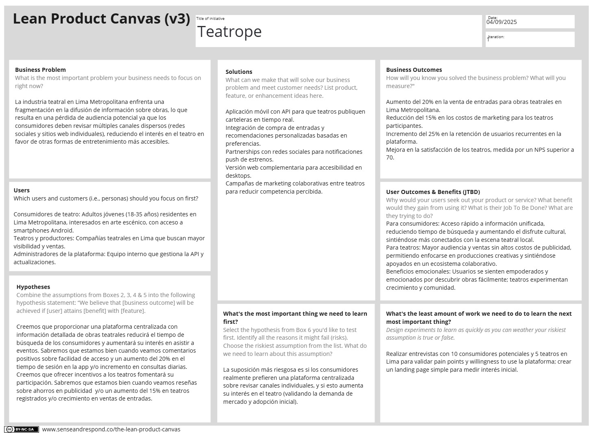

## 1.3 Segmentos Objetivo

Segmento 1: Usuarios (Consumidores de teatro)

| Característica Demográfica | Descripción | Información Estadística de Sustento |
|----------------------------|-------------|-------------------------------------|
| Edad | Principalmente adultos jóvenes entre 18 y 55 años, con énfasis en el rango 25-34 años, que representan la mayoría de la audiencia digital y física activa en eventos culturales. | El 62% de la audiencia digital del Gran Teatro Nacional (GTN) en Perú es menor de 35 años, con el 33.5% específicamente en el rango 25-34 años, según el primer estudio de públicos digitales del GTN (2024). En general, solo el 7-10% de la población peruana asiste a teatros o museos anualmente, con un enfoque en grupos urbanos jóvenes. |
| Género | Mixto, con una ligera predominancia masculina (aprox. 54% hombres y 46% mujeres), reflejando brechas digitales en el acceso a artes escénicas. | Estudio del GTN indica 54% hombres y 46% mujeres en audiencias digitales, destacando una brecha de género digital del 12% en Perú que afecta el acceso femenino a contenidos culturales. |
| Ubicación | Residentes en Lima Metropolitana y regiones cercanas (e.g., La Libertad, Arequipa, Cusco), con extensión a audiencias internacionales hispanohablantes. | El 80% de la población peruana vive en áreas urbanas, con Lima como centro cultural principal. Audiencias digitales del GTN incluyen regiones peruanas clave y países como España, EE.UU., México, Argentina y Colombia. Aprox. 42% de la audiencia digital nunca ha visitado teatros en persona, indicando potencial para captar nuevos usuarios urbanos. |
| Nivel Socioeconómico | Clases media y media-alta, con acceso a smartphones y tiempo libre para ocio cultural. | En Perú, el ingreso bruto promedio es de ~USD 6,417 en 2024, con mayor participación cultural en segmentos urbanos de ingresos medios (ranking 10° en Latinoamérica). Asistencia a eventos como teatros es baja (7-10% nacional), pero concentrada en Lima con mayor poder adquisitivo. |
| Hábitos Tecnológicos | Usuarios activos de dispositivos móviles, con alto consumo de contenido cultural digital en las primeras 24 horas de publicación. | El 82.3% de la audiencia accede a contenido digital en las primeras 24 horas (58.35% inmediatamente), con un lifespan corto de engagement (solo 17.88% después del primer día). |

Segmento 2: Teatros (Empresas o Compañías Teatrales)

| Característica Demográfica (Adaptada a Empresas) | Descripción | Información Estadística de Sustento |
|--------------------------------------------------|-------------|-------------------------------------|
| Tamaño de la Empresa | Pequeñas y medianas compañías teatrales, con capacidad para 100-1,500 espectadores, incluyendo venues independientes y multi-propósito. | Hay aprox. 20-30 teatros activos en Lima, con capacidades variadas (e.g., Gran Teatro Nacional: 1,500 asientos; Teatro Municipal: 1,181). Listados como Tripadvisor mencionan 15 principales, mientras que hay ~250 grupos teatrales en todo Perú, con concentración en Lima. Más de 40 compañías han visitado Lima históricamente, con énfasis en producciones modernas y experimentales. |
| Tipo de Organización | Compañías independientes, circos-teatro (e.g., La Tarumba) y venues municipales/multipropósito, enfocadas en drama, ballet, ópera y teatro experimental. | Principales incluyen Gran Teatro Nacional (multi-propósito, inaugurado 2012), Teatro Municipal (clásico, re-inaugurado 2010), y grupos como Maguey (fundado 1982, teatro alternativo). Hay énfasis en organizaciones independientes como La Tarumba, una de las más exitosas en Perú. |
| Ubicación | Concentrado en Lima Metropolitana, con venues en distritos como el Centro Histórico, Barranco y Miraflores. | La mayoría de teatros están en Lima (e.g., Segura Theater: el más antiguo de Latinoamérica; Marsano, Canout). Listados muestran ~10-15 venues clave en áreas urbanas centrales. |
| Antigüedad/Experiencia | Mezcla de instituciones históricas (siglo XIX) y modernas (post-2000), con foco en innovación cultural. | Ejemplos: Teatro Segura (antiguo); Gran Teatro Nacional (2012). Más de 40 compañías han operado en Lima desde el siglo XX, con ~250 grupos nacionales activos en 2024. |
| Enfoque Operacional | Orientadas a producciones locales e internacionales, con desafíos en marketing digital y audiencia. | Asistencia cultural baja (7-10% población), pero potencial en Lima con festivales como el de Artes Escénicas (19 obras de grupos peruanos y latinoamericanos). |

<div style="page-break-after: always;"></div>

# Capítulo II: Requierements Elicitation & Analysis
## 2.1 Competidores
### 2.1.1 Analisis Competitivo
El analisis de la competencia constituye un recurso esencial en la planificación estratégica, pues facilita la detección de oportunidades, la anticipación de riesgos y la creación de ventajas diferenciales duraderas en el mercado. Su relevancia se centra en apoyar a las organizaciones a responder a un entorno cambiante y a decidir con base en información sólida. En este sentido, se expone a continuación la aplicación de esta herramienta en el proyecto y la evaluación de los competidores.
<table>
  <tr>
    <th colspan="6">Competitive Analysis Landscape – Teatrope</th>
  </tr>
  <tr>
    <td colspan="1" align="center" rowspan="2">¿Por qué llevar a cabo este análisis?</td>
    <td colspan="5" align="center">¿Cómo identificar a nuestros principales competidores?</td>
  </tr>
  <tr>
    <td colspan="5" align="center">
      Se analizan plataformas digitales y aplicaciones móviles de teatro y espectáculos que ofrecen funcionalidades similares a Teatrope: información de funciones, compra de entradas, acceso a contenidos exclusivos y difusión cultural. Esto permite entender su posicionamiento y diseñar estrategias diferenciadoras.
    </td>
  </tr>
  <tr>
    <th colspan="2" align="center">Nombre y logo</th>
    <td align="center"><b>Teatrope</b><br>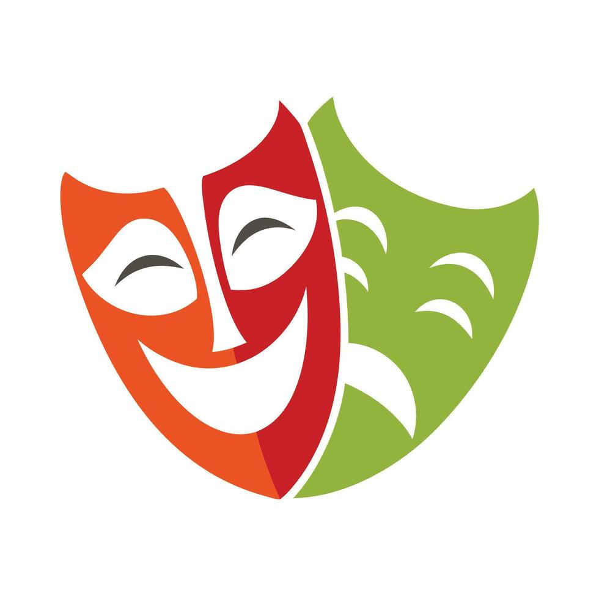</td>
    <td align="center"><b>TodayTix</b><br>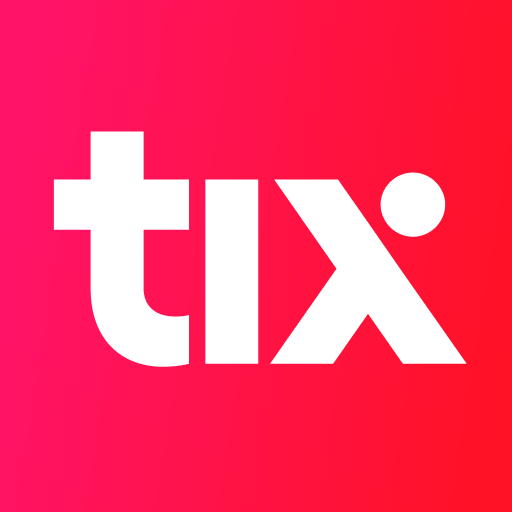</td>
    <td align="center"><b>Teatrix</b><br></td>
    <td align="center"><b>Gran Teatro Nacional (GTN App)</b><br>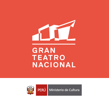</td>
  </tr>
  <tr>
    <th rowspan="2" align="center">Perfil</th>
    <td align="center">Overview</td>
    <td>Plataforma que reúne todos los teatros en Lima con detalles de funciones, ubicación, elenco y directores.</td>
    <td>App internacional de venta de entradas para teatro con descuentos, loterías y compra rápida.</td>
    <td>Aplicación de streaming con obras teatrales y musicales en alta calidad.</td>
    <td>App institucional del Gran Teatro Nacional con programación y difusión cultural.</td>
  </tr>
  <tr>
    <td align="center">Ventaja competitiva</td>
    <td>
      <ul>
        <li>Información centralizada del teatro limeño.</li>
        <li>Calendario y mapas en tiempo real.</li>
        <li>Experiencia “todo en uno” para los amantes del teatro local.</li>
      </ul>
    </td>
    <td>
      <ul>
        <li>Acceso a entradas con grandes descuentos.</li>
        <li>Promociones exclusivas y loterías.</li>
        <li>Proceso de compra rápido e intuitivo.</li>
      </ul>
    </td>
    <td>
      <ul>
        <li>Acceso ilimitado a obras grabadas.</li>
        <li>Contenido adicional como entrevistas.</li>
        <li>Calidad audiovisual HD y subtítulos.</li>
      </ul>
    </td>
    <td>
      <ul>
        <li>Respaldo institucional del Estado.</li>
        <li>Difusión cultural y acceso gratuito.</li>
        <li>Programación exclusiva del GTN.</li>
      </ul>
    </td>
  </tr>
  <tr>
    <th rowspan="2" align="center">Perfil de marketing</th>
    <td align="center">Mercado objetivo</td>
    <td>
      <ul>
        <li>Público limeño aficionado al teatro.</li>
        <li>Teatros independientes y grandes salas.</li>
        <li>Usuarios que buscan descubrir obras locales.</li>
      </ul>
    </td>
    <td>
      <ul>
        <li>Público internacional interesado en Broadway.</li>
        <li>Turistas y locales que buscan espectáculos.</li>
        <li>Consumidores que priorizan descuentos.</li>
      </ul>
    </td>
    <td>
      <ul>
        <li>Usuarios que prefieren teatro en streaming.</li>
        <li>Amantes de obras clásicas y modernas.</li>
        <li>Público que busca comodidad en casa.</li>
      </ul>
    </td>
    <td>
      <ul>
        <li>Asistentes frecuentes al GTN.</li>
        <li>Estudiantes y promotores culturales.</li>
        <li>Turistas culturales en Lima.</li>
      </ul>
    </td>
  </tr>
  <tr>
    <td align="center">Estrategias de marketing</td>
    <td>
      <ul>
        <li>Alianzas con teatros locales.</li>
        <li>Campañas en redes sociales.</li>
        <li>Eventos culturales comunitarios.</li>
      </ul>
    </td>
    <td>
      <ul>
        <li>Marketing digital global.</li>
        <li>Promociones flash y descuentos.</li>
        <li>Campañas dirigidas en turismo cultural.</li>
      </ul>
    </td>
    <td>
      <ul>
        <li>Publicidad en plataformas de streaming.</li>
        <li>Campañas de suscripción mensual.</li>
        <li>Promociones en App Store y Google Play.</li>
      </ul>
    </td>
    <td>
      <ul>
        <li>Comunicación institucional.</li>
        <li>Promoción de eventos en medios.</li>
        <li>Difusión en escuelas y universidades.</li>
      </ul>
    </td>
  </tr>
  <tr>
    <th rowspan="3" align="center">Perfil del producto</th>
    <td align="center">Productos & Servicios</td>
    <td>
      <ul>
        <li>Directorio de teatros y obras.</li>
        <li>Información de funciones y elencos.</li>
        <li>Calendario y geolocalización.</li>
      </ul>
    </td>
    <td>
      <ul>
        <li>Venta de entradas online.</li>
        <li>Loterías y descuentos especiales.</li>
        <li>Promociones de último minuto.</li>
      </ul>
    </td>
    <td>
      <ul>
        <li>Streaming de obras teatrales.</li>
        <li>Catálogo bajo demanda.</li>
        <li>Contenido exclusivo para suscriptores.</li>
      </ul>
    </td>
    <td>
      <ul>
        <li>Programación cultural del GTN.</li>
        <li>Eventos y actividades educativas.</li>
        <li>Acceso a contenidos multimedia.</li>
      </ul>
    </td>
  </tr>
  <tr>
    <td align="center">Precios y Costos</td>
    <td>
      <ul>
        <li>Acceso gratuito.</li>
        <li>Ingresos por publicidad.</li>
        <li>Alianzas con teatros para monetización.</li>
      </ul>
    </td>
    <td>
      <ul>
        <li>Compra directa de entradas.</li>
        <li>Tarifas variables según espectáculo.</li>
        <li>Comisiones por transacción.</li>
      </ul>
    </td>
    <td>
      <ul>
        <li>Suscripción mensual.</li>
        <li>Planes anuales con descuentos.</li>
        <li>Prueba gratuita limitada.</li>
      </ul>
    </td>
    <td>
      <ul>
        <li>App gratuita.</li>
        <li>Financiamiento estatal.</li>
        <li>Sin modelo de monetización comercial.</li>
      </ul>
    </td>
  </tr>
  <tr>
    <td align="center">Canales de distribución</td>
    <td>Web y aplicación móvil.</td>
    <td>App iOS/Android y sitio web.</td>
    <td>App móvil y web streaming.</td>
    <td>App móvil y web institucional.</td>
  </tr>
  <tr>
    <th rowspan="4" align="center">Análisis SWOT</th>
    <td align="center">Fortalezas</td>
    <td>
      <ul>
        <li>Especialización en teatro limeño.</li>
        <li>Información centralizada.</li>
        <li>Experiencia cultural integral.</li>
      </ul>
    </td>
    <td>
      <ul>
        <li>Popularidad internacional.</li>
        <li>Acceso rápido y descuentos.</li>
        <li>Proceso simple de compra.</li>
      </ul>
    </td>
    <td>
      <ul>
        <li>Amplio catálogo en streaming.</li>
        <li>Alta calidad audiovisual.</li>
        <li>Contenido exclusivo adicional.</li>
      </ul>
    </td>
    <td>
      <ul>
        <li>Respaldo institucional.</li>
        <li>Difusión cultural gratuita.</li>
        <li>Acceso a públicos diversos.</li>
      </ul>
    </td>
  </tr>
  <tr>
    <td align="center">Debilidades</td>
    <td>
      <ul>
        <li>No gestiona venta directa de entradas.</li>
        <li>Dependencia de alianzas con teatros.</li>
        <li>Escasa visibilidad fuera de Lima.</li>
      </ul>
    </td>
    <td>
      <ul>
        <li>Enfoque en Broadway, no teatro local.</li>
        <li>Competencia fuerte global.</li>
        <li>Limitado en información de actores/directores.</li>
      </ul>
    </td>
    <td>
      <ul>
        <li>No cubre funciones presenciales.</li>
        <li>Dependencia de internet estable.</li>
        <li>Limitado a formato digital.</li>
      </ul>
    </td>
    <td>
      <ul>
        <li>Solo cubre un teatro específico.</li>
        <li>Alcance limitado geográficamente.</li>
        <li>No orientado a venta de entradas.</li>
      </ul>
    </td>
  </tr>
  <tr>
    <td align="center">Oportunidades</td>
    <td>
      <ul>
        <li>Expandirse a todo el Perú.</li>
        <li>Agregar módulo de venta de entradas.</li>
        <li>Alianzas con festivales culturales.</li>
      </ul>
    </td>
    <td>
      <ul>
        <li>Ingresar a nuevos mercados.</li>
        <li>Ampliar alianzas con teatros globales.</li>
        <li>Fortalecer presencia en turismo cultural.</li>
      </ul>
    </td>
    <td>
      <ul>
        <li>Mayor consumo cultural en streaming.</li>
        <li>Ampliar catálogo con obras latinoamericanas.</li>
        <li>Ofrecer experiencias inmersivas (VR/AR).</li>
      </ul>
    </td>
    <td>
      <ul>
        <li>Mayor digitalización cultural en Perú.</li>
        <li>Programas de apoyo estatal al arte.</li>
        <li>Integración con apps educativas.</li>
      </ul>
    </td>
  </tr>
  <tr>
    <td align="center">Amenazas</td>
    <td>
      <ul>
        <li>Competencia con Teleticket/Joinnus.</li>
        <li>Plataformas internacionales consolidadas.</li>
        <li>Baja adopción tecnológica en algunos sectores.</li>
      </ul>
    </td>
    <td>
      <ul>
        <li>Competencia feroz en apps de boletaje.</li>
        <li>Alternativas más económicas.</li>
        <li>Dependencia de tendencias de consumo.</li>
      </ul>
    </td>
    <td>
      <ul>
        <li>Nuevos competidores en streaming.</li>
        <li>Alternativas con más funcionalidades.</li>
        <li>Competencia con plataformas globales.</li>
      </ul>
    </td>
    <td>
      <ul>
        <li>Alternativas privadas con más recursos.</li>
        <li>Competencia con apps culturales externas.</li>
        <li>Dependencia del financiamiento estatal.</li>
      </ul>
    </td>
  </tr>
</table>

### 2.1.2 Estrategias y tácticas frente a competidores
Con base en el análisis competitivo realizado, fue posible identificar con mayor claridad las principales fortalezas, debilidades, oportunidades y amenazas que caracterizan a las plataformas rivales en el sector teatral y cultural. Esta información es un insumo clave para diseñar un plan estratégico que permita a Teatrope ingresar al mercado con una propuesta sólida y diferenciada. A continuación, se detallan las estrategias y tácticas que se plantean para consolidar su posicionamiento.


#### Frente a las fortalezas de los competidores 

* TodayTix sobresale por sus promociones, loterías y la rapidez en la compra de entradas.

* Teatrix ofrece un catálogo amplio en streaming y contenidos audiovisuales en alta definición.

* GTN App cuenta con el respaldo institucional del Estado y acceso gratuito a su programación.

#### Fortalezas de Teatrope:

* Concentración de la oferta teatral limeña en una sola plataforma.

* Experiencia integral que incluye cartelera, ubicaciones, fichas de actores y directores.

* Especialización en teatro local, un enfoque poco explorado por otras aplicaciones.

#### Estrategias

* Diferenciar la propuesta resaltando el enfoque cultural limeño.

* Convertirse en el punto digital de referencia para los espectadores de teatro en Lima.

* Comunicar el aporte social y cultural como elemento central de valor.

#### Tácticas

* Crear campañas en redes sociales que cuenten historias de teatros, actores y directores locales.

* Producir material audiovisual que muestre la experiencia completa de asistir al teatro.

* Establecer alianzas con medios culturales y críticos especializados para reseñar obras en la app.

#### Frente a las debilidades de los competidores

* TodayTix carece de cobertura sobre el teatro local y su talento.

* Teatrix está limitado al consumo en línea y no atiende la asistencia presencial.

* GTN App restringe su alcance a un solo teatro y a su propia programación.

#### Debilidades de Teatrope:

* No gestiona todavía la venta directa de boletos.

* Depende de la colaboración activa de los teatros para mantener información actualizada.

* Limitada visibilidad más allá de Lima Metropolitana.

#### Estrategias

* Implementar integraciones con sistemas de boletería locales.

* Desarrollar un mecanismo de autogestión para que cada teatro pueda actualizar sus funciones.

* Planificar una expansión gradual hacia otras ciudades del país.

#### Tácticas

* Lanzar una versión piloto en alianza con teatros principales de Lima.

* Crear paneles de administración para teatros afiliados.

* Impulsar campañas de difusión en universidades, festivales y espacios culturales nacionales.

#### Frente a las oportunidades de los competidores

* TodayTix capitaliza el turismo cultural y el mercado internacional.

* Teatrix se beneficia del crecimiento del consumo digital de contenidos culturales.

* GTN App aprovecha las iniciativas estatales de digitalización cultural.

#### Oportunidades de Teatrope:

* Crecimiento de la digitalización cultural en el Perú y la región.

* Potencial de alianzas con teatros, festivales e instituciones culturales.

* Demanda creciente por experiencias centralizadas y accesibles.

#### Estrategias

* Posicionar a Teatrope como la principal plataforma digital para el teatro en Perú.

* Incorporar funcionalidades innovadoras como reseñas, alertas y recomendaciones personalizadas.

* Establecer vínculos con organizaciones educativas y culturales.

#### Tácticas

* Realizar campañas dirigidas a estudiantes y jóvenes amantes del arte.

* Generar colaboraciones con festivales teatrales para integrar su programación.

* Activar un sistema de notificaciones que informe sobre estrenos y últimas entradas disponibles.

#### Frente a las amenazas de los competidores

* Teleticket y Joinnus son plataformas consolidadas de boletería en el mercado local.

* TodayTix cuenta con un fuerte reconocimiento internacional y grandes recursos.

* El costo de adquisición de usuarios en el sector cultural es elevado.

#### Amenazas de Teatrope:

* Competencia con aplicaciones de boletería masivas.

* Riesgo de posicionamiento de marcas extranjeras con mayor alcance.

* Brecha tecnológica en parte del público objetivo.

#### Estrategias

* Diferenciarse mediante un enfoque local y cultural.

* Fidelizar al usuario ofreciendo beneficios exclusivos y experiencias únicas.

* Construir identidad de marca vinculada al orgullo cultural peruano.

#### Tácticas

* Implementar un programa de recompensas para usuarios frecuentes.

* Desarrollar un sistema de referidos que incentive a atraer nuevos usuarios.

* Diseñar campañas de comunicación bajo un concepto cultural como: “El teatro en un solo lugar”.

## 2.2 Entrevistas
### 2.2.1 Diseño de entrevistas
### Preguntas para Segmento 1: Consumidores de teatro

#### Objetivo: 
Conocer hábitos de consumo cultural, canales de información, motivaciones y expectativas respecto a una plataforma centralizada.

#### Introducción: 

“Queremos conocer mejor cómo el público de Lima Metropolitana se informa y consume teatro, para diseñar una plataforma que se adapte a sus necesidades.”

•	¿Con qué frecuencia asistes a obras de teatro al año o al mes?

•	¿Cómo te informas actualmente sobre funciones de teatro? (redes sociales, boca a boca, webs de teatros, etc.)

•	¿Qué dificultades encuentras al buscar información sobre obras en Lima?

•	¿Qué factores influyen más en tu decisión de asistir a una obra? (precio, cercanía, elenco, recomendaciones, etc.)

•	¿Qué opinas de la idea de una plataforma “todo en uno” donde encuentres fechas, disponibilidad y compra de entradas?

•	¿Qué funcionalidades valoras más en una aplicación o web sobre teatro? (notificaciones, filtros por género/ubicación, reseñas, descuentos, etc.)

•	¿Qué redes sociales usas más para informarte sobre actividades culturales?

•	¿Sueles comprar entradas online o prefieres en boletería? ¿Por qué?

•	¿Has dejado de ir a una obra por no encontrar información clara?

•	Si tuvieras una aplicación así, ¿qué es lo primero que quisieras ver al abrirla?

### Preguntas para Segmento 2: Teatros y productores

#### Objetivo: 
Identificar necesidades de difusión, gestión de entradas y relación con el público.

#### Introducción:
“Estamos desarrollando una plataforma que busca reunir en un solo espacio toda la oferta teatral de Lima Metropolitana. Queremos conocer su perspectiva como productor/teatro.”

•	¿Qué canales utilizan actualmente para difundir sus obras? (redes sociales, prensa, carteleras, alianzas, etc.)

•	¿Cuáles son los principales retos para atraer público y llenar funciones?

•	¿Qué limitaciones encuentra en los sistemas de venta de entradas actuales?

•	¿Qué tan importante es para ustedes contar con información centralizada sobre la oferta teatral de Lima?

•	¿Qué beneficios esperaría de una plataforma que concentre obras, funciones y venta de entradas?

•	¿Qué tipo de estadísticas o reportes les serían más útiles? (visibilidad e interacción, perfil del público, ventas en tiempo real, etc.)

•	¿Estarían dispuestos a pagar o suscribirse a una plataforma así? ¿En qué condiciones?

•	¿Qué experiencia han tenido con alianzas de promoción cultural (municipios, festivales, apps)?

•	¿Cuánto tiempo y recursos invierten en publicidad digital por obra?

•	¿Qué tan abiertos estarían a recibir reseñas del público en línea?

•	Si existiera una integración con redes sociales o Google Maps, ¿les resultaría atractivo?

### 2.2.2. Registro de entrevistas
### Segmento objetivo #1: Consumidores de teatro
##### Datos del Entrevistado #1
- **Nombre completo:** Fabrizio Amir Leon Vivas
- **Segmento Objetivo:** Consumidor de teatro
- **Edad:** 22
- **Distrito:** Surco
- **Inicio de la entrevista:** 00:19
- **Duración:** 34:53
- **Screenshot del cuadro de video:** 
- **URL del video (Microsoft Stream):** *[Entrevista 01](https://upcedupe-my.sharepoint.com/:v:/g/personal/u202312504_upc_edu_pe/EQDZxYIUpyxIrQg_ds8mV-YBaAV7fyP5U1h2_oUOKEIkKA?nav=eyJyZWZlcnJhbEluZm8iOnsicmVmZXJyYWxBcHAiOiJPbmVEcml2ZUZvckJ1c2luZXNzIiwicmVmZXJyYWxBcHBQbGF0Zm9ybSI6IldlYiIsInJlZmVycmFsTW9kZSI6InZpZXciLCJyZWZlcnJhbFZpZXciOiJNeUZpbGVzTGlua0NvcHkifX0&e=ZciAEx)*

**Resumen:**
El entrevistado asiste al teatro 1 ves al mes . Se informa principalmente a través de redes sociales y foros de internet, pero enfrenta como mayor dificultad la falta de información completa y centralizada sobre las obras en Lima, especialmente en relación a precios, fechas y elenco. Al decidir asistir a una función, prioriza en primer lugar las recomendaciones que recibe sobre la obra, en segundo lugar el elenco, en tercer lugar la ubicacion del teatro y en cuarto lugar el precio de las obras. Entre las posibles funcionalidades de la plataforma Teatrope, considera que la cartelera actualizada con toda la informacion clara las obras serían lo más útil e interesante para mejorar su experiencia como consumidor.

##### Datos del Entrevistado #2
- **Nombre completo:** Gabriel Reyna
- **Segmento Objetivo:** Consumidor de teatro
- **Edad:** 22
- **Distrito:** Barranco
- **Inicio de la entrevista:** 06:49
- **Duración:** 34:53
- **Screenshot del cuadro de video:** 
- **URL del video (Microsoft Stream):** *[Entrevista 02](https://upcedupe-my.sharepoint.com/:v:/g/personal/u202312504_upc_edu_pe/EQDZxYIUpyxIrQg_ds8mV-YBaAV7fyP5U1h2_oUOKEIkKA?nav=eyJyZWZlcnJhbEluZm8iOnsicmVmZXJyYWxBcHAiOiJPbmVEcml2ZUZvckJ1c2luZXNzIiwicmVmZXJyYWxBcHBQbGF0Zm9ybSI6IldlYiIsInJlZmVycmFsTW9kZSI6InZpZXciLCJyZWZlcnJhbFZpZXciOiJNeUZpbGVzTGlua0NvcHkifX0&e=ZciAEx)*

**Resumen:**
El entrevistado asiste al teatro 4 ves al mes . Se informa principalmente a través de redes sociales, foros de internet y por amistades, pero enfrenta como mayor dificultad la falta de información completa sobre las obras en Lima, especialmente en relación a precios, fechas y elenco. Al decidir asistir a una función, prioriza en primer lugar las la ubicacion del teatro, en segundo lugar las recomendaciones de la obra y en tercer lugar el elenco que se va a presentar. Entre las posibles funcionalidades de la plataforma Teatrope, considera que la gestion de carteleras para, como filtros y favoritos serian lo mas util e interesante para mejorar su experiencia como consumidor.

##### Datos del Entrevistado #3
- **Nombre completo:** Victor Otto Reinoso Diaz
- **Segmento Objetivo:** Consumidor de teatro
- **Edad:** 24
- **Distrito:** Lurigancho - Chosica
- **Inicio de la entrevista:** 11:41
- **Duración:** 34:53
- **Screenshot del cuadro de video:** 
- **URL del video (Microsoft Stream):** *[Entrevista 03](https://upcedupe-my.sharepoint.com/:v:/g/personal/u202312504_upc_edu_pe/EQDZxYIUpyxIrQg_ds8mV-YBaAV7fyP5U1h2_oUOKEIkKA?nav=eyJyZWZlcnJhbEluZm8iOnsicmVmZXJyYWxBcHAiOiJPbmVEcml2ZUZvckJ1c2luZXNzIiwicmVmZXJyYWxBcHBQbGF0Zm9ybSI6IldlYiIsInJlZmVycmFsTW9kZSI6InZpZXciLCJyZWZlcnJhbFZpZXciOiJNeUZpbGVzTGlua0NvcHkifX0&e=ZciAEx)*

**Resumen:**
El entrevistado asiste al teatro con frecuencia, aproximadamente 1–2 veces al mes (15–20 veces al año). Se informa principalmente a través de redes sociales, pero enfrenta como mayor dificultad la falta de información completa y centralizada sobre las obras en Lima, especialmente en relación a precios, fechas y elenco. Al decidir asistir a una función, prioriza en primer lugar las recomendaciones que recibe sobre la obra, en segundo lugar la cercanía del teatro, y en tercer lugar el elenco. Entre las posibles funcionalidades de la plataforma Teatrope, considera que las notificaciones serían lo más útil e interesante para mejorar su experiencia como consumidor.


### Segmento objetivo #2: Teatros y productores de teatro
##### Datos del Entrevistado #1
- **Nombre completo:** Mario César Mendoza Peña
- **Segmento Objetivo:** Teatros y productores de teatro
- **Edad:** 35
- **Distrito:** Miraflores
- **Inicio de la entrevista:** 17:20
- **Duración:** 34:53
- **Screenshot del cuadro de video:** 
- **URL del video (Microsoft Stream):** *[Entrevista 01](https://upcedupe-my.sharepoint.com/:v:/g/personal/u202312504_upc_edu_pe/EQDZxYIUpyxIrQg_ds8mV-YBaAV7fyP5U1h2_oUOKEIkKA?nav=eyJyZWZlcnJhbEluZm8iOnsicmVmZXJyYWxBcHAiOiJPbmVEcml2ZUZvckJ1c2luZXNzIiwicmVmZXJyYWxBcHBQbGF0Zm9ybSI6IldlYiIsInJlZmVycmFsTW9kZSI6InZpZXciLCJyZWZlcnJhbFZpZXciOiJNeUZpbGVzTGlua0NvcHkifX0&e=ZciAEx)*

  
**Resumen:** El entrevistado menciona que los principales retos a los que se entrenta al momento de difundir sus producciones son el atraer al público a funciones intermedias de obras que se presentan durante mucho tiempo. Además, uno de los puntos débiles que encuentra en el sistema actual de venta de entras es que es complicado gestionar los cambios y devoluciones. En general, el entrevistado ve valor en una plataforma como Teatrope y en los beneficios que esto pueda traer tanto a las empresas como a los usuarios mismos. Como productor, estaría dispuesto a pagar para ser parte de Teatrope, y considera que actualmente no hay mucha colaboración de difusión entre las diferentes productoras lo que no ayuda en mucho a promover el arte escénico en Lima. 


### 2.2.3. Análisis de entrevistas

#### Segmento 1: Consumidores de teatro

<div>
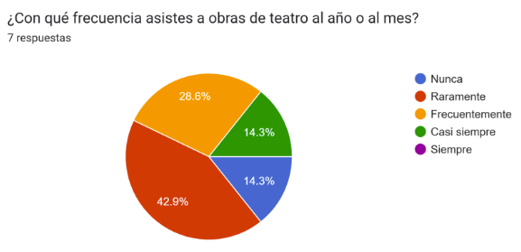
<br>
<p>El 28.6% de los entrevistados asisten al teatro frecuentemente, y el 14.3% de los entrevistados asisten casi siempre. El resto de los entrevistados son personas que no asisten mucho precisamente por los problemas que nuestra app intenta solucionar. 
</p>
</div>

<div>
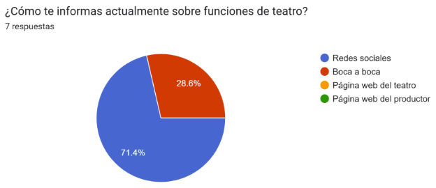
<br>
<p>
Mas del 70% de los entrevistados se informan sobre funciones de teatro a través de redes sociales. 
</p>
</div>

<div>
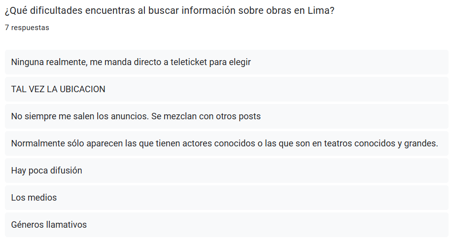
<br>
<p>
Las principales dificultades que los usuarios manifiestan se relacionan con la falta de centralización de la información, donde puedan encontrar toda la data disponible en un solo lugar. 
</p>
</div>

<div>
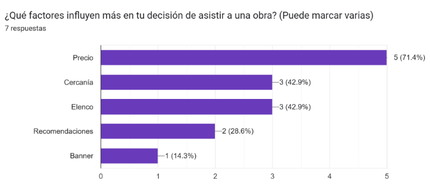
<br>
<p>
La mayoría de usuarios indican que el precio y la cercanía influyen más en su decisión de asistir a una obra, lo que nos da oportunidades para implementar funcionalidades que se concentren en esto.
</p>
</div>

<div>
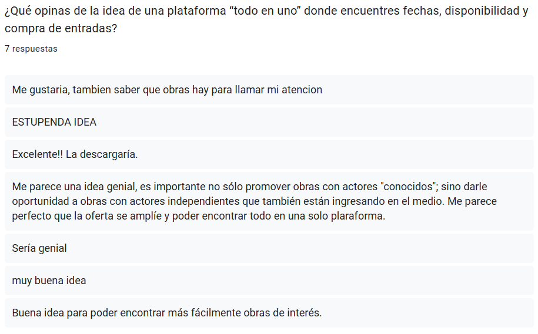
<br>
<p>
La mayoría de usuarios entrevistados estarían de acuerdo en una plataforma "todo en uno" sobre información de obras de teatro. 
</p>
</div>

<div>
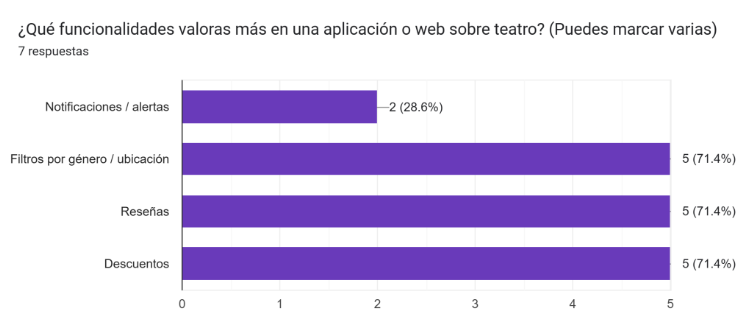
<br>
<p>
Se podría decir que las funcionalidades que el usuario más valora en la aplicación web serían filtros de búsqueda, reseñas que puedan dejar ellos sobre las obras y descuentos especiales para usuarios recurrentes. 
</p>
</div>

<div>
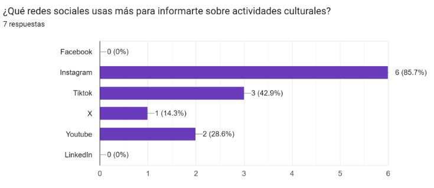
<br>
<p>
La gran mayoría de usuarios afirman que para enterarse sobre actividades culturales utilizan principalmente Instagram y Tiktok, lo que nos indican las principales plataformas para hacer promoción a nuestro producto.
</p>
</div>

<div>
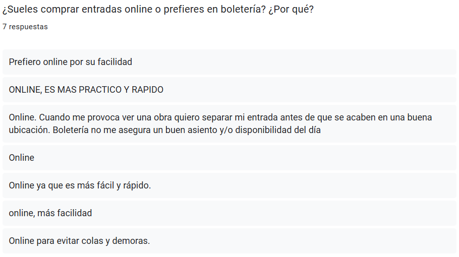
<br>
<p>
Todos los usuarios prefieren comprar entradas online, esto es bueno ya que la aplicación busca promover principalmente las ventas a través de canales online.
</p>
</div>

<div>
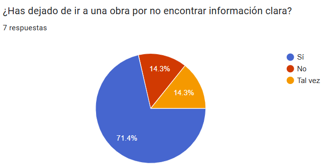
<br>
<p>
Más del 70% de encuestados afirman haber dejado de ir a una obra por no encontrar información clara y a tiempo. Esto evidencia que el usuario no quiere invertir mucho esfuerzo en buscar y tomarse el tiempo de investigar sobre las obras de teatro. Es decir, se requiere una solución que haga este proceso más rápido y eficiente. 
</p>
</div>

<div>
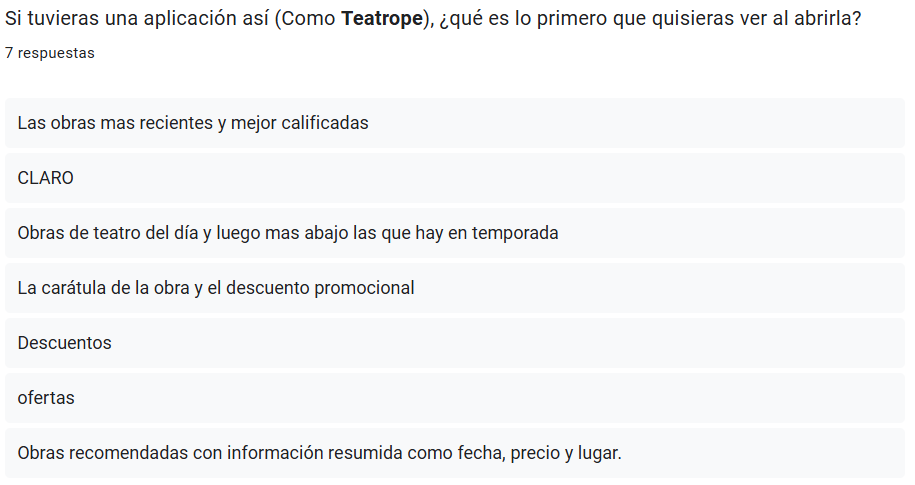
<br>
<p>
La mayoría de usuarios afirman que lo primero que querrían ver al abrir la aplicación serían obras recomendadas y obras del día con descuentos o promociones. 
</p>
</div>

#### Segmento 2: Teatros y productores

<div>
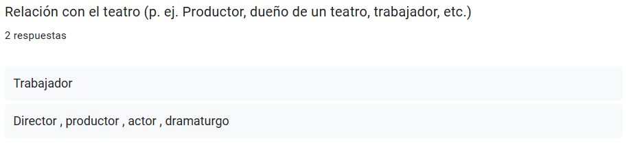
<br>
<p>
Se tiene como muestra a un trabajador y un director de teatro. 
</p>
</div>

<div>
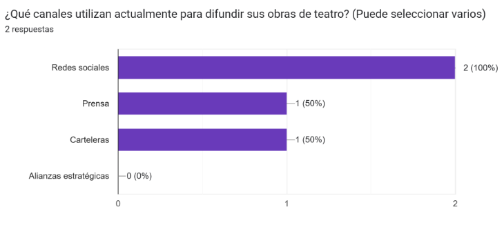
<br>
<p>
Actualmente no se utilizan alianzas estratégicas como canales para difundir las obras de teatro, lo que podría significar una oportunidad de mejora. 
</p>
</div>

<div>
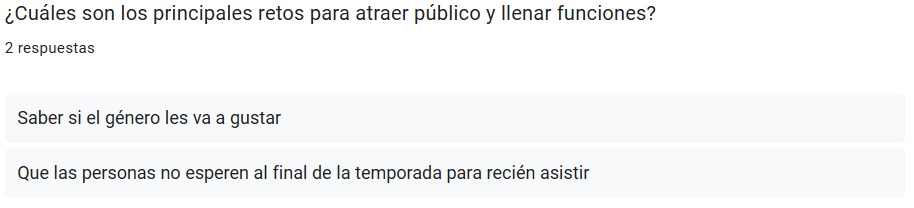
<br>
<p>
Mencionan que los principales retos para atraer público es saber si les gustará el género específico de la obra y poder llenar las salas en periodos de temporadas largas. 
</p>
</div>

<div>
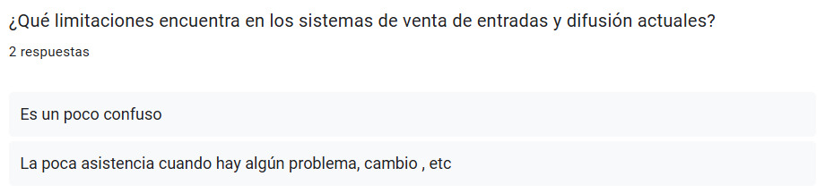
<br>
<p>
Los sistemas de venta de entradas tienen dificultades al momento de cambio o reembolos de entradas. 
</p>
</div>

<div>
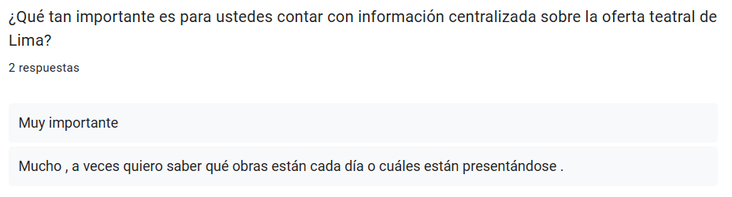
<br>
<p>
Para los encuestados es importante saber qué obras hay actualmente. 
</p>
</div>

<div>

<br>
<p>
Se esperaría poder atraer más público, y para los usuarios de la aplicación descuentos, material extra de las funciones o detrás de cámaras, y mejores ubicaciones en las funciones principales. 
</p>
</div>

<div>
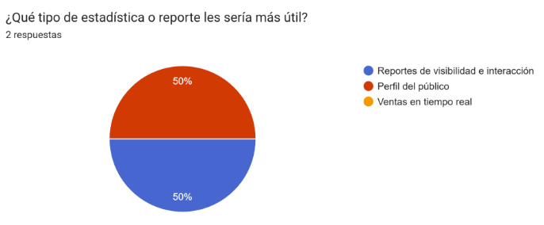
<br>
<p>
Los encuestados mencionan que reportes como el perfil del público o reportes de visibilidad e interacción serían de utilidad para su labor. 
</p>
</div>

<div>
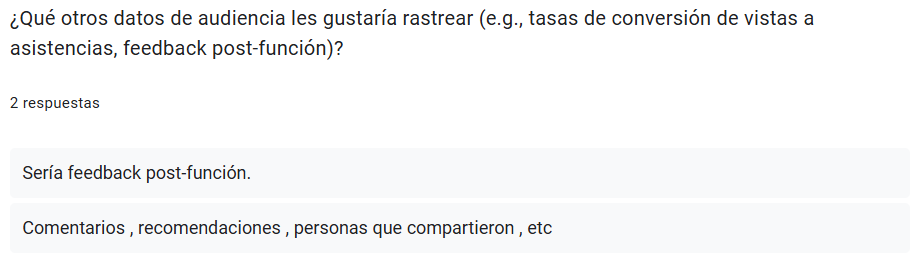
<br>
<p>
Los encuestados sugieren otros datos como feedback post-función, comentarios acerca de las obras dados por el público, recomendaciones, etc. Todo esto sería recopilado por la aplicación.
</p>
</div>

<div>
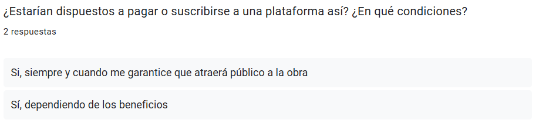
<br>
<p>
Todos los encuestados estarían dispuestos a pagar una suscripción para participar en la aplicación.
</p>
</div>

<div>
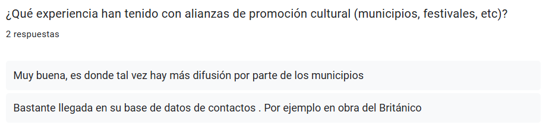
<br>
<p>
Los encuestados mencionan que han tenido buena experiencia con alianzas de promoción cultural, especialmente con municipios. Además valoran el hecho de tener una base de datos de contactos como punto de partida para una campaña publicitaria. 
</p>
</div>

<div>
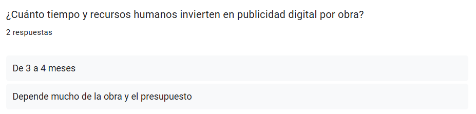
<br>
<p>
Por obra se invierten aproximadamente de 3 a 4 meses en tiempo para publicidad digital, pero depende mucho de la obra y el presupuesto, según los encuestados.
</p>
</div>

<div>
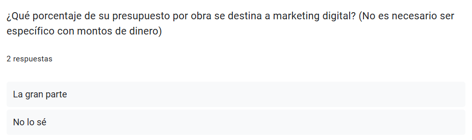
<br>
<p>
Mencionan que una gran parte de presupuesto de destina para la publicidad, lo que confirma la oportunidad de inversión de estas empresas en nuestra plataforma. 
</p>
</div>

<div>
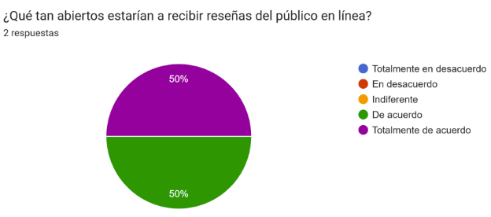
<br>
<p>
Los encuestados estarían de acuerdo a recibir reseñas públicas acerca de sus obras, lo cual sería una funcionalidad clave de nuestra aplicación.
</p>
</div>

<div>
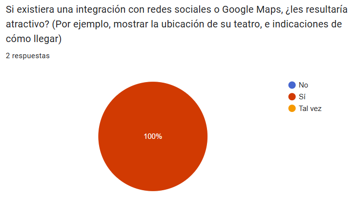
<br>
<p>
Se menciona que les resultaría atractivo una integración con redes sociales o google maps, para facilitar la llegada de los clientes al teatro. 
</p>
</div>

<div>
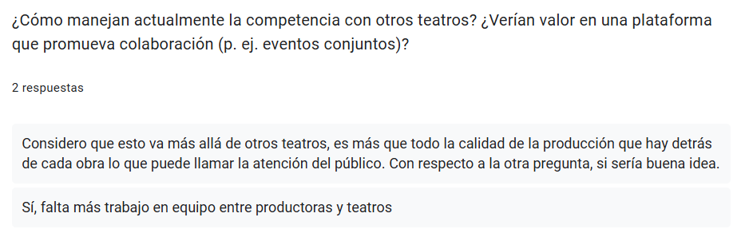
<br>
<p>
Se considera que falta más trabjo en equipo entre productoras y teatros, además de que no se le da mucho valor al trabajo y la calidad de la producción. Los encuestados piensan que es buena idea una plataforma que promueva la colaboración entre teatros. 
</p>
</div>

<div>
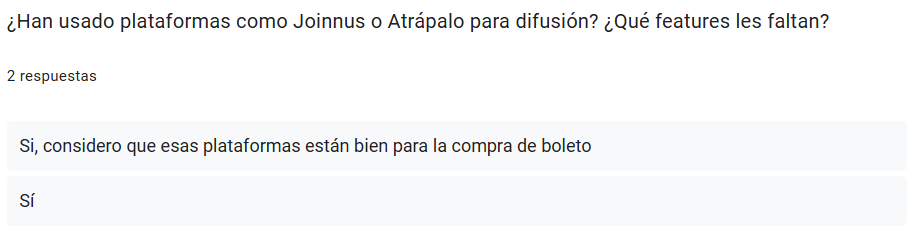
<br>
<p>
Los encuestados sí han utilizado plataformas conocidas de ventas de entradas y publicidad, lo que asegura una familiaridad con este tipo de sistemas. 
</p>
</div>

<div>
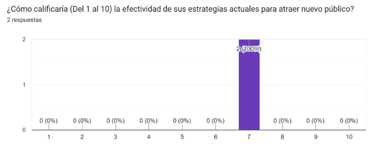
<br>
<p>
Los encuestados calificarían la efectividad de sus estrategias actuales para atraer nuevo público en un 7/10, lo que revela una oportunidad de mejora. 
</p>
</div>

## 2.3. Needfinding
### 2.3.1. User Persona

Los User Personas son arquetipos que representan a los segmentos de usuarios identificados para el proyecto Teatrope. Se construyen a partir del análisis de entrevistas preliminares y la observación de la competencia, con el fin de sintetizar comportamientos, necesidades, motivaciones y frustraciones comunes.
Estos perfiles no describen a individuos reales, sino a representaciones basadas en patrones recurrentes de los usuarios meta. Su objetivo es guiar el diseño de la plataforma, asegurando que las decisiones estratégicas respondan a necesidades concretas tanto de consumidores de teatro como de teatros y productores.

**User Persona 1: Consumidores de teatro**
<div align="center"></div>

**User Persona 2: Teatros y productores**
<div align="center"></div>

Estos dos User Personas guiarán el diseño de Teatrope, asegurando que la plataforma responda a los dos frentes clave: usuarios finales que buscan información y experiencias culturales y productores que requieren difusión y venta eficiente.

### 2.3.2. User Task Matrix
El presente User Task Matrix se construye a partir de los User Personas definidos previamente:
- Consumidor de teatro (Valeria Soto) → Representa a personas entre 10 y 60 años interesadas en el arte escénico y que buscan información centralizada sobre obras en Lima Metropolitana.
- Teatros y productores (Ricardo Guzmán) → Representa a teatros y compañías que requieren mayor visibilidad, venta de entradas y conexión con su público.<br>
El objetivo de esta matriz es identificar las tareas clave que cada segmento realiza en su vida real para cumplir sus objetivos culturales y de gestión, independientemente de la existencia de una plataforma como Teatrope.

| Tareas/Tasks                                                  | Frecuencia<br/>(Consumidor de teatro - Valeria) | Importancia<br/>(Consumidor de teatro - Valeria) |Frecuencia<br/>(Teatro y productor de teatro - Ricardo)| Importancia<br/>(Teatro y productor de teatro - Ricardo)|
|---------------------------------------------------------------|-------------------------------------------------|------------|----------|---------------------------------------------------------|
| Buscar información sobre obras (cartelera, horarios, géneros) |Alta| Muy Alta   |Media| Alta                                                    |
| Comprar entradas (online o boletería)                         |Media| Muy alta   |Alta| Muy alta                                                |
| Recibir/consultar recomendaciones o reseñas                   |Media| Alta       |Baja| Media                                                   |
| Compartir experiencias en redes sociales                      |Media| Media      |Baja| Baja                                                    |
| Descubrir nuevas obras o teatros                              |Media| Alta       |Media| Alta                                                    |
| Difundir obras y funciones (redes, prensa, afiches)           |Baja| Media      |Alta| Muy alta                                                |
| Gestionar disponibilidad y precios de entradas                |Baja| Media      |Alta| Muy alta                                                |
| Destacar funciones especiales (estrenos, festivales, invitados)|Baja|Media|Media| Muy alta                                                |
| Subir y actualizar información de obras en cartelera          |Baja| Baja       |Alta| Muy alta                                                |
| Establecer contacto con el público (comunidad, fidelización)  |Media| Alta       |Media| Muy alta                                                |
| Guardar o marcar obras de interés (“favoritos”)               |Media| Alta       |Media| Media                                                   |
|Verificar visibilidad de sus obras en la cartelera|Baja|Media|Alta| Alta                                                    |
|Compartir cartelera y obras con amigos/familia|Media|Media|Media| Media                                                   |

Con esta matriz, se observa que Teatrope debe equilibrar funciones que faciliten la búsqueda y compra de entradas para consumidores y al mismo tiempo ofrezcan a productores herramientas de difusión y gestión.

### 2.3.3. User Journey Mapping

El User Journey Mapping permite visualizar el recorrido actual (As-Is) que siguen los segmentos de usuarios para cumplir sus objetivos principales en relación con la oferta teatral de Lima Metropolitana.
En este caso, se elaboran los journey maps de cada User Persona:
- Consumidor (Valeria Soto): su viaje comienza al buscar información sobre obras y termina en la decisión de asistir (o no) a una función.
- Productor (Ricardo Guzmán): su viaje inicia al planificar una temporada y culmina en la difusión y monitoreo de sus funciones.<br>
El objetivo es identificar puntos de dolor, emociones y oportunidades en la situación actual sin la existencia de Teatrope.

**User Journey Map - Consumidor (Valeria Soto)**
<div align="center">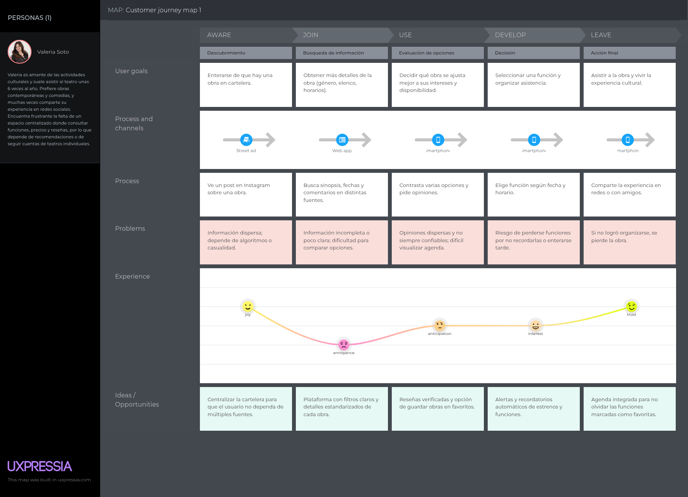 </div>

**User Journey Map - Productor (Ricardo Guzmán)**
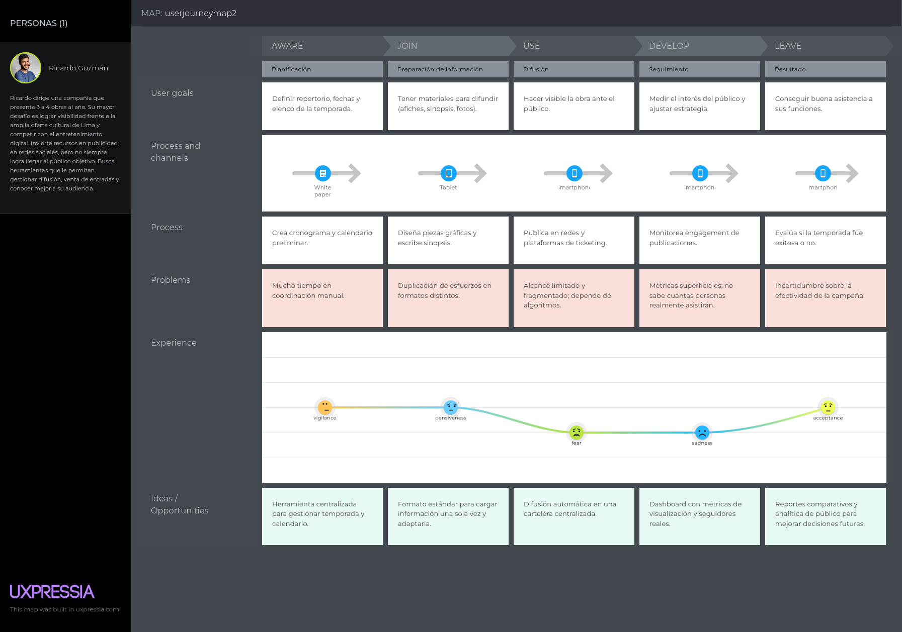
<br><br>
Se puede determinar que: 
- El consumidor sufre por la dispersión de información.
- El productor por la fragmentación en la difusión.<br>
Ambos comparten la necesidad de una cartelera centralizada como punto de encuentro.

### 2.3.4. Empathy Mapping
**Consumidores de teatro - Valeria Soto**
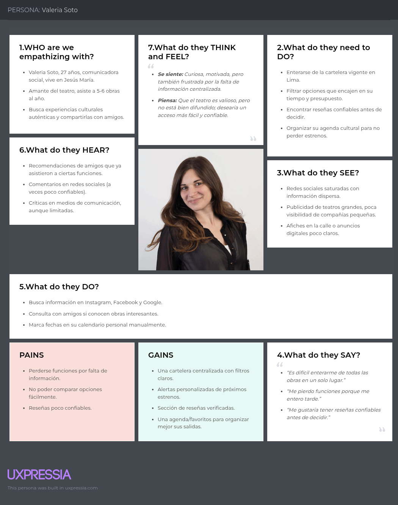
**Teatro y productor de teatro - Ricardo Guzmán**
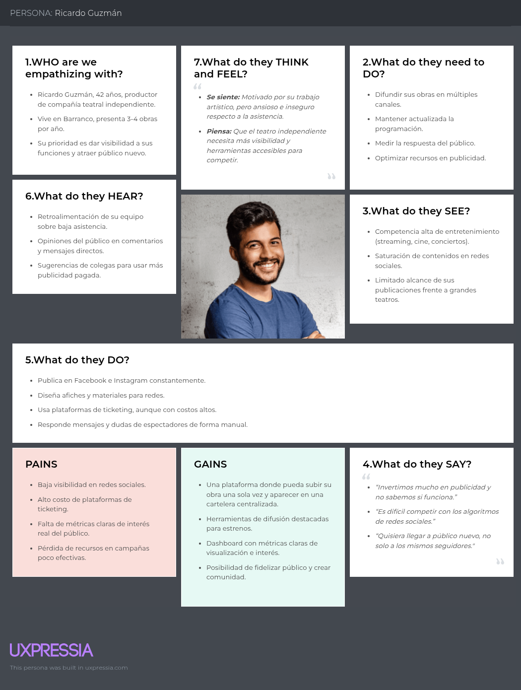
Con estos Empathy Maps, se evidencia que:
- El consumidor necesita información clara, centralizada y confiable.
- El productor necesita visibilidad, eficiencia en difusión y métricas.<br>
Ambos tienen dolores distintos, pero coinciden en que una plataforma como Teatrope sería el puente entre sus necesidades.

### 2.3.5. Ubiquitous Language

| **Term (English)** | **Término (Español)** | **Definition** |
|---------------------|------------------------|----------------|
| **User** | Usuario | Persona que accede a la plataforma, puede ser consumidor de teatro o productor. |
| **Theater Consumer** | Consumidor de teatro | Usuario que consulta la cartelera, guarda favoritos y recibe notificaciones sobre funciones. |
| **Producer** | Productor | Usuario encargado de publicar obras y gestionar funciones dentro de la plataforma. |
| **Production** | Obra teatral | Producción teatral con título, sinopsis, elenco y material multimedia asociado. |
| **Showtime** | Función | Presentación específica de una obra, definida por fecha, hora y teatro. |
| **Billboard** | Cartelera | Listado centralizado de todas las obras y funciones disponibles. |
| **Notification** | Notificación | Mensaje enviado al consumidor con recordatorios o novedades relevantes. |
| **Profile** | Perfil | Información básica y preferencias del usuario, incluyendo ubicación, rol y ajustes de notificaciones. |
| **Role** | Rol | Permisos asignados a cada usuario (ejemplo: consumidor, productor). |
| **Capacity** | Aforo | Número máximo de asistentes que puede recibir una función. |
| **Booking** | Reserva | Proceso por el cual un usuario aparta un espacio en una función  |
| **Discount** | Promoción | Beneficio aplicado a una obra o función para incentivar la asistencia. |
| **Visibility** | Visibilidad | Grado de exposición que tiene una obra dentro de la cartelera digital. |
| **Reminder** | Recordatorio | Alerta activada por el consumidor para no perder una función. |
| **Favorite** | Favorito | Marca que hace el consumidor sobre una obra para guardarla en su lista personal de interés. |

## 2.4 Requirements Specification

### 2.4.1 User Stories

<div style="max-width:900px;margin:0 auto;">
  <table style="width:100%;border-collapse:collapse;">
    <tr>
      <th style="text-align:left;border:1px solid #ccc;padding:8px;">Story ID</th>
      <th style="text-align:left;border:1px solid #ccc;padding:8px;">User</th>
      <th style="text-align:left;border:1px solid #ccc;padding:8px;">Priority</th>
      <th style="text-align:left;border:1px solid #ccc;padding:8px;">Epic</th>
    </tr>
    <tr>
      <td style="border:1px solid #ccc;padding:8px;">US001</td>
      <td style="border:1px solid #ccc;padding:8px;">Consumidor de teatro</td>
      <td style="border:1px solid #ccc;padding:8px;">Alta</td>
      <td style="border:1px solid #ccc;padding:8px;">01</td>
    </tr>
    <tr>
      <th colspan="4" style="border:1px solid #ccc;padding:10px;text-align:center;">
        Title: Ver la cartelera del dia
      </th>
    </tr>
    <tr>
      <th style="text-align:left;border:1px solid #ccc;padding:8px;width:20%;">Description</th>
      <td colspan="3" style="border:1px solid #ccc;padding:8px;">
        Como consumidor de teatro quiero ver la cartelera de las funciones del día de hoy
        para decidir rápidamente a qué obra asistir.
      </td>
    </tr>
    <tr>
      <th style="text-align:left;border:1px solid #ccc;padding:8px;">Acceptance Criteria</th>
      <td colspan="3" style="border:1px solid #ccc;padding:8px;line-height:1.5;">
        <strong>Scenario:</strong> Cartelera del día<br>
        <strong>Given</strong> que estoy en la pantalla de inicio,<br>
        <strong>When</strong> selecciono la opción “Cartelera”,<br>
        <strong>Then</strong> se muestran únicamente las funciones disponibles para esa fecha.
      </td>
    </tr>
  </table>
</div>

<div style="max-width:900px;margin:0 auto;">
  <table style="width:100%;border-collapse:collapse;">
    <tr>
      <th style="text-align:left;border:1px solid #ccc;padding:8px;">Story ID</th>
      <th style="text-align:left;border:1px solid #ccc;padding:8px;">User</th>
      <th style="text-align:left;border:1px solid #ccc;padding:8px;">Priority</th>
      <th style="text-align:left;border:1px solid #ccc;padding:8px;">Epic</th>
    </tr>
    <tr>
      <td style="border:1px solid #ccc;padding:8px;">US002</td>
      <td style="border:1px solid #ccc;padding:8px;">Consumidor de teatro</td>
      <td style="border:1px solid #ccc;padding:8px;">Alta</td>
      <td style="border:1px solid #ccc;padding:8px;">01</td>
    </tr>
    <tr>
      <th colspan="4" style="border:1px solid #ccc;padding:10px;text-align:center;">
        Title: Buscar por obra o teatro
      </th>
    </tr>
    <tr>
      <th style="text-align:left;border:1px solid #ccc;padding:8px;width:20%;">Description</th>
      <td colspan="3" style="border:1px solid #ccc;padding:8px;">
        Como consumidor de teatro quiero buscar por nombre de obra o teatro
        para encontrar fácilmente lo que estoy buscando.
      </td>
    </tr>
    <tr>
      <th style="text-align:left;border:1px solid #ccc;padding:8px;">Acceptance Criteria</th>
      <td colspan="3" style="border:1px solid #ccc;padding:8px;line-height:1.5;">
        <strong>Scenario:</strong> Búsqueda por texto<br>
        <strong>Given</strong> que estoy en la barra de búsqueda,<br>
        <strong>When</strong> ingreso un término y confirmo,<br>
        <strong>Then</strong> se muestran resultados relevantes.
      </td>
    </tr>
  </table>
</div>

<div style="max-width:900px;margin:0 auto;">
  <table style="width:100%;border-collapse:collapse;">
    <tr>
      <th style="text-align:left;border:1px solid #ccc;padding:8px;">Story ID</th>
      <th style="text-align:left;border:1px solid #ccc;padding:8px;">User</th>
      <th style="text-align:left;border:1px solid #ccc;padding:8px;">Priority</th>
      <th style="text-align:left;border:1px solid #ccc;padding:8px;">Epic</th>
    </tr>
    <tr>
      <td style="border:1px solid #ccc;padding:8px;">US003</td>
      <td style="border:1px solid #ccc;padding:8px;">Consumidor de teatro</td>
      <td style="border:1px solid #ccc;padding:8px;">Media</td>
      <td style="border:1px solid #ccc;padding:8px;">01</td>
    </tr>
    <tr>
      <th colspan="4" style="border:1px solid #ccc;padding:10px;text-align:center;">
        Title: Filtrar por fecha
      </th>
    </tr>
    <tr>
      <th style="text-align:left;border:1px solid #ccc;padding:8px;width:20%;">Description</th>
      <td colspan="3" style="border:1px solid #ccc;padding:8px;">
        Como consumidor de teatro quiero filtrar las funciones por fecha
        para ver únicamente aquellas de un día específico.
      </td>
    </tr>
    <tr>
      <th style="text-align:left;border:1px solid #ccc;padding:8px;">Acceptance Criteria</th>
      <td colspan="3" style="border:1px solid #ccc;padding:8px;line-height:1.5;">
        <strong>Scenario:</strong> Filtro por fecha<br>
        <strong>Given</strong> que tengo el panel de filtros abierto,<br>
        <strong>When</strong> selecciono una fecha,<br>
        <strong>Then</strong> la lista muestra solo funciones de ese día.
      </td>
    </tr>
  </table>
</div>

<div style="max-width:900px;margin:0 auto;">
  <table style="width:100%;border-collapse:collapse;">
    <tr>
      <th style="text-align:left;border:1px solid #ccc;padding:8px;">Story ID</th>
      <th style="text-align:left;border:1px solid #ccc;padding:8px;">User</th>
      <th style="text-align:left;border:1px solid #ccc;padding:8px;">Priority</th>
      <th style="text-align:left;border:1px solid #ccc;padding:8px;">Epic</th>
    </tr>
    <tr>
      <td style="border:1px solid #ccc;padding:8px;">US004</td>
      <td style="border:1px solid #ccc;padding:8px;">Consumidor de teatro</td>
      <td style="border:1px solid #ccc;padding:8px;">Media</td>
      <td style="border:1px solid #ccc;padding:8px;">01</td>
    </tr>
    <tr>
      <th colspan="4" style="border:1px solid #ccc;padding:10px;text-align:center;">
        Title: Filtrar por distrito
      </th>
    </tr>
    <tr>
      <th style="text-align:left;border:1px solid #ccc;padding:8px;width:20%;">Description</th>
      <td colspan="3" style="border:1px solid #ccc;padding:8px;">
        Como consumidor de teatro quiero filtrar las funciones por distrito
        para limitar la búsqueda a mi zona de interés.
      </td>
    </tr>
    <tr>
      <th style="text-align:left;border:1px solid #ccc;padding:8px;">Acceptance Criteria</th>
      <td colspan="3" style="border:1px solid #ccc;padding:8px;line-height:1.5;">
        <strong>Scenario:</strong> Filtro por distrito<br>
        <strong>Given</strong> que tengo el panel de filtros abierto,<br>
        <strong>When</strong> selecciono un distrito,<br>
        <strong>Then</strong> la lista muestra únicamente las funciones en ese distrito.
      </td>
    </tr>
  </table>
</div>

<div style="max-width:900px;margin:0 auto;">
  <table style="width:100%;border-collapse:collapse;">
    <tr>
      <th style="text-align:left;border:1px solid #ccc;padding:8px;">Story ID</th>
      <th style="text-align:left;border:1px solid #ccc;padding:8px;">User</th>
      <th style="text-align:left;border:1px solid #ccc;padding:8px;">Priority</th>
      <th style="text-align:left;border:1px solid #ccc;padding:8px;">Epic</th>
    </tr>
    <tr>
      <td style="border:1px solid #ccc;padding:8px;">US005</td>
      <td style="border:1px solid #ccc;padding:8px;">Consumidor de teatro</td>
      <td style="border:1px solid #ccc;padding:8px;">Baja</td>
      <td style="border:1px solid #ccc;padding:8px;">01</td>
    </tr>
    <tr>
      <th colspan="4" style="border:1px solid #ccc;padding:10px;text-align:center;">
        Title: Ordenar por hora
      </th>
    </tr>
    <tr>
      <th style="text-align:left;border:1px solid #ccc;padding:8px;width:20%;">Description</th>
      <td colspan="3" style="border:1px solid #ccc;padding:8px;">
        Como consumidor de teatro quiero ordenar las funciones por hora
        para ver cuáles ocurren primero.
      </td>
    </tr>
    <tr>
      <th style="text-align:left;border:1px solid #ccc;padding:8px;">Acceptance Criteria</th>
      <td colspan="3" style="border:1px solid #ccc;padding:8px;line-height:1.5;">
        <strong>Scenario:</strong> Orden por hora<br>
        <strong>Given</strong> que tengo una lista de funciones en pantalla,<br>
        <strong>When</strong> selecciono la opción de ordenar por hora,<br>
        <strong>Then</strong> la lista se organiza ascendentemente según el horario.
      </td>
    </tr>
  </table>
</div>

<div style="max-width:900px;margin:0 auto;">
  <table style="width:100%;border-collapse:collapse;">
    <tr>
      <th style="text-align:left;border:1px solid #ccc;padding:8px;">Story ID</th>
      <th style="text-align:left;border:1px solid #ccc;padding:8px;">User</th>
      <th style="text-align:left;border:1px solid #ccc;padding:8px;">Priority</th>
      <th style="text-align:left;border:1px solid #ccc;padding:8px;">Epic</th>
    </tr>
    <tr>
      <td style="border:1px solid #ccc;padding:8px;">US006</td>
      <td style="border:1px solid #ccc;padding:8px;">Consumidor de teatro</td>
      <td style="border:1px solid #ccc;padding:8px;">Alta</td>
      <td style="border:1px solid #ccc;padding:8px;">02</td>
    </tr>
    <tr>
      <th colspan="4" style="border:1px solid #ccc;padding:10px;text-align:center;">
        Title: Ver ficha de obra
      </th>
    </tr>
    <tr>
      <th style="text-align:left;border:1px solid #ccc;padding:8px;width:20%;">Description</th>
      <td colspan="3" style="border:1px solid #ccc;padding:8px;">
        Como consumidor de teatro quiero ver la ficha de la obra con sinopsis, elenco y horarios 
        para decidir si asistir.
      </td>
    </tr>
    <tr>
      <th style="text-align:left;border:1px solid #ccc;padding:8px;">Acceptance Criteria</th>
      <td colspan="3" style="border:1px solid #ccc;padding:8px;line-height:1.5;">
        <strong>Scenario:</strong> Ver ficha<br>
        <strong>Given</strong> que estoy en una lista,<br>
        <strong>When</strong> toco una obra,<br>
        <strong>Then</strong> se muestra la sinopsis, elenco y horarios.
      </td>
    </tr>
  </table>
</div>

<div style="max-width:900px;margin:0 auto;">
  <table style="width:100%;border-collapse:collapse;">
    <tr>
      <th style="text-align:left;border:1px solid #ccc;padding:8px;">Story ID</th>
      <th style="text-align:left;border:1px solid #ccc;padding:8px;">User</th>
      <th style="text-align:left;border:1px solid #ccc;padding:8px;">Priority</th>
      <th style="text-align:left;border:1px solid #ccc;padding:8px;">Epic</th>
    </tr>
    <tr>
      <td style="border:1px solid #ccc;padding:8px;">US007</td>
      <td style="border:1px solid #ccc;padding:8px;">Consumidor de teatro</td>
      <td style="border:1px solid #ccc;padding:8px;">Media</td>
      <td style="border:1px solid #ccc;padding:8px;">02</td>
    </tr>
    <tr>
      <th colspan="4" style="border:1px solid #ccc;padding:10px;text-align:center;">
        Title: Ver mapa del teatro
      </th>
    </tr>
    <tr>
      <th style="text-align:left;border:1px solid #ccc;padding:8px;width:20%;">Description</th>
      <td colspan="3" style="border:1px solid #ccc;padding:8px;">
        Como consumidor de teatro quiero ver un mapa con la ubicación del teatro 
        para orientarme fácilmente.
      </td>
    </tr>
    <tr>
      <th style="text-align:left;border:1px solid #ccc;padding:8px;">Acceptance Criteria</th>
      <td colspan="3" style="border:1px solid #ccc;padding:8px;line-height:1.5;">
        <strong>Scenario:</strong> Ver mapa<br>
        <strong>Given</strong> que estoy en la ficha de la obra,<br>
        <strong>When</strong> selecciono “Mapa”,<br>
        <strong>Then</strong> veo la ubicación y opción de abrir en Google Maps.
      </td>
    </tr>
  </table>
</div>

<div style="max-width:900px;margin:0 auto;">
  <table style="width:100%;border-collapse:collapse;">
    <tr>
      <th style="text-align:left;border:1px solid #ccc;padding:8px;">Story ID</th>
      <th style="text-align:left;border:1px solid #ccc;padding:8px;">User</th>
      <th style="text-align:left;border:1px solid #ccc;padding:8px;">Priority</th>
      <th style="text-align:left;border:1px solid #ccc;padding:8px;">Epic</th>
    </tr>
    <tr>
      <td style="border:1px solid #ccc;padding:8px;">US008</td>
      <td style="border:1px solid #ccc;padding:8px;">Consumidor de teatro</td>
      <td style="border:1px solid #ccc;padding:8px;">Alta</td>
      <td style="border:1px solid #ccc;padding:8px;">02</td>
    </tr>
    <tr>
      <th colspan="4" style="border:1px solid #ccc;padding:10px;text-align:center;">
        Title: Abrir enlace de compra externo
      </th>
    </tr>
    <tr>
      <th style="text-align:left;border:1px solid #ccc;padding:8px;width:20%;">Description</th>
      <td colspan="3" style="border:1px solid #ccc;padding:8px;">
        Como consumidor de teatro quiero abrir el enlace de compra externo desde la ficha de la obra 
        para adquirir entradas.
      </td>
    </tr>
    <tr>
      <th style="text-align:left;border:1px solid #ccc;padding:8px;">Acceptance Criteria</th>
      <td colspan="3" style="border:1px solid #ccc;padding:8px;line-height:1.5;">
        <strong>Scenario:</strong> Enlace externo<br>
        <strong>Given</strong> que estoy en la ficha,<br>
        <strong>When</strong> selecciono “Comprar”,<br>
        <strong>Then</strong> se abre el sitio externo correspondiente.
      </td>
    </tr>
  </table>
</div>

<div style="max-width:900px;margin:0 auto;">
  <table style="width:100%;border-collapse:collapse;">
    <tr>
      <th style="text-align:left;border:1px solid #ccc;padding:8px;">Story ID</th>
      <th style="text-align:left;border:1px solid #ccc;padding:8px;">User</th>
      <th style="text-align:left;border:1px solid #ccc;padding:8px;">Priority</th>
      <th style="text-align:left;border:1px solid #ccc;padding:8px;">Epic</th>
    </tr>
    <tr>
      <td style="border:1px solid #ccc;padding:8px;">US009</td>
      <td style="border:1px solid #ccc;padding:8px;">Consumidor de teatro</td>
      <td style="border:1px solid #ccc;padding:8px;">Baja</td>
      <td style="border:1px solid #ccc;padding:8px;">02</td>
    </tr>
    <tr>
      <th colspan="4" style="border:1px solid #ccc;padding:10px;text-align:center;">
        Title: Ver galería de fotos
      </th>
    </tr>
    <tr>
      <th style="text-align:left;border:1px solid #ccc;padding:8px;width:20%;">Description</th>
      <td colspan="3" style="border:1px solid #ccc;padding:8px;">
        Como consumidor de teatro quiero ver imágenes de la obra 
        para conocer mejor la producción antes de asistir.
      </td>
    </tr>
    <tr>
      <th style="text-align:left;border:1px solid #ccc;padding:8px;">Acceptance Criteria</th>
      <td colspan="3" style="border:1px solid #ccc;padding:8px;line-height:1.5;">
        <strong>Scenario:</strong> Galería<br>
        <strong>Given</strong> que estoy en la ficha,<br>
        <strong>When</strong> abro “Fotos”,<br>
        <strong>Then</strong> veo un carrusel con imágenes de la obra.
      </td>
    </tr>
  </table>
</div>

<div style="max-width:900px;margin:0 auto;">
  <table style="width:100%;border-collapse:collapse;">
    <tr>
      <th style="text-align:left;border:1px solid #ccc;padding:8px;">Story ID</th>
      <th style="text-align:left;border:1px solid #ccc;padding:8px;">User</th>
      <th style="text-align:left;border:1px solid #ccc;padding:8px;">Priority</th>
      <th style="text-align:left;border:1px solid #ccc;padding:8px;">Epic</th>
    </tr>
    <tr>
      <td style="border:1px solid #ccc;padding:8px;">US010</td>
      <td style="border:1px solid #ccc;padding:8px;">Consumidor de teatro</td>
      <td style="border:1px solid #ccc;padding:8px;">Media</td>
      <td style="border:1px solid #ccc;padding:8px;">02</td>
    </tr>
    <tr>
      <th colspan="4" style="border:1px solid #ccc;padding:10px;text-align:center;">
        Title: Compartir ficha de obra
      </th>
    </tr>
    <tr>
      <th style="text-align:left;border:1px solid #ccc;padding:8px;width:20%;">Description</th>
      <td colspan="3" style="border:1px solid #ccc;padding:8px;">
        Como consumidor de teatro quiero compartir la ficha de una obra por link 
        para invitar a otros.
      </td>
    </tr>
    <tr>
      <th style="text-align:left;border:1px solid #ccc;padding:8px;">Acceptance Criteria</th>
      <td colspan="3" style="border:1px solid #ccc;padding:8px;line-height:1.5;">
        <strong>Scenario:</strong> Compartir ficha<br>
        <strong>Given</strong> que estoy en la ficha,<br>
        <strong>When</strong> selecciono “Compartir”,<br>
        <strong>Then</strong> se abre el menú de compartir con enlace disponible.
      </td>
    </tr>
  </table>
</div>

<div style="max-width:900px;margin:0 auto;">
  <table style="width:100%;border-collapse:collapse;">
    <tr>
      <th style="text-align:left;border:1px solid #ccc;padding:8px;">Story ID</th>
      <th style="text-align:left;border:1px solid #ccc;padding:8px;">User</th>
      <th style="text-align:left;border:1px solid #ccc;padding:8px;">Priority</th>
      <th style="text-align:left;border:1px solid #ccc;padding:8px;">Epic</th>
    </tr>
    <tr>
      <td style="border:1px solid #ccc;padding:8px;">US011</td>
      <td style="border:1px solid #ccc;padding:8px;">Productor</td>
      <td style="border:1px solid #ccc;padding:8px;">Media</td>
      <td style="border:1px solid #ccc;padding:8px;">03</td>
    </tr>
    <tr>
      <th colspan="4" style="border:1px solid #ccc;padding:10px;text-align:center;">
        Title: Ver estado de publicación
      </th>
    </tr>
    <tr>
      <th style="text-align:left;border:1px solid #ccc;padding:8px;width:20%;">Description</th>
      <td colspan="3" style="border:1px solid #ccc;padding:8px;">
        Como productor quiero ver el estado de publicación de mis obras 
        para saber cuáles están visibles en la cartelera.
      </td>
    </tr>
    <tr>
      <th style="text-align:left;border:1px solid #ccc;padding:8px;">Acceptance Criteria</th>
      <td colspan="3" style="border:1px solid #ccc;padding:8px;line-height:1.5;">
        <strong>Scenario:</strong> Estado de publicación<br>
        <strong>Given</strong> que inicio sesión,<br>
        <strong>When</strong> abro “Mis obras”,<br>
        <strong>Then</strong> veo el estado (publicado o borrador) de cada obra.
      </td>
    </tr>
  </table>
</div>

<div style="max-width:900px;margin:0 auto;">
  <table style="width:100%;border-collapse:collapse;">
    <tr>
      <th style="text-align:left;border:1px solid #ccc;padding:8px;">Story ID</th>
      <th style="text-align:left;border:1px solid #ccc;padding:8px;">User</th>
      <th style="text-align:left;border:1px solid #ccc;padding:8px;">Priority</th>
      <th style="text-align:left;border:1px solid #ccc;padding:8px;">Epic</th>
    </tr>
    <tr>
      <td style="border:1px solid #ccc;padding:8px;">US012</td>
      <td style="border:1px solid #ccc;padding:8px;">Productor</td>
      <td style="border:1px solid #ccc;padding:8px;">Media</td>
      <td style="border:1px solid #ccc;padding:8px;">03</td>
    </tr>
    <tr>
      <th colspan="4" style="border:1px solid #ccc;padding:10px;text-align:center;">
        Title: Ver última actualización de datos
      </th>
    </tr>
    <tr>
      <th style="text-align:left;border:1px solid #ccc;padding:8px;width:20%;">Description</th>
      <td colspan="3" style="border:1px solid #ccc;padding:8px;">
        Como productor quiero ver la fecha y hora de la última actualización de mis obras 
        para asegurar que la información esté vigente.
      </td>
    </tr>
    <tr>
      <th style="text-align:left;border:1px solid #ccc;padding:8px;">Acceptance Criteria</th>
      <td colspan="3" style="border:1px solid #ccc;padding:8px;line-height:1.5;">
        <strong>Scenario:</strong> Ver frescura<br>
        <strong>Given</strong> que estoy en el panel de control,<br>
        <strong>When</strong> consulto una obra,<br>
        <strong>Then</strong> se muestra la fecha y hora de última actualización.
      </td>
    </tr>
  </table>
</div>

<div style="max-width:900px;margin:0 auto;">
  <table style="width:100%;border-collapse:collapse;">
    <tr>
      <th style="text-align:left;border:1px solid #ccc;padding:8px;">Story ID</th>
      <th style="text-align:left;border:1px solid #ccc;padding:8px;">User</th>
      <th style="text-align:left;border:1px solid #ccc;padding:8px;">Priority</th>
      <th style="text-align:left;border:1px solid #ccc;padding:8px;">Epic</th>
    </tr>
    <tr>
      <td style="border:1px solid #ccc;padding:8px;">US013</td>
      <td style="border:1px solid #ccc;padding:8px;">Productor</td>
      <td style="border:1px solid #ccc;padding:8px;">Alta</td>
      <td style="border:1px solid #ccc;padding:8px;">03</td>
    </tr>
    <tr>
      <th colspan="4" style="border:1px solid #ccc;padding:10px;text-align:center;">
        Title: Editar información de obra publicada
      </th>
    </tr>
    <tr>
      <th style="text-align:left;border:1px solid #ccc;padding:8px;width:20%;">Description</th>
      <td colspan="3" style="border:1px solid #ccc;padding:8px;">
        Como productor quiero editar los datos de una obra publicada 
        para corregir errores o actualizar información.
      </td>
    </tr>
    <tr>
      <th style="text-align:left;border:1px solid #ccc;padding:8px;">Acceptance Criteria</th>
      <td colspan="3" style="border:1px solid #ccc;padding:8px;line-height:1.5;">
        <strong>Scenario:</strong> Editar obra<br>
        <strong>Given</strong> que tengo una obra publicada,<br>
        <strong>When</strong> modifico información y guardo,<br>
        <strong>Then</strong> los cambios se reflejan en la vista pública.
      </td>
    </tr>
  </table>
</div>

<div style="max-width:900px;margin:0 auto;">
  <table style="width:100%;border-collapse:collapse;">
    <tr>
      <th style="text-align:left;border:1px solid #ccc;padding:8px;">Story ID</th>
      <th style="text-align:left;border:1px solid #ccc;padding:8px;">User</th>
      <th style="text-align:left;border:1px solid #ccc;padding:8px;">Priority</th>
      <th style="text-align:left;border:1px solid #ccc;padding:8px;">Epic</th>
    </tr>
    <tr>
      <td style="border:1px solid #ccc;padding:8px;">US014</td>
      <td style="border:1px solid #ccc;padding:8px;">Productor</td>
      <td style="border:1px solid #ccc;padding:8px;">Baja</td>
      <td style="border:1px solid #ccc;padding:8px;">03</td>
    </tr>
    <tr>
      <th colspan="4" style="border:1px solid #ccc;padding:10px;text-align:center;">
        Title: Reportar enlace roto
      </th>
    </tr>
    <tr>
      <th style="text-align:left;border:1px solid #ccc;padding:8px;width:20%;">Description</th>
      <td colspan="3" style="border:1px solid #ccc;padding:8px;">
        Como productor quiero reportar enlaces de compra rotos 
        para que puedan ser corregidos a tiempo.
      </td>
    </tr>
    <tr>
      <th style="text-align:left;border:1px solid #ccc;padding:8px;">Acceptance Criteria</th>
      <td colspan="3" style="border:1px solid #ccc;padding:8px;line-height:1.5;">
        <strong>Scenario:</strong> Enlace roto<br>
        <strong>Given</strong> que detecto un enlace incorrecto,<br>
        <strong>When</strong> lo marco como roto,<br>
        <strong>Then</strong> el sistema registra el reporte.
      </td>
    </tr>
  </table>
</div>

<div style="max-width:900px;margin:0 auto;">
  <table style="width:100%;border-collapse:collapse;">
    <tr>
      <th style="text-align:left;border:1px solid #ccc;padding:8px;">Story ID</th>
      <th style="text-align:left;border:1px solid #ccc;padding:8px;">User</th>
      <th style="text-align:left;border:1px solid #ccc;padding:8px;">Priority</th>
      <th style="text-align:left;border:1px solid #ccc;padding:8px;">Epic</th>
    </tr>
    <tr>
      <td style="border:1px solid #ccc;padding:8px;">US015</td>
      <td style="border:1px solid #ccc;padding:8px;">Productor</td>
      <td style="border:1px solid #ccc;padding:8px;">Alta</td>
      <td style="border:1px solid #ccc;padding:8px;">04</td>
    </tr>
    <tr>
      <th colspan="4" style="border:1px solid #ccc;padding:10px;text-align:center;">
        Title: Iniciar sesión
      </th>
    </tr>
    <tr>
      <th style="text-align:left;border:1px solid #ccc;padding:8px;width:20%;">Description</th>
      <td colspan="3" style="border:1px solid #ccc;padding:8px;">
        Como productor quiero iniciar sesión en la plataforma 
        para gestionar mis obras.
      </td>
    </tr>
    <tr>
      <th style="text-align:left;border:1px solid #ccc;padding:8px;">Acceptance Criteria</th>
      <td colspan="3" style="border:1px solid #ccc;padding:8px;line-height:1.5;">
        <strong>Scenario:</strong> Login<br>
        <strong>Given</strong> que tengo una cuenta válida,<br>
        <strong>When</strong> ingreso usuario y contraseña,<br>
        <strong>Then</strong> accedo al panel de gestión.
      </td>
    </tr>
  </table>
</div>
<div style="max-width:900px;margin:0 auto;">
  <table style="width:100%;border-collapse:collapse;">
    <tr>
      <th style="text-align:left;border:1px solid #ccc;padding:8px;">Story ID</th>
      <th style="text-align:left;border:1px solid #ccc;padding:8px;">User</th>
      <th style="text-align:left;border:1px solid #ccc;padding:8px;">Priority</th>
      <th style="text-align:left;border:1px solid #ccc;padding:8px;">Epic</th>
    </tr>
    <tr>
      <td style="border:1px solid #ccc;padding:8px;">US017</td>
      <td style="border:1px solid #ccc;padding:8px;">Productor</td>
      <td style="border:1px solid #ccc;padding:8px;">Alta</td>
      <td style="border:1px solid #ccc;padding:8px;">04</td>
    </tr>
    <tr>
      <th colspan="4" style="border:1px solid #ccc;padding:10px;text-align:center;">
        Title: Agregar funciones a una obra
      </th>
    </tr>
    <tr>
      <th style="text-align:left;border:1px solid #ccc;padding:8px;width:20%;">Description</th>
      <td colspan="3" style="border:1px solid #ccc;padding:8px;">
        Como productor quiero añadir fechas, horas y salas a mis obras 
        para completar la cartelera.
      </td>
    </tr>
    <tr>
      <th style="text-align:left;border:1px solid #ccc;padding:8px;">Acceptance Criteria</th>
      <td colspan="3" style="border:1px solid #ccc;padding:8px;line-height:1.5;">
        <strong>Scenario:</strong> Agregar función<br>
        <strong>Given</strong> que tengo una obra creada,<br>
        <strong>When</strong> registro fecha, hora y sala,<br>
        <strong>Then</strong> la función aparece en la ficha pública.
      </td>
    </tr>
  </table>
</div>

<div style="max-width:900px;margin:0 auto;">
  <table style="width:100%;border-collapse:collapse;">
    <tr>
      <th style="text-align:left;border:1px solid #ccc;padding:8px;">Story ID</th>
      <th style="text-align:left;border:1px solid #ccc;padding:8px;">User</th>
      <th style="text-align:left;border:1px solid #ccc;padding:8px;">Priority</th>
      <th style="text-align:left;border:1px solid #ccc;padding:8px;">Epic</th>
    </tr>
    <tr>
      <td style="border:1px solid #ccc;padding:8px;">US018</td>
      <td style="border:1px solid #ccc;padding:8px;">Productor</td>
      <td style="border:1px solid #ccc;padding:8px;">Media</td>
      <td style="border:1px solid #ccc;padding:8px;">04</td>
    </tr>
    <tr>
      <th colspan="4" style="border:1px solid #ccc;padding:10px;text-align:center;">
        Title: Publicar u ocultar obra
      </th>
    </tr>
    <tr>
      <th style="text-align:left;border:1px solid #ccc;padding:8px;width:20%;">Description</th>
      <td colspan="3" style="border:1px solid #ccc;padding:8px;">
        Como productor quiero controlar la visibilidad de mis obras 
        para decidir cuándo aparecen en la cartelera.
      </td>
    </tr>
    <tr>
      <th style="text-align:left;border:1px solid #ccc;padding:8px;">Acceptance Criteria</th>
      <td colspan="3" style="border:1px solid #ccc;padding:8px;line-height:1.5;">
        <strong>Scenario:</strong> Visibilidad<br>
        <strong>Given</strong> que tengo una obra creada,<br>
        <strong>When</strong> cambio su estado a publicado/oculto,<br>
        <strong>Then</strong> la obra aparece o desaparece de la cartelera pública.
      </td>
    </tr>
  </table>
</div>
<div style="max-width:900px;margin:0 auto;">
  <table style="width:100%;border-collapse:collapse;">
    <tr>
      <th style="text-align:left;border:1px solid #ccc;padding:8px;">Story ID</th>
      <th style="text-align:left;border:1px solid #ccc;padding:8px;">User</th>
      <th style="text-align:left;border:1px solid #ccc;padding:8px;">Priority</th>
      <th style="text-align:left;border:1px solid #ccc;padding:8px;">Epic</th>
    </tr>
    <tr>
      <td style="border:1px solid #ccc;padding:8px;">US016</td>
      <td style="border:1px solid #ccc;padding:8px;">Productor</td>
      <td style="border:1px solid #ccc;padding:8px;">Alta</td>
      <td style="border:1px solid #ccc;padding:8px;">04</td>
    </tr>
    <tr>
      <th colspan="4" style="border:1px solid #ccc;padding:10px;text-align:center;">
        Title: Crear obra
      </th>
    </tr>
    <tr>
      <th style="text-align:left;border:1px solid #ccc;padding:8px;width:20%;">Description</th>
      <td colspan="3" style="border:1px solid #ccc;padding:8px;">
        Como productor quiero registrar una nueva obra con título, sinopsis e imagen 
        para publicarla en la cartelera.
      </td>
    </tr>
    <tr>
      <th style="text-align:left;border:1px solid #ccc;padding:8px;">Acceptance Criteria</th>
      <td colspan="3" style="border:1px solid #ccc;padding:8px;line-height:1.5;">
        <strong>Scenario:</strong> Crear obra<br>
        <strong>Given</strong> que inicio sesión,<br>
        <strong>When</strong> completo los campos obligatorios,<br>
        <strong>Then</strong> la obra queda registrada en el sistema.
      </td>
    </tr>
  </table>
</div>

<div style="max-width:900px;margin:0 auto;">
  <table style="width:100%;border-collapse:collapse;">
    <tr>
      <th style="text-align:left;border:1px solid #ccc;padding:8px;">Story ID</th>
      <th style="text-align:left;border:1px solid #ccc;padding:8px;">User</th>
      <th style="text-align:left;border:1px solid #ccc;padding:8px;">Priority</th>
      <th style="text-align:left;border:1px solid #ccc;padding:8px;">Epic</th>
    </tr>
    <tr>
      <td style="border:1px solid #ccc;padding:8px;">US017</td>
      <td style="border:1px solid #ccc;padding:8px;">Productor</td>
      <td style="border:1px solid #ccc;padding:8px;">Alta</td>
      <td style="border:1px solid #ccc;padding:8px;">04</td>
    </tr>
    <tr>
      <th colspan="4" style="border:1px solid #ccc;padding:10px;text-align:center;">
        Title: Agregar funciones a una obra
      </th>
    </tr>
    <tr>
      <th style="text-align:left;border:1px solid #ccc;padding:8px;width:20%;">Description</th>
      <td colspan="3" style="border:1px solid #ccc;padding:8px;">
        Como productor quiero añadir fechas, horas y salas a mis obras 
        para completar la cartelera.
      </td>
    </tr>
    <tr>
      <th style="text-align:left;border:1px solid #ccc;padding:8px;">Acceptance Criteria</th>
      <td colspan="3" style="border:1px solid #ccc;padding:8px;line-height:1.5;">
        <strong>Scenario:</strong> Agregar función<br>
        <strong>Given</strong> que tengo una obra creada,<br>
        <strong>When</strong> registro fecha, hora y sala,<br>
        <strong>Then</strong> la función aparece en la ficha pública.
      </td>
    </tr>
  </table>
</div>
<div style="max-width:900px;margin:0 auto;">
  <table style="width:100%;border-collapse:collapse;">
    <tr>
      <th style="text-align:left;border:1px solid #ccc;padding:8px;">Story ID</th>
      <th style="text-align:left;border:1px solid #ccc;padding:8px;">User</th>
      <th style="text-align:left;border:1px solid #ccc;padding:8px;">Priority</th>
      <th style="text-align:left;border:1px solid #ccc;padding:8px;">Epic</th>
    </tr>
    <tr>
      <td style="border:1px solid #ccc;padding:8px;">US019</td>
      <td style="border:1px solid #ccc;padding:8px;">Productor</td>
      <td style="border:1px solid #ccc;padding:8px;">Media</td>
      <td style="border:1px solid #ccc;padding:8px;">04</td>
    </tr>
    <tr>
      <th colspan="4" style="border:1px solid #ccc;padding:10px;text-align:center;">
        Title: Añadir enlace de compra
      </th>
    </tr>
    <tr>
      <th style="text-align:left;border:1px solid #ccc;padding:8px;width:20%;">Description</th>
      <td colspan="3" style="border:1px solid #ccc;padding:8px;">
        Como productor quiero añadir el enlace de compra de entradas 
        para redirigir al usuario a la boletería oficial.
      </td>
    </tr>
    <tr>
      <th style="text-align:left;border:1px solid #ccc;padding:8px;">Acceptance Criteria</th>
      <td colspan="3" style="border:1px solid #ccc;padding:8px;line-height:1.5;">
        <strong>Scenario:</strong> Enlace de compra<br>
        <strong>Given</strong> que edito una obra,<br>
        <strong>When</strong> agrego una URL válida,<br>
        <strong>Then</strong> aparece el botón “Comprar” en la ficha de la obra.
      </td>
    </tr>
  </table>
</div>

<div style="max-width:900px;margin:0 auto;">
  <table style="width:100%;border-collapse:collapse;">
    <tr>
      <th style="text-align:left;border:1px solid #ccc;padding:8px;">Story ID</th>
      <th style="text-align:left;border:1px solid #ccc;padding:8px;">User</th>
      <th style="text-align:left;border:1px solid #ccc;padding:8px;">Priority</th>
      <th style="text-align:left;border:1px solid #ccc;padding:8px;">Epic</th>
    </tr>
    <tr>
      <td style="border:1px solid #ccc;padding:8px;">US018</td>
      <td style="border:1px solid #ccc;padding:8px;">Productor</td>
      <td style="border:1px solid #ccc;padding:8px;">Media</td>
      <td style="border:1px solid #ccc;padding:8px;">04</td>
    </tr>
    <tr>
      <th colspan="4" style="border:1px solid #ccc;padding:10px;text-align:center;">
        Title: Publicar u ocultar obra
      </th>
    </tr>
    <tr>
      <th style="text-align:left;border:1px solid #ccc;padding:8px;width:20%;">Description</th>
      <td colspan="3" style="border:1px solid #ccc;padding:8px;">
        Como productor quiero controlar la visibilidad de mis obras 
        para decidir cuándo aparecen en la cartelera.
      </td>
    </tr>
    <tr>
      <th style="text-align:left;border:1px solid #ccc;padding:8px;">Acceptance Criteria</th>
      <td colspan="3" style="border:1px solid #ccc;padding:8px;line-height:1.5;">
        <strong>Scenario:</strong> Visibilidad<br>
        <strong>Given</strong> que tengo una obra creada,<br>
        <strong>When</strong> cambio su estado a publicado/oculto,<br>
        <strong>Then</strong> la obra aparece o desaparece de la cartelera pública.
      </td>
    </tr>
  </table>
</div>
<div style="max-width:900px;margin:0 auto;">
  <table style="width:100%;border-collapse:collapse;">
    <tr>
      <th style="text-align:left;border:1px solid #ccc;padding:8px;">Story ID</th>
      <th style="text-align:left;border:1px solid #ccc;padding:8px;">User</th>
      <th style="text-align:left;border:1px solid #ccc;padding:8px;">Priority</th>
      <th style="text-align:left;border:1px solid #ccc;padding:8px;">Epic</th>
    </tr>
    <tr>
      <td style="border:1px solid #ccc;padding:8px;">US020</td>
      <td style="border:1px solid #ccc;padding:8px;">Consumidor de teatro</td>
      <td style="border:1px solid #ccc;padding:8px;">Alta</td>
      <td style="border:1px solid #ccc;padding:8px;">05</td>
    </tr>
    <tr>
      <th colspan="4" style="border:1px solid #ccc;padding:10px;text-align:center;">
        Title: Guardar obra como favorita
      </th>
    </tr>
    <tr>
      <th style="text-align:left;border:1px solid #ccc;padding:8px;width:20%;">Description</th>
      <td colspan="3" style="border:1px solid #ccc;padding:8px;">
        Como consumidor de teatro quiero guardar obras en una lista de favoritos
        para revisarlas después.
      </td>
    </tr>
    <tr>
      <th style="text-align:left;border:1px solid #ccc;padding:8px;">Acceptance Criteria</th>
      <td colspan="3" style="border:1px solid #ccc;padding:8px;line-height:1.5;">
        <strong>Scenario:</strong> Favoritos<br>
        <strong>Given</strong> que estoy en la ficha,<br>
        <strong>When</strong> selecciono “Favorito”,<br>
        <strong>Then</strong> la obra queda en mi lista.
      </td>
    </tr>
  </table>
</div>

<div style="max-width:900px;margin:0 auto;">
  <table style="width:100%;border-collapse:collapse;">
    <tr>
      <th style="text-align:left;border:1px solid #ccc;padding:8px;">Story ID</th>
      <th style="text-align:left;border:1px solid #ccc;padding:8px;">User</th>
      <th style="text-align:left;border:1px solid #ccc;padding:8px;">Priority</th>
      <th style="text-align:left;border:1px solid #ccc;padding:8px;">Epic</th>
    </tr>
    <tr>
      <td style="border:1px solid #ccc;padding:8px;">US021</td>
      <td style="border:1px solid #ccc;padding:8px;">Consumidor de teatro</td>
      <td style="border:1px solid #ccc;padding:8px;">Media</td>
      <td style="border:1px solid #ccc;padding:8px;">05</td>
    </tr>
    <tr>
      <th colspan="4" style="border:1px solid #ccc;padding:10px;text-align:center;">
        Title: Ver lista de favoritos
      </th>
    </tr>
    <tr>
      <th style="text-align:left;border:1px solid #ccc;padding:8px;width:20%;">Description</th>
      <td colspan="3" style="border:1px solid #ccc;padding:8px;">
        Como consumidor de teatro quiero consultar mis obras favoritas
        para tener acceso rápido a ellas.
      </td>
    </tr>
    <tr>
      <th style="text-align:left;border:1px solid #ccc;padding:8px;">Acceptance Criteria</th>
      <td colspan="3" style="border:1px solid #ccc;padding:8px;line-height:1.5;">
        <strong>Scenario:</strong> Ver favoritos<br>
        <strong>Given</strong> que tengo obras guardadas,<br>
        <strong>When</strong> abro “Favoritos”,<br>
        <strong>Then</strong> veo listado de mis obras guardadas.
      </td>
    </tr>
  </table>
</div>
<div style="max-width:900px;margin:0 auto;">
  <table style="width:100%;border-collapse:collapse;">
    <tr>
      <th style="text-align:left;border:1px solid #ccc;padding:8px;">Story ID</th>
      <th style="text-align:left;border:1px solid #ccc;padding:8px;">User</th>
      <th style="text-align:left;border:1px solid #ccc;padding:8px;">Priority</th>
      <th style="text-align:left;border:1px solid #ccc;padding:8px;">Epic</th>
    </tr>
    <tr>
      <td style="border:1px solid #ccc;padding:8px;">US019</td>
      <td style="border:1px solid #ccc;padding:8px;">Productor</td>
      <td style="border:1px solid #ccc;padding:8px;">Media</td>
      <td style="border:1px solid #ccc;padding:8px;">04</td>
    </tr>
    <tr>
      <th colspan="4" style="border:1px solid #ccc;padding:10px;text-align:center;">
        Title: Añadir enlace de compra
      </th>
    </tr>
    <tr>
      <th style="text-align:left;border:1px solid #ccc;padding:8px;width:20%;">Description</th>
      <td colspan="3" style="border:1px solid #ccc;padding:8px;">
        Como productor quiero añadir el enlace de compra de entradas 
        para redirigir al usuario a la boletería oficial.
      </td>
    </tr>
    <tr>
      <th style="text-align:left;border:1px solid #ccc;padding:8px;">Acceptance Criteria</th>
      <td colspan="3" style="border:1px solid #ccc;padding:8px;line-height:1.5;">
        <strong>Scenario:</strong> Enlace de compra<br>
        <strong>Given</strong> que edito una obra,<br>
        <strong>When</strong> agrego una URL válida,<br>
        <strong>Then</strong> aparece el botón “Comprar” en la ficha de la obra.
      </td>
    </tr>
  </table>
</div>

<div style="max-width:900px;margin:0 auto;">
  <table style="width:100%;border-collapse:collapse;">
    <tr>
      <th style="text-align:left;border:1px solid #ccc;padding:8px;">Story ID</th>
      <th style="text-align:left;border:1px solid #ccc;padding:8px;">User</th>
      <th style="text-align:left;border:1px solid #ccc;padding:8px;">Priority</th>
      <th style="text-align:left;border:1px solid #ccc;padding:8px;">Epic</th>
    </tr>
    <tr>
      <td style="border:1px solid #ccc;padding:8px;">US020</td>
      <td style="border:1px solid #ccc;padding:8px;">Consumidor de teatro</td>
      <td style="border:1px solid #ccc;padding:8px;">Alta</td>
      <td style="border:1px solid #ccc;padding:8px;">05</td>
    </tr>
    <tr>
      <th colspan="4" style="border:1px solid #ccc;padding:10px;text-align:center;">
        Title: Guardar obra como favorita
      </th>
    </tr>
    <tr>
      <th style="text-align:left;border:1px solid #ccc;padding:8px;width:20%;">Description</th>
      <td colspan="3" style="border:1px solid #ccc;padding:8px;">
        Como consumidor de teatro quiero guardar obras en una lista de favoritos
        para revisarlas después.
      </td>
    </tr>
    <tr>
      <th style="text-align:left;border:1px solid #ccc;padding:8px;">Acceptance Criteria</th>
      <td colspan="3" style="border:1px solid #ccc;padding:8px;line-height:1.5;">
        <strong>Scenario:</strong> Favoritos<br>
        <strong>Given</strong> que estoy en la ficha,<br>
        <strong>When</strong> selecciono “Favorito”,<br>
        <strong>Then</strong> la obra queda en mi lista.
      </td>
    </tr>
  </table>
</div>
<div style="max-width:900px;margin:0 auto;">
  <table style="width:100%;border-collapse:collapse;">
    <tr>
      <th style="text-align:left;border:1px solid #ccc;padding:8px;">Story ID</th>
      <th style="text-align:left;border:1px solid #ccc;padding:8px;">User</th>
      <th style="text-align:left;border:1px solid #ccc;padding:8px;">Priority</th>
      <th style="text-align:left;border:1px solid #ccc;padding:8px;">Epic</th>
    </tr>
    <tr>
      <td style="border:1px solid #ccc;padding:8px;">US022</td>
      <td style="border:1px solid #ccc;padding:8px;">Consumidor de teatro</td>
      <td style="border:1px solid #ccc;padding:8px;">Alta</td>
      <td style="border:1px solid #ccc;padding:8px;">05</td>
    </tr>
    <tr>
      <th colspan="4" style="border:1px solid #ccc;padding:10px;text-align:center;">
        Title: Activar recordatorio
      </th>
    </tr>
    <tr>
      <th style="text-align:left;border:1px solid #ccc;padding:8px;width:20%;">Description</th>
      <td colspan="3" style="border:1px solid #ccc;padding:8px;">
        Como consumidor de teatro quiero programar recordatorios de funciones
        para no olvidarlas.
      </td>
    </tr>
    <tr>
      <th style="text-align:left;border:1px solid #ccc;padding:8px;">Acceptance Criteria</th>
      <td colspan="3" style="border:1px solid #ccc;padding:8px;line-height:1.5;">
        <strong>Scenario:</strong> Recordatorio<br>
        <strong>Given</strong> que veo un horario,<br>
        <strong>When</strong> selecciono “Recordar”,<br>
        <strong>Then</strong> recibo notificación según el tiempo configurado.
      </td>
    </tr>
  </table>
</div>

<div style="max-width:900px;margin:0 auto;">
  <table style="width:100%;border-collapse:collapse;">
    <tr>
      <th style="text-align:left;border:1px solid #ccc;padding:8px;">Story ID</th>
      <th style="text-align:left;border:1px solid #ccc;padding:8px;">User</th>
      <th style="text-align:left;border:1px solid #ccc;padding:8px;">Priority</th>
      <th style="text-align:left;border:1px solid #ccc;padding:8px;">Epic</th>
    </tr>
    <tr>
      <td style="border:1px solid #ccc;padding:8px;">US023</td>
      <td style="border:1px solid #ccc;padding:8px;">Consumidor de teatro</td>
      <td style="border:1px solid #ccc;padding:8px;">Media</td>
      <td style="border:1px solid #ccc;padding:8px;">05</td>
    </tr>
    <tr>
      <th colspan="4" style="border:1px solid #ccc;padding:10px;text-align:center;">
        Title: Cancelar recordatorio
      </th>
    </tr>
    <tr>
      <th style="text-align:left;border:1px solid #ccc;padding:8px;width:20%;">Description</th>
      <td colspan="3" style="border:1px solid #ccc;padding:8px;">
        Como consumidor de teatro quiero cancelar un recordatorio
        para no recibir alertas innecesarias.
      </td>
    </tr>
    <tr>
      <th style="text-align:left;border:1px solid #ccc;padding:8px;">Acceptance Criteria</th>
      <td colspan="3" style="border:1px solid #ccc;padding:8px;line-height:1.5;">
        <strong>Scenario:</strong> Cancelar recordatorio<br>
        <strong>Given</strong> que tengo un recordatorio activo,<br>
        <strong>When</strong> lo desactivo,<br>
        <strong>Then</strong> no recibo notificación.
      </td>
    </tr>
  </table>
</div>
<div style="max-width:900px;margin:0 auto;">
  <table style="width:100%;border-collapse:collapse;">
    <tr>
      <th style="text-align:left;border:1px solid #ccc;padding:8px;">Story ID</th>
      <th style="text-align:left;border:1px solid #ccc;padding:8px;">User</th>
      <th style="text-align:left;border:1px solid #ccc;padding:8px;">Priority</th>
      <th style="text-align:left;border:1px solid #ccc;padding:8px;">Epic</th>
    </tr>
    <tr>
      <td style="border:1px solid #ccc;padding:8px;">US021</td>
      <td style="border:1px solid #ccc;padding:8px;">Consumidor de teatro</td>
      <td style="border:1px solid #ccc;padding:8px;">Media</td>
      <td style="border:1px solid #ccc;padding:8px;">05</td>
    </tr>
    <tr>
      <th colspan="4" style="border:1px solid #ccc;padding:10px;text-align:center;">
        Title: Ver lista de favoritos
      </th>
    </tr>
    <tr>
      <th style="text-align:left;border:1px solid #ccc;padding:8px;width:20%;">Description</th>
      <td colspan="3" style="border:1px solid #ccc;padding:8px;">
        Como consumidor de teatro quiero consultar mis obras favoritas
        para tener acceso rápido a ellas.
      </td>
    </tr>
    <tr>
      <th style="text-align:left;border:1px solid #ccc;padding:8px;">Acceptance Criteria</th>
      <td colspan="3" style="border:1px solid #ccc;padding:8px;line-height:1.5;">
        <strong>Scenario:</strong> Ver favoritos<br>
        <strong>Given</strong> que tengo obras guardadas,<br>
        <strong>When</strong> abro “Favoritos”,<br>
        <strong>Then</strong> veo listado de mis obras guardadas.
      </td>
    </tr>
  </table>
</div>

<div style="max-width:900px;margin:0 auto;">
  <table style="width:100%;border-collapse:collapse;">
    <tr>
      <th style="text-align:left;border:1px solid #ccc;padding:8px;">Story ID</th>
      <th style="text-align:left;border:1px solid #ccc;padding:8px;">User</th>
      <th style="text-align:left;border:1px solid #ccc;padding:8px;">Priority</th>
      <th style="text-align:left;border:1px solid #ccc;padding:8px;">Epic</th>
    </tr>
    <tr>
      <td style="border:1px solid #ccc;padding:8px;">US022</td>
      <td style="border:1px solid #ccc;padding:8px;">Consumidor de teatro</td>
      <td style="border:1px solid #ccc;padding:8px;">Alta</td>
      <td style="border:1px solid #ccc;padding:8px;">05</td>
    </tr>
    <tr>
      <th colspan="4" style="border:1px solid #ccc;padding:10px;text-align:center;">
        Title: Activar recordatorio
      </th>
    </tr>
    <tr>
      <th style="text-align:left;border:1px solid #ccc;padding:8px;width:20%;">Description</th>
      <td colspan="3" style="border:1px solid #ccc;padding:8px;">
        Como consumidor de teatro quiero programar recordatorios de funciones
        para no olvidarlas.
      </td>
    </tr>
    <tr>
      <th style="text-align:left;border:1px solid #ccc;padding:8px;">Acceptance Criteria</th>
      <td colspan="3" style="border:1px solid #ccc;padding:8px;line-height:1.5;">
        <strong>Scenario:</strong> Recordatorio<br>
        <strong>Given</strong> que veo un horario,<br>
        <strong>When</strong> selecciono “Recordar”,<br>
        <strong>Then</strong> recibo notificación según el tiempo configurado.
      </td>
    </tr>
  </table>
</div>
<div style="max-width:900px;margin:0 auto;">
  <table style="width:100%;border-collapse:collapse;">
    <tr>
      <th style="text-align:left;border:1px solid #ccc;padding:8px;">Story ID</th>
      <th style="text-align:left;border:1px solid #ccc;padding:8px;">User</th>
      <th style="text-align:left;border:1px solid #ccc;padding:8px;">Priority</th>
      <th style="text-align:left;border:1px solid #ccc;padding:8px;">Epic</th>
    </tr>
    <tr>
      <td style="border:1px solid #ccc;padding:8px;">US024</td>
      <td style="border:1px solid #ccc;padding:8px;">Consumidor de teatro</td>
      <td style="border:1px solid #ccc;padding:8px;">Media</td>
      <td style="border:1px solid #ccc;padding:8px;">05</td>
    </tr>
    <tr>
      <th colspan="4" style="border:1px solid #ccc;padding:10px;text-align:center;">
        Title: Recibir alerta de estreno
      </th>
    </tr>
    <tr>
      <th style="text-align:left;border:1px solid #ccc;padding:8px;width:20%;">Description</th>
      <td colspan="3" style="border:1px solid #ccc;padding:8px;">
        Como consumidor de teatro quiero recibir alertas cuando una obra que sigo 
        tiene un nuevo estreno.
      </td>
    </tr>
    <tr>
      <th style="text-align:left;border:1px solid #ccc;padding:8px;">Acceptance Criteria</th>
      <td colspan="3" style="border:1px solid #ccc;padding:8px;line-height:1.5;">
        <strong>Scenario:</strong> Alerta estreno<br>
        <strong>Given</strong> que sigo una obra,<br>
        <strong>When</strong> se publica un nuevo estreno,<br>
        <strong>Then</strong> recibo una notificación.
      </td>
    </tr>
  </table>
</div>

<div style="max-width:900px;margin:0 auto;">
  <table style="width:100%;border-collapse:collapse;">
    <tr>
      <th style="text-align:left;border:1px solid #ccc;padding:8px;">Story ID</th>
      <th style="text-align:left;border:1px solid #ccc;padding:8px;">User</th>
      <th style="text-align:left;border:1px solid #ccc;padding:8px;">Priority</th>
      <th style="text-align:left;border:1px solid #ccc;padding:8px;">Epic</th>
    </tr>
    <tr>
      <td style="border:1px solid #ccc;padding:8px;">US023</td>
      <td style="border:1px solid #ccc;padding:8px;">Consumidor de teatro</td>
      <td style="border:1px solid #ccc;padding:8px;">Media</td>
      <td style="border:1px solid #ccc;padding:8px;">05</td>
    </tr>
    <tr>
      <th colspan="4" style="border:1px solid #ccc;padding:10px;text-align:center;">
        Title: Cancelar recordatorio
      </th>
    </tr>
    <tr>
      <th style="text-align:left;border:1px solid #ccc;padding:8px;width:20%;">Description</th>
      <td colspan="3" style="border:1px solid #ccc;padding:8px;">
        Como consumidor de teatro quiero cancelar un recordatorio
        para no recibir alertas innecesarias.
      </td>
    </tr>
    <tr>
      <th style="text-align:left;border:1px solid #ccc;padding:8px;">Acceptance Criteria</th>
      <td colspan="3" style="border:1px solid #ccc;padding:8px;line-height:1.5;">
        <strong>Scenario:</strong> Cancelar recordatorio<br>
        <strong>Given</strong> que tengo un recordatorio activo,<br>
        <strong>When</strong> lo desactivo,<br>
        <strong>Then</strong> no recibo notificación.
      </td>
    </tr>
  </table>
</div>
<div style="max-width:900px;margin:0 auto;">
  <table style="width:100%;border-collapse:collapse;">
    <tr>
      <th style="text-align:left;border:1px solid #ccc;padding:8px;">Story ID</th>
      <th style="text-align:left;border:1px solid #ccc;padding:8px;">User</th>
      <th style="text-align:left;border:1px solid #ccc;padding:8px;">Priority</th>
      <th style="text-align:left;border:1px solid #ccc;padding:8px;">Epic</th>
    </tr>
    <tr>
      <td style="border:1px solid #ccc;padding:8px;">US025</td>
      <td style="border:1px solid #ccc;padding:8px;">Consumidor de teatro</td>
      <td style="border:1px solid #ccc;padding:8px;">Baja</td>
      <td style="border:1px solid #ccc;padding:8px;">06</td>
    </tr>
    <tr>
      <th colspan="4" style="border:1px solid #ccc;padding:10px;text-align:center;">
        Title: Cambiar idioma de la app
      </th>
    </tr>
    <tr>
      <th style="text-align:left;border:1px solid #ccc;padding:8px;width:20%;">Description</th>
      <td colspan="3" style="border:1px solid #ccc;padding:8px;">
        Como consumidor de teatro quiero cambiar el idioma de la app (ES/EN) 
        para entender mejor la información.
      </td>
    </tr>
    <tr>
      <th style="text-align:left;border:1px solid #ccc;padding:8px;">Acceptance Criteria</th>
      <td colspan="3" style="border:1px solid #ccc;padding:8px;line-height:1.5;">
        <strong>Scenario:</strong> Cambiar idioma<br>
        <strong>Given</strong> que estoy en Configuración,<br>
        <strong>When</strong> selecciono “English”,<br>
        <strong>Then</strong> la interfaz se muestra en inglés.
      </td>
    </tr>
  </table>
</div>

<div style="max-width:900px;margin:0 auto;">
  <table style="width:100%;border-collapse:collapse;">
    <tr>
      <th style="text-align:left;border:1px solid #ccc;padding:8px;">Story ID</th>
      <th style="text-align:left;border:1px solid #ccc;padding:8px;">User</th>
      <th style="text-align:left;border:1px solid #ccc;padding:8px;">Priority</th>
      <th style="text-align:left;border:1px solid #ccc;padding:8px;">Epic</th>
    </tr>
    <tr>
      <td style="border:1px solid #ccc;padding:8px;">US024</td>
      <td style="border:1px solid #ccc;padding:8px;">Consumidor de teatro</td>
      <td style="border:1px solid #ccc;padding:8px;">Media</td>
      <td style="border:1px solid #ccc;padding:8px;">05</td>
    </tr>
    <tr>
      <th colspan="4" style="border:1px solid #ccc;padding:10px;text-align:center;">
        Title: Recibir alerta de estreno
      </th>
    </tr>
    <tr>
      <th style="text-align:left;border:1px solid #ccc;padding:8px;width:20%;">Description</th>
      <td colspan="3" style="border:1px solid #ccc;padding:8px;">
        Como consumidor de teatro quiero recibir alertas cuando una obra que sigo 
        tiene un nuevo estreno.
      </td>
    </tr>
    <tr>
      <th style="text-align:left;border:1px solid #ccc;padding:8px;">Acceptance Criteria</th>
      <td colspan="3" style="border:1px solid #ccc;padding:8px;line-height:1.5;">
        <strong>Scenario:</strong> Alerta estreno<br>
        <strong>Given</strong> que sigo una obra,<br>
        <strong>When</strong> se publica un nuevo estreno,<br>
        <strong>Then</strong> recibo una notificación.
      </td>
    </tr>
  </table>
</div>

<div style="max-width:900px;margin:0 auto;">
  <table style="width:100%;border-collapse:collapse;">
    <tr>
      <th style="text-align:left;border:1px solid #ccc;padding:8px;">Story ID</th>
      <th style="text-align:left;border:1px solid #ccc;padding:8px;">User</th>
      <th style="text-align:left;border:1px solid #ccc;padding:8px;">Priority</th>
      <th style="text-align:left;border:1px solid #ccc;padding:8px;">Epic</th>
    </tr>
    <tr>
      <td style="border:1px solid #ccc;padding:8px;">US025</td>
      <td style="border:1px solid #ccc;padding:8px;">Consumidor de teatro</td>
      <td style="border:1px solid #ccc;padding:8px;">Baja</td>
      <td style="border:1px solid #ccc;padding:8px;">06</td>
    </tr>
    <tr>
      <th colspan="4" style="border:1px solid #ccc;padding:10px;text-align:center;">
        Title: Cambiar idioma de la app
      </th>
    </tr>
    <tr>
      <th style="text-align:left;border:1px solid #ccc;padding:8px;width:20%;">Description</th>
      <td colspan="3" style="border:1px solid #ccc;padding:8px;">
        Como consumidor de teatro quiero cambiar el idioma de la app (ES/EN) 
        para entender mejor la información.
      </td>
    </tr>
    <tr>
      <th style="text-align:left;border:1px solid #ccc;padding:8px;">Acceptance Criteria</th>
      <td colspan="3" style="border:1px solid #ccc;padding:8px;line-height:1.5;">
        <strong>Scenario:</strong> Cambiar idioma<br>
        <strong>Given</strong> que estoy en Configuración,<br>
        <strong>When</strong> selecciono “English”,<br>
        <strong>Then</strong> la interfaz se muestra en inglés.
      </td>
    </tr>
  </table>
</div>

<div style="max-width:900px;margin:0 auto;">
  <table style="width:100%;border-collapse:collapse;">
    <tr>
      <th style="text-align:left;border:1px solid #ccc;padding:8px;">Story ID</th>
      <th style="text-align:left;border:1px solid #ccc;padding:8px;">User</th>
      <th style="text-align:left;border:1px solid #ccc;padding:8px;">Priority</th>
      <th style="text-align:left;border:1px solid #ccc;padding:8px;">Epic</th>
    </tr>
    <tr>
      <td style="border:1px solid #ccc;padding:8px;">US026</td>
      <td style="border:1px solid #ccc;padding:8px;">Consumidor de teatro</td>
      <td style="border:1px solid #ccc;padding:8px;">Baja</td>
      <td style="border:1px solid #ccc;padding:8px;">06</td>
    </tr>
    <tr>
      <th colspan="4" style="border:1px solid #ccc;padding:10px;text-align:center;">
        Title: Ajustar notificaciones generales
      </th>
    </tr>
    <tr>
      <th style="text-align:left;border:1px solid #ccc;padding:8px;width:20%;">Description</th>
      <td colspan="3" style="border:1px solid #ccc;padding:8px;">
        Como consumidor de teatro quiero activar o desactivar notificaciones 
        para controlar lo que recibo.
      </td>
    </tr>
    <tr>
      <th style="text-align:left;border:1px solid #ccc;padding:8px;">Acceptance Criteria</th>
      <td colspan="3" style="border:1px solid #ccc;padding:8px;line-height:1.5;">
        <strong>Scenario:</strong> Ajustar notificaciones<br>
        <strong>Given</strong> que estoy en Configuración,<br>
        <strong>When</strong> desactivo “Notificaciones”,<br>
        <strong>Then</strong> dejo de recibir avisos.
      </td>
    </tr>
  </table>
</div>

<div style="max-width:900px;margin:0 auto;">
  <table style="width:100%;border-collapse:collapse;">
    <tr>
      <th style="text-align:left;border:1px solid #ccc;padding:8px;">Story ID</th>
      <th style="text-align:left;border:1px solid #ccc;padding:8px;">User</th>
      <th style="text-align:left;border:1px solid #ccc;padding:8px;">Priority</th>
      <th style="text-align:left;border:1px solid #ccc;padding:8px;">Epic</th>
    </tr>
    <tr>
      <td style="border:1px solid #ccc;padding:8px;">US027</td>
      <td style="border:1px solid #ccc;padding:8px;">Consumidor de teatro</td>
      <td style="border:1px solid #ccc;padding:8px;">Media</td>
      <td style="border:1px solid #ccc;padding:8px;">06</td>
    </tr>
    <tr>
      <th colspan="4" style="border:1px solid #ccc;padding:10px;text-align:center;">
        Title: Editar perfil
      </th>
    </tr>
    <tr>
      <th style="text-align:left;border:1px solid #ccc;padding:8px;width:20%;">Description</th>
      <td colspan="3" style="border:1px solid #ccc;padding:8px;">
        Como consumidor de teatro quiero editar mis datos básicos (nombre y correo) 
        para mantener mi perfil actualizado.
      </td>
    </tr>
    <tr>
      <th style="text-align:left;border:1px solid #ccc;padding:8px;">Acceptance Criteria</th>
      <td colspan="3" style="border:1px solid #ccc;padding:8px;line-height:1.5;">
        <strong>Scenario:</strong> Editar perfil<br>
        <strong>Given</strong> que estoy en Perfil,<br>
        <strong>When</strong> cambio nombre y guardo,<br>
        <strong>Then</strong> los datos se actualizan correctamente.
      </td>
    </tr>
  </table>
</div>

<div style="max-width:900px;margin:0 auto;">
  <table style="width:100%;border-collapse:collapse;">
    <tr>
      <th style="text-align:left;border:1px solid #ccc;padding:8px;">Story ID</th>
      <th style="text-align:left;border:1px solid #ccc;padding:8px;">User</th>
      <th style="text-align:left;border:1px solid #ccc;padding:8px;">Priority</th>
      <th style="text-align:left;border:1px solid #ccc;padding:8px;">Epic</th>
    </tr>
    <tr>
      <td style="border:1px solid #ccc;padding:8px;">US028</td>
      <td style="border:1px solid #ccc;padding:8px;">Consumidor de teatro</td>
      <td style="border:1px solid #ccc;padding:8px;">Baja</td>
      <td style="border:1px solid #ccc;padding:8px;">06</td>
    </tr>
    <tr>
      <th colspan="4" style="border:1px solid #ccc;padding:10px;text-align:center;">
        Title: Cerrar sesión
      </th>
    </tr>
    <tr>
      <th style="text-align:left;border:1px solid #ccc;padding:8px;width:20%;">Description</th>
      <td colspan="3" style="border:1px solid #ccc;padding:8px;">
        Como consumidor de teatro quiero cerrar sesión 
        para salir de mi cuenta de forma segura.
      </td>
    </tr>
    <tr>
      <th style="text-align:left;border:1px solid #ccc;padding:8px;">Acceptance Criteria</th>
      <td colspan="3" style="border:1px solid #ccc;padding:8px;line-height:1.5;">
        <strong>Scenario:</strong> Logout<br>
        <strong>Given</strong> que estoy autenticado,<br>
        <strong>When</strong> selecciono “Cerrar sesión”,<br>
        <strong>Then</strong> regreso a la pantalla de inicio sin sesión activa.
      </td>
    </tr>
  </table>
</div>

### Spike Stories

<table border="1" cellspacing="0" cellpadding="6">

  <!-- SS01 -->
  <tr>
    <td>SS01</td>
    <td>Equipo de desarrollo</td>
    <td>Must have</td>
    <td>EP01</td>
  </tr>
  <tr>
    <th scope="row">Title</th>
    <td colspan="3">Visualización centralizada de cartelera</td>
  </tr>
  <tr>
    <th colspan="4">Description</th>
  </tr>
  <tr>
    <td colspan="4">
      Como equipo de desarrollo quiero investigar arquitecturas y bibliotecas que permitan mostrar una cartelera centralizada con filtros (género, fecha, ubicación) para asegurar que los usuarios puedan explorar obras de manera rápida y ordenada. Investigar acerca de funcionalidades de Kotlin y Compose para manipulación de data y componentes como las cards de obras en la cartelera. 
    </td>
  </tr>
  <tr>
    <th colspan="4">Acceptance Criteria</th>
  </tr>
  <tr>
    <td colspan="4">
      <strong>Escenario: Revisar documentación y bibliotecas de visualización y manipulación.</strong><br>
      Dado que el equipo necesita opciones para mostrar grandes cantidades de datos<br>
      Cuando el desarrollador revisa bibliotecas de filtrado y paginación (React, Angular Material, Kotlin, Flutter, etc.)<br>
      Entonces documenta las capacidades, limitaciones y rendimiento de cada opción.<br><br>
      <strong>Escenario: Evaluar rendimiento</strong><br>
      Dado que la cartelera debe responder en menos de 1s por búsqueda<br>
      Cuando se implementa un prototipo con filtros básicos<br>
      Entonces se mide y documenta el tiempo de respuesta promedio.<br><br>
      <strong>Escenario: Prototipar cartelera</strong><br>
      Dado la necesidad de validar la viabilidad<br>
      Cuando se construye un PoC que muestre 50 obras con filtros dinámicos<br>
      Entonces el PoC funciona en web y móvil, está documentado y referenciado en el informe.
    </td>
  </tr>
  <!-- SS02 -->
  <tr>
    <td>SS02</td>
    <td>Equipo de desarrollo</td>
    <td>Must have</td>
    <td>EP01</td>
  </tr>
  <tr>
    <th scope="row">Title</th>
    <td colspan="3">Sistema de reseñas verificadas</td>
  </tr>
  <tr>
    <th colspan="4">Description</th>
  </tr>
  <tr>
    <td colspan="4">
      Como equipo de desarrollo quiero investigar modelos de reseñas autenticadas con moderación automática para garantizar que los usuarios confíen en los comentarios y recomendaciones sobre obras.
    </td>
  </tr>
  <tr>
    <th colspan="4">Acceptance Criteria</th>
  </tr>
  <tr>
    <td colspan="4">
      <strong>Escenario: Revisar bibliotecas de reseñas</strong><br>
      Dado que se necesita un sistema confiable<br>
      Cuando se investigan modelos tipo ecommerce con autenticación<br>
      Entonces se documenta factibilidad y limitaciones.<br><br>
      <strong>Escenario: Evaluar autenticación</strong><br>
      Dado que los usuarios deben autenticarse para dejar reseñas<br>
      Cuando se testea login con Google/Facebook<br>
      Entonces se documenta la integración viable para la plataforma.<br><br>
      <strong>Escenario: Prototipo de reseñas</strong><br>
      Dado la necesidad de validar la funcionalidad<br>
      Cuando se construye un PoC con creación y visualización de reseñas<br>
      Entonces el PoC funciona en web y móvil y queda registrado en repositorio.
    </td>
  </tr>

  <!-- SS03 -->
  <tr>
    <td>SS03</td>
    <td>Equipo de desarrollo</td>
    <td>Must have</td>
    <td>EP02</td>
  </tr>
  <tr>
    <th scope="row">Title</th>
    <td colspan="3">Notificaciones y alertas personalizadas</td>
  </tr>
  <tr>
    <th colspan="4">Description</th>
  </tr>
  <tr>
    <td colspan="4">
      Como equipo de desarrollo quiero investigar servicios de notificaciones (Firebase, Web Push API) para enviar alertas segmentadas según las preferencias de los usuarios (estrenos, obras favoritas).
    </td>
  </tr>
  <tr>
    <th colspan="4">Acceptance Criteria</th>
  </tr>
  <tr>
    <td colspan="4">
      <strong>Escenario: Revisar servicios de notificaciones</strong><br>
      Dado que el equipo necesita opciones multiplataforma<br>
      Cuando se comparan Firebase Cloud Messaging y Web Push API<br>
      Entonces se documentan ventajas, riesgos y compatibilidad.<br><br>
      <strong>Escenario: Probar envío de alertas</strong><br>
      Dado que se necesita validar la entrega<br>
      Cuando se implementa un prototipo de alerta por estreno<br>
      Entonces se verifica la recepción en Android, iOS y navegadores web.<br><br>
      <strong>Escenario: Documentar hallazgos</strong><br>
      Dado que el Spike debe cerrarse<br>
      Cuando se compila un informe<br>
      Entonces el documento incluye configuración, compatibilidad y recomendaciones.
    </td>
  </tr>

  <!-- SS04 -->
  <tr>
    <td>SS04</td>
    <td>Equipo de desarrollo</td>
    <td>Must have</td>
    <td>EP02</td>
  </tr>
  <tr>
    <th scope="row">Title</th>
    <td colspan="3">Gestión de contenidos para productores</td>
  </tr>
  <tr>
    <th colspan="4">Description</th>
  </tr>
  <tr>
    <td colspan="4">
      Como equipo de desarrollo quiero investigar un CMS ligero (Strapi, Directus, módulo propio) para permitir a los productores subir y actualizar información de sus obras en tiempo real.
    </td>
  </tr>
  <tr>
    <th colspan="4">Acceptance Criteria</th>
  </tr>
  <tr>
    <td colspan="4">
      <strong>Escenario: Revisar opciones de CMS</strong><br>
      Dado que los productores no son expertos técnicos<br>
      Cuando se prueban CMS headless compatibles con Angular/React<br>
      Entonces se documenta facilidad de uso y limitaciones.<br><br>
      <strong>Escenario: Probar actualización de datos</strong><br>
      Dado que la cartelera debe reflejar cambios inmediatos<br>
      Cuando se implementa un prototipo de carga de obra<br>
      Entonces se mide tiempo de sincronización en UI (&lt;2s).<br><br>
      <strong>Escenario: Documentar hallazgos</strong><br>
      Dado que el Spike está completo<br>
      Cuando se genera informe<br>
      Entonces se incluyen pros/contras, riesgos y recomendación de enfoque.
    </td>
  </tr>

  <!-- SS05 -->
  <tr>
    <td>SS05</td>
    <td>Equipo de desarrollo</td>
    <td>Must have</td>
    <td>EP03</td>
  </tr>
  <tr>
    <th scope="row">Title</th>
    <td colspan="3">Integración con mapas y calendarios</td>
  </tr>
  <tr>
    <th colspan="4">Description</th>
  </tr>
  <tr>
    <td colspan="4">
      Como equipo de desarrollo quiero investigar la integración con APIs de Google Maps y Google Calendar/Outlook para mostrar ubicación de teatros y permitir a los usuarios agendar funciones en sus calendarios.
    </td>
  </tr>
  <tr>
    <th colspan="4">Acceptance Criteria</th>
  </tr>
  <tr>
    <td colspan="4">
      <strong>Escenario: Revisar APIs de mapas</strong><br>
      Dado que se necesita ubicar teatros en la app<br>
      Cuando se prueba Google Maps API en web y móvil<br>
      Entonces se documenta precisión, carga y limitaciones.<br><br>
      <strong>Escenario: Probar integración con calendarios</strong><br>
      Dado que los usuarios quieren agendar funciones<br>
      Cuando se construye un prototipo con exportación a Google Calendar/iCal<br>
      Entonces se valida compatibilidad y experiencia de usuario.<br><br>
      <strong>Escenario: Documentar hallazgos</strong><br>
      Dado que el Spike debe cerrarse<br>
      Cuando se genera informe<br>
      Entonces se incluyen configuraciones probadas, pros/contras y recomendaciones.
    </td>
  </tr>

</table>

### 2.4.2 Impact Mapping

Para la elaboración del Impact Mapping del producto se tomaron en cuenta los Business Goals planteados anteriormente, así como los User Persona que representan a nuestros segmentos y las User Stories creadas para Teatrope

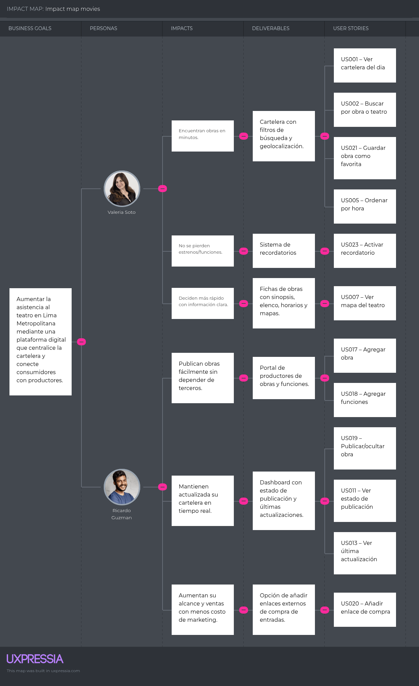

### 2.4.3 Product Backlog

| # Orden | User Story Id | Título                                      | Story Points |
|--------:|---------------|---------------------------------------------|-------------:|
| 1       | US001         | Ver la cartelera del dia                     | 3            |
| 2       | US002         | Buscar por obra o teatro                    | 5            |
| 3       | US006         | Ver ficha de obra                           | 3            |
| 4       | US003         | Filtrar por fecha                           | 2            |
| 5       | US004         | Filtrar por distrito                        | 3            |
| 6       | US005         | Ordenar por hora                            | 2            |
| 7       | US008         | Abrir enlace de compra externo              | 2            |
| 8       | US007         | Ver mapa del teatro                         | 2            |
| 9       | US010         | Compartir ficha de obra                     | 2            |
| 10      | US009         | Ver galería de fotos                        | 3            |
| 11      | US020         | Guardar obra como favorita                  | 3            |
| 12      | US021         | Ver lista de favoritos                      | 2            |
| 13      | US022         | Activar recordatorio                        | 5            |
| 14      | US023         | Cancelar recordatorio                       | 2            |
| 15      | US024        | Recibir alerta de estreno                   | 5            |
| 16      | US016         | Agregar obra                                  | 5            |
| 17      | US017         | Agregar funciones a una obra                | 5            |
| 18      | US018         | Publicar u ocultar obra                     | 3            |
| 19      | US019         | Añadir enlace de compra                     | 2            |
| 20      | US011         | Ver estado de publicación                   | 2            |
| 21      | US013         | Editar información de obra publicada        | 3            |
| 22      | US012         | Ver última actualización de datos           | 2            |
| 23      | US014         | Reportar enlace roto                        | 2            |
| 24      | US027         | Editar perfil                               | 3            |
| 25      | US026         | Ajustar notificaciones generales            | 2            |
| 26      | US025         | Cambiar idioma de la app                    | 2            |
| 27      | US028         | Cerrar sesión                               | 1            |
| 28      | US015         | Iniciar sesión                              | 3            |
| 29      | SS01         | Visualización centrada de cartelera          | 3            |
| 30      | SS02         | Sistema de reseñas verificadas               | 3            |
| 31      | SS03         | Notificaciones y alertas personalizadas      | 3            |
| 32      | SS04         | Gestión de contenidos para productores       | 3            |
| 33      | SS05         | Integración con mapas y calendarios          | 3            |

## 2.5 Strategic-Level Domain-Driven Design
### 2.5.1 EventStorming

Realizamos sesiones de Event Storming en Miro. Esta técnica colaborativa permite a equipos técnicos y no técnicos explorar y modelar procesos de negocio a partir de eventos del dominio, creando una visión compartida y aclarando límites y necesidades del sistema. En nuestro caso recorrimos: unstructured exploration, timelines, pain points, pivotal points, commands, policies, read models, external systems y, finalmente, aggregates y bounded contexts. Las figuras siguientes documentan cada paso.

#### 2.5.1.1 Candidate Context Discovery

Siguiendo DDD, realizamos el Event Storming en Miro (sesión de 3 horas). A partir de los eventos y comandos del dominio, agrupamos responsabilidades y reducimos acoplamientos; de este proceso emergieron cinco bounded contexts:

- Gestión de contenido teatral 

- Descubrimiento de eventos

- Autenticación y usuarios

- Entradas

- Notificaciones y recomendaciones

[Tablero de Miro con Event Storming](https://miro.com/welcomeonboard/Sk5KMDcrZzZwL282WG5leEsvb29YZFdTVFJjWlBlYzgzWmFWTHVIQU5BcG9EVTVLcDFhUWhuMldmWERVdmhLY0ozQUdUVWFmODVpeVZ4Q013RUZlQjV0eXVUNjh4T000emdVRWszTGM0cjg5TmdaVzIvQ2V1UjhrdDV5bXl4TjR0R2lncW1vRmFBVnlLcVJzTmdFdlNRPT0hdjE=?share_link_id=562103997021)

Paso 1: Unstructured Exploration

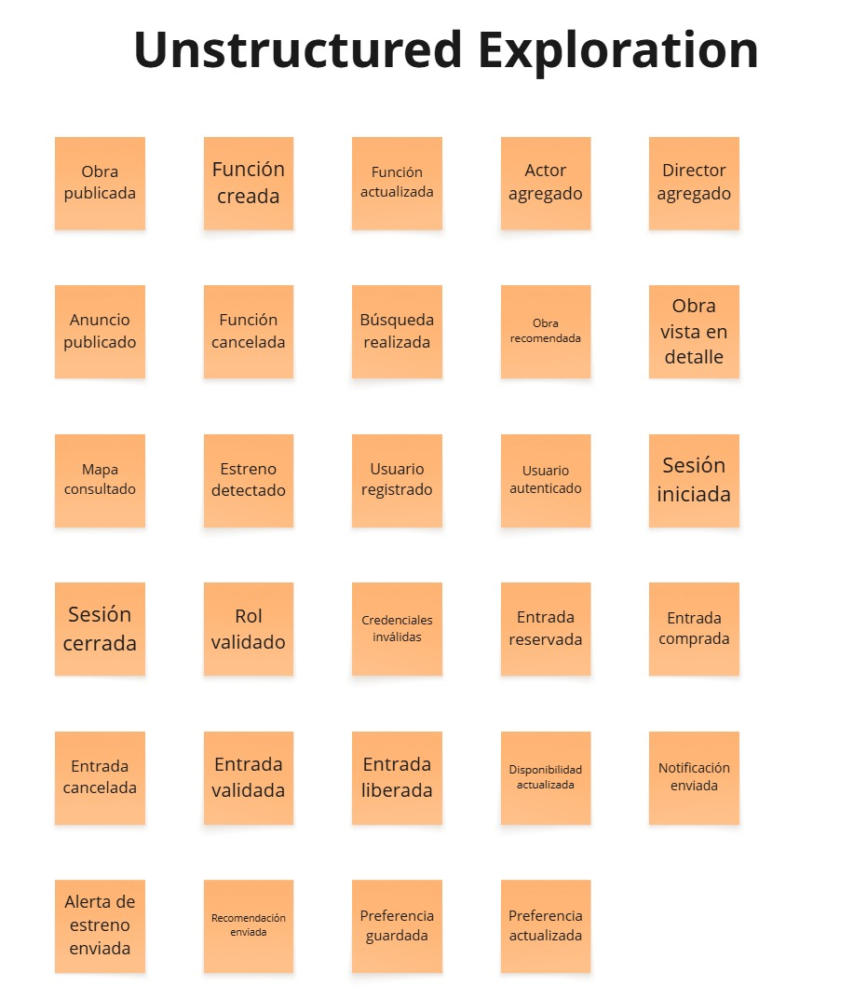

Paso 2: Timelines

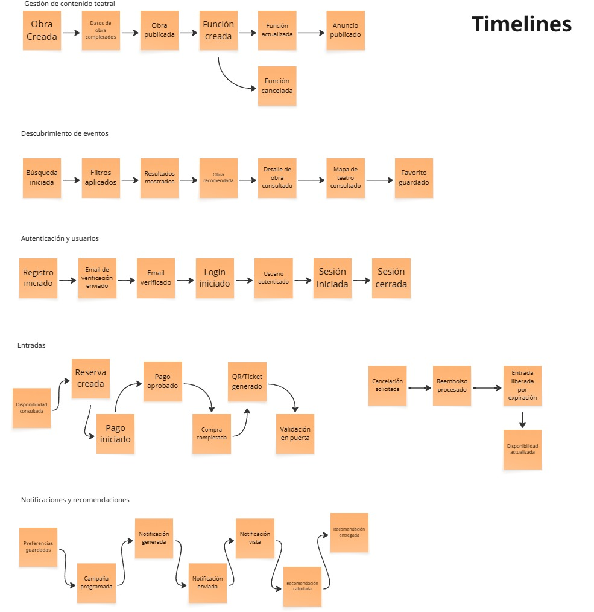

Paso 3: Pain Points

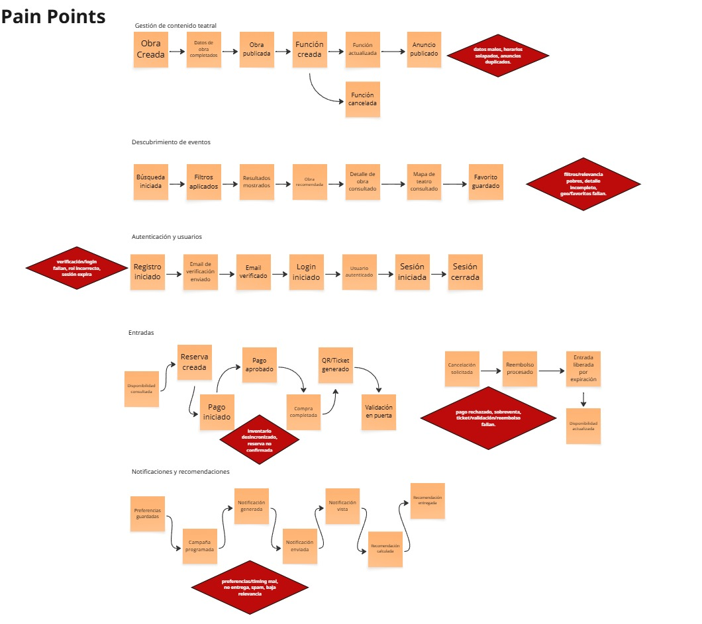

Paso 4: Pivotal Points

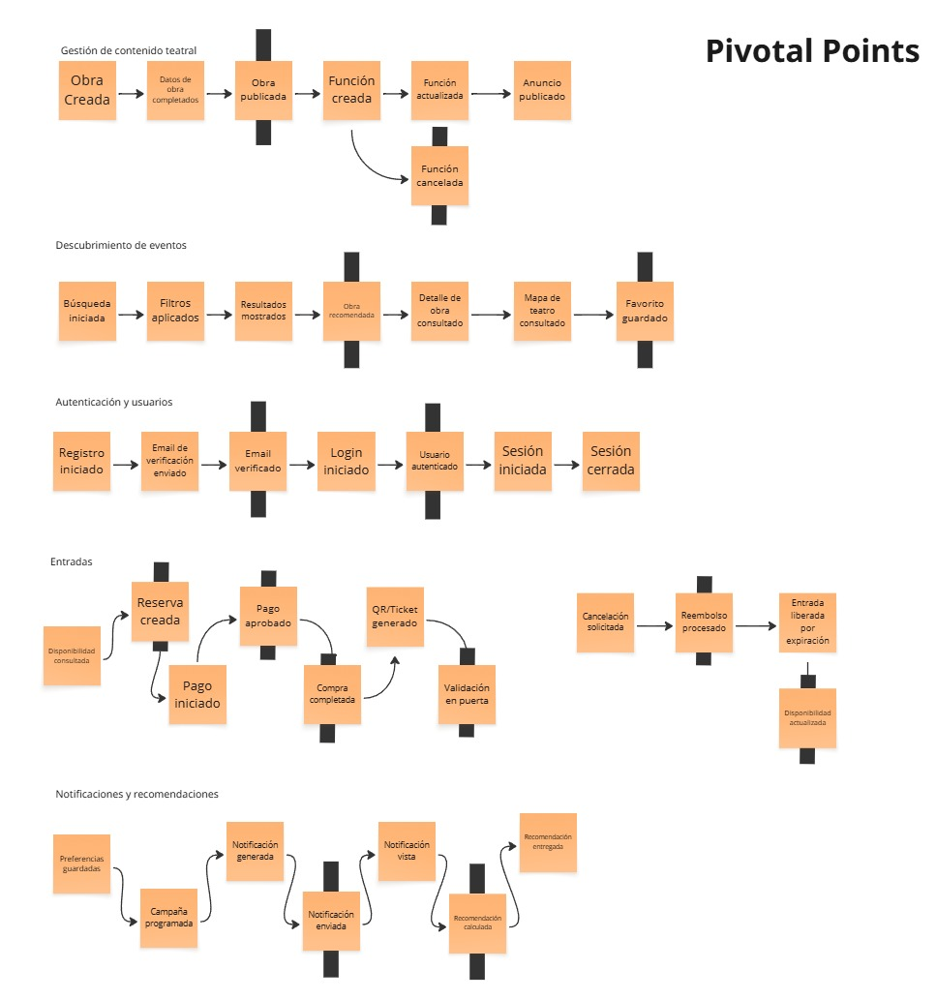

Paso 5: Commands

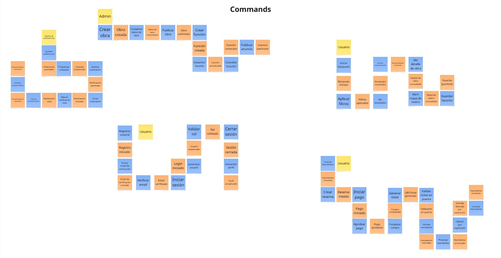

Paso 6: Policies

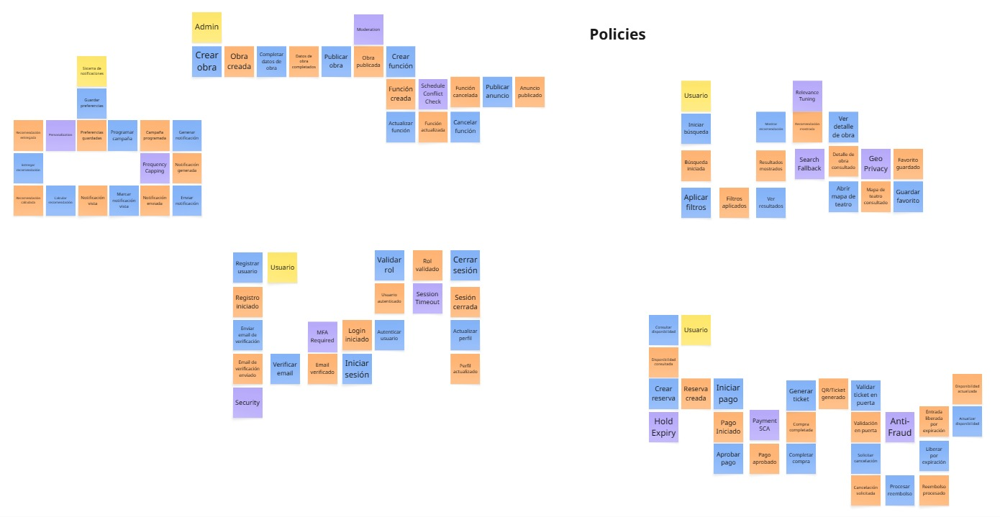

Paso 7: Read Models

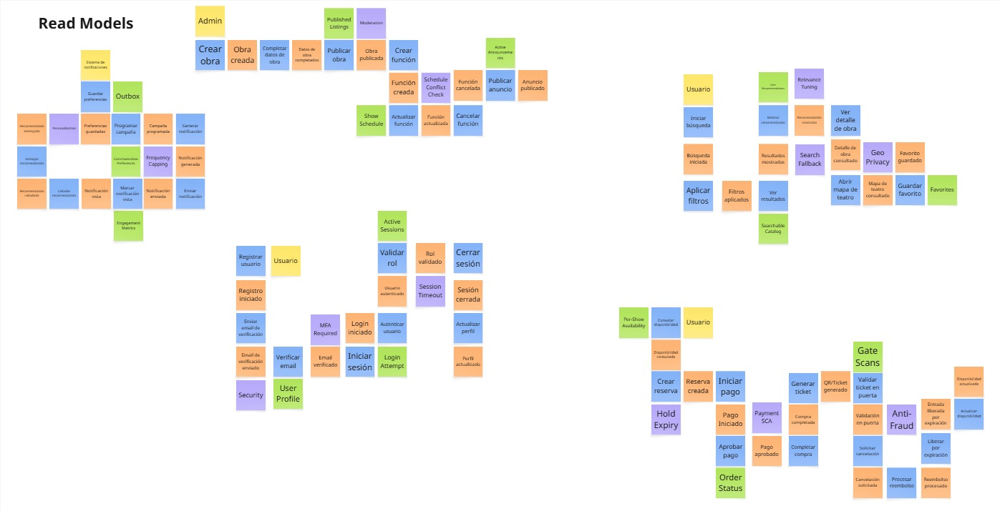

Paso 8: External Systems

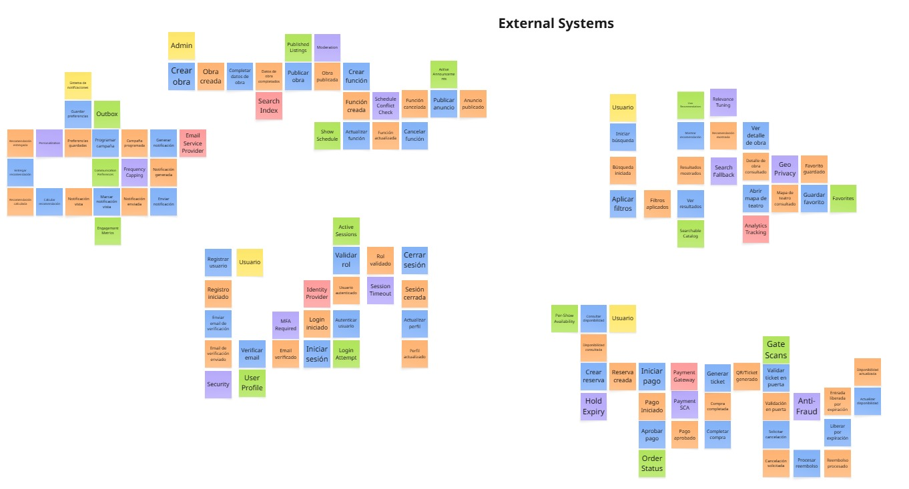

Paso 9: Aggregates

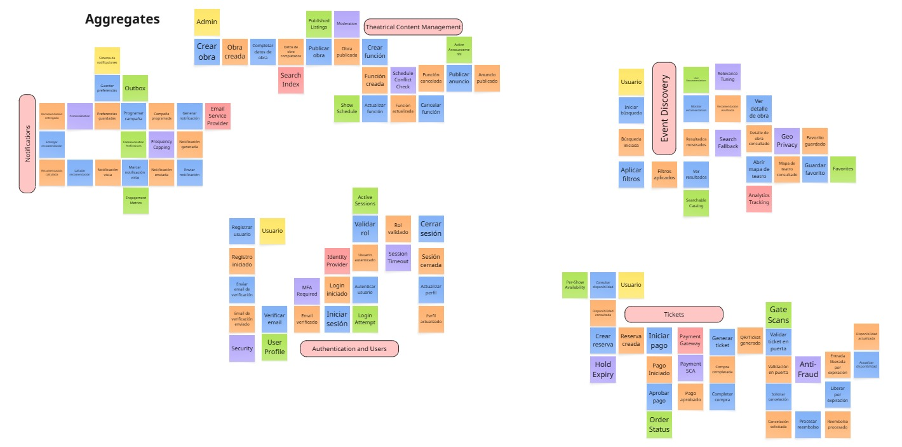

Paso 10: Bounded context

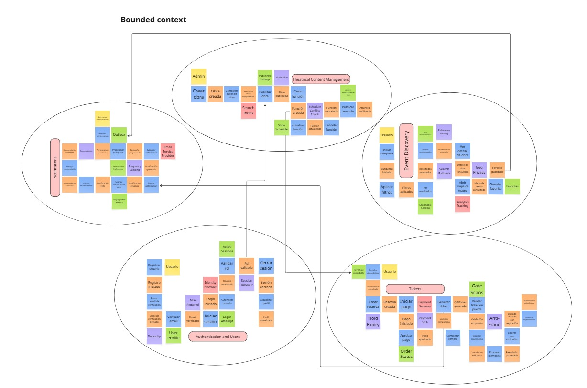

#### 2.5.1.2 Domain Message Flows Modeling

Los siguientes diagramas muestran el flujo de mensajes entre los bounded contexts del sistema. Fueron elaborados en Miro y evidencian cómo los contextos interactúan mediante Commands , Events y Queries.

[Tablero de Miro con Domain Message Flows Modeling](https://miro.com/welcomeonboard/emQyb05TQm9XNDh2R2NUb2JtcEkvNENVWGpRK0hBcSszcUQ5amRldkNiNkdxc2pKbytVZHA4YlNuVytTN3F3UW90L3dqT1FUSFlheWkxL0cyZXMrc0p0eXVUNjh4T000emdVRWszTGM0ci9WZ2djSFNveFY5Rm1TK3lUZ2syUDJyVmtkMG5hNDA3dVlncnBvRVB2ZXBnPT0hdjE=?share_link_id=53157372795)

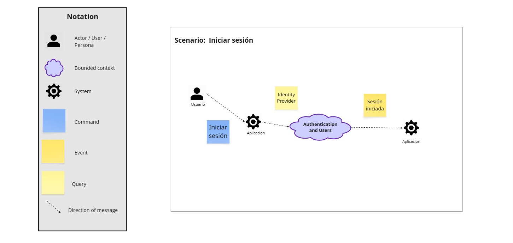


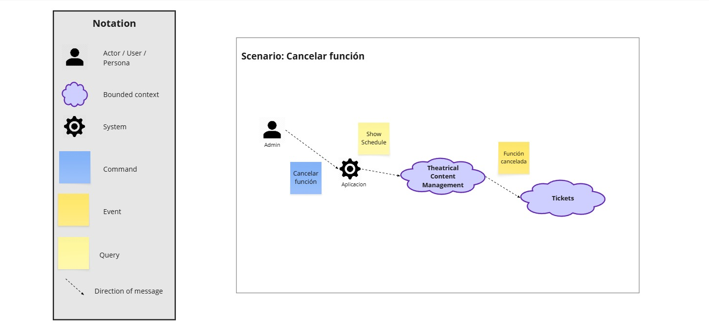

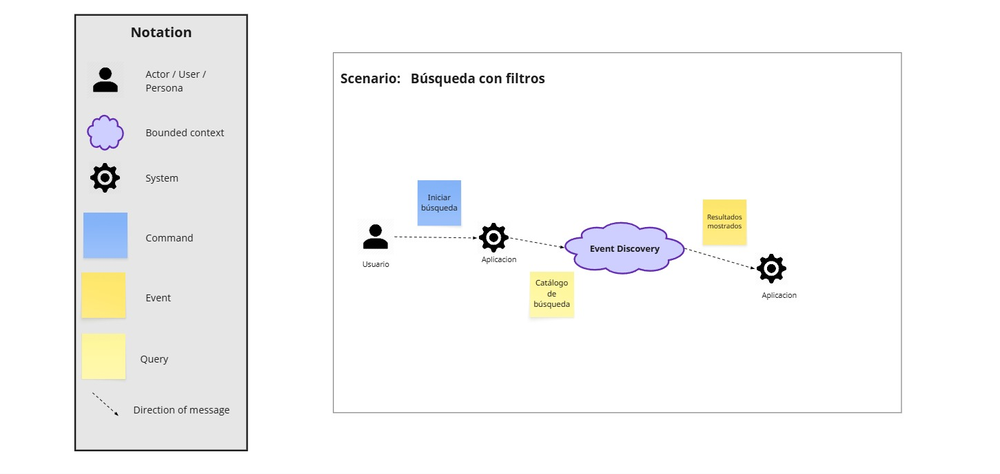

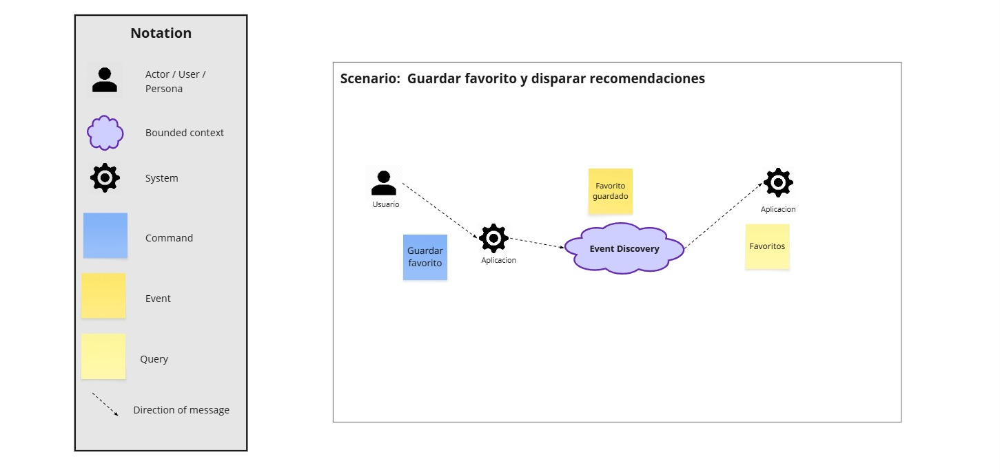


#### 2.5.1.3 Bounded Context Canvases

En esta sección, se presentan los Bounded Context Canvases. 

El objetivo es crear un diagrama informativo para cada bounded context, capturando su información clave y su impacto en el negocio.

[Tablero de Miro con Bounded Context Canvases](https://miro.com/welcomeonboard/ZVcrV3pXQ0tSVTdISVdrQVo5ZnN6eERaVWZydTl1RWtEOXEzQjNvdDJhUzJCckVhMXkvQlJuc2FUVXR0d1lBME9xNG5od3psOEI3UU9iWHFjMXJNd1RqcHlXRWt4T2tzOWZuUVJBQ1dPRzJSVmtQazhMZGtnZlI1cmpXdzVnSkpNakdSWkpBejJWRjJhRnhhb1UwcS9BPT0hdjE=?share_link_id=299259442899)

Bounded Context Canvases - Gestión de contenido teatral 


Bounded Context Canvases - Descubrimiento de eventos


Bounded Context Canvases - Autenticación y usuarios


Bounded Context Canvases - Entradas


Bounded Context Canvases - Notificaciones y recomendaciones


### 2.5.2 Context Mapping

Como parte del modelado del dominio de Teatrope, se identificaron cinco Bounded Contexts principales: Gestión de Contenido Teatral, Descubrimiento de Eventos, Autenticación y Usuarios, Entradas y Notificaciones & Recomendaciones. Con esta base se analizaron las interacciones y dependencias existentes, con el objetivo de comprender cómo se relacionan, qué información intercambian y qué nivel de acoplamiento mantienen. Este ejercicio permite definir de manera más clara los límites del sistema y establecer estrategias de integración entre contextos.

#### Análisis de Contextos

* Gestión de Contenido Teatral → Descubrimiento de Eventos:

Relación de Customer/Supplier. La información de obras, funciones y anuncios publicada por el primer contexto es consumida por el segundo, permitiendo que los usuarios consulten eventos actualizados.

* Descubrimiento de Eventos → Notificaciones & Recomendaciones:

Relación de integración. Las búsquedas y recomendaciones activan recordatorios o alertas, como notificaciones de próximos estrenos.

* Autenticación y Usuarios → Todos los Contextos:

Contexto transversal que gestiona la autenticación y autorización de roles. Puede implementarse como Shared Kernel compartido entre contextos, o como Conformist si los demás aceptan las reglas de seguridad sin modificarlas.

* Entradas → Notificaciones:

Depende de Gestión de Contenido Teatral y Descubrimiento de Eventos para confirmar disponibilidad de funciones y enviar notificaciones de compra o agotamiento.

#### Escenarios Alternativos

¿Qué pasaría si se separan Notificaciones y Recomendaciones en contextos distintos?
Esto permitiría escalar y mantener cada funcionalidad de manera independiente, reduciendo la complejidad de desarrollo. Sin embargo, aumentaría la cantidad de integraciones y podría requerir coordinación adicional para el envío de alertas personalizadas.

¿Qué pasaría si la autenticación se mueve a un servicio externo centralizado?
Facilitaría la integración con servicios de terceros (por ejemplo, pasarelas de pago o redes sociales) y simplificaría la administración de credenciales. No obstante, crearía dependencia técnica y riesgos de indisponibilidad si el servicio externo falla.

¿Qué pasaría si el Descubrimiento de Eventos implementa caché local para búsquedas frecuentes?
Mejoraría el rendimiento y la experiencia del usuario, ya que las consultas serían más rápidas. Sin embargo, se debería implementar un mecanismo de sincronización para evitar mostrar información desactualizada.

¿Qué pasaría si la validación de disponibilidad de Entradas se ejecuta directamente en Gestión de Contenido Teatral?
Reduciría el riesgo de sobreventa de entradas, pero generaría mayor acoplamiento entre contextos y podría limitar la autonomía del contexto de Entradas.


### 2.5.3 Software Architecture

#### 2.5.3.1 Software Architecture Context Level Diagrams


#### 2.5.3.2 Software Architecture Container Level Diagrams


#### 2.5.3.3 Software Architecture Deployment Diagrams


## 2.6 Tactical-Level Domain-Driven Design

<p>
En esta sección se aborda la perspectiva táctica del Domain-Driven Design (DDD), que se enfoca en la representación del dominio del negocio a través de elementos específicos de software. Partiendo de los límites definidos en el diseño estratégico, se identifican los componentes esenciales que modelan las reglas del dominio, gestionan los flujos de la aplicación y facilitan la interacción con sistemas externos.
</p>
</div>
</div>


### 2.6.1 Bounded Context: Gestión de contenido teatral

En esta sección, presentamos la perspectiva táctica del diseño de software para el Bounded Context "Gestión de Contenido Teatral", que maneja la publicación, actualización y validación de información teatral por parte de los teatros (proveedores). Siguiendo principios de DDD táctico, se detalla un diccionario de clases por capa, incluyendo nombre, tipo, propósito, atributos clave, métodos principales y relaciones.

#### 2.6.1.1 Domain Layer

Esta capa contiene el modelo de dominio central, enfocado en lógica de negocio pura (entidades, agregados, servicios de dominio) para la gestión de contenido teatral.

| Clase | Tipo | Propósito |
|:------|:-----|:----------|
| Teatro | Entity | Representa un teatro o compañía productora como entidad raíz del agregado, gestionando identidad y atributos básicos para publicación. |
| Obra | Entity | Modela una obra teatral específica, parte del agregado de Teatro, encapsulando detalles creativos. |
| Funcion | Value Object | Representa una función específica de una obra (inmutable, sin identidad propia), encapsula detalles de programación para validación |
| Persona | Value Object | Objeto de valor inmutable para actores/directores, evitando duplicación.|
| ContenidoService | Domain Service | Servicio de dominio para lógica compleja como validación de publicaciones antes de persistencia. Coordina invariantes de dominio sin estado. |
| TeatroRepository | Repository (Interface) | Interfaz para persistencia de agregados Teatro. Abstrae acceso a datos, soportando almacenamiento local en app móvil para offline. |
| ContenidoPublicadoEvent | Domain Event | Evento emitido al publicar/actualizar contenido para integración con otros BCs. |

#### 2.6.1.2 Interface Layer

Esta capa maneja interacciones externas, como endpoints REST para teatros publicar contenido vía API interna, y adapters para recursos del dispositivo 

| Clase | Tipo | Propósito |
|:------|:-----|:----------|
| ContenidoController | Controller |Maneja endpoints REST de la API interna para publicación por teatros. Expone API segura para teatros autenticados. |
| ObraRequestDTO | DTO | Data Transfer Object para entrada de datos de obra desde API. Valida y transporta datos de request sin exponer dominio interno. |
| ObraResponseDTO | DTO | DTO para respuesta de obra publicada. Serializa datos seguros para respuesta API, ocultando detalles sensibles. |
| GPSAdapter | Adapter | Adapter para acceso a recurso interno del dispositivo (GPS) en app móvil. Integra con Android Location Services para enriquecer Direccion. | 

#### 2.6.1.3 Application Layer

Esta capa orquesta flujos de aplicación, coordinando domain services y repositories sin lógica de negocio, soportando CQRS para separación de lecturas/escrituras en la app móvil. 

| Clase | Tipo | Propósito |
|:------|:-----|:----------|
| PublicarContenidoService | Application Service | Servicio para orquestar publicación de contenido. Maneja transacciones unitarias en API interna. |
| ActualizarContenidoService | Application Service | Maneja actualizaciones de contenido existente. Asegura consistencia en updates, integrando con almacenamiento local para offline. |
| ContenidoQueryService | Application Service (Query) | Para consultas de contenido (CQRS). Optimiza lecturas para app móvil, soportando queries eficientes. |

#### 2.6.1.4 Infrastructure Layer

Esta capa implementa detalles técnicos como persistencia (incluyendo almacenamiento local en dispositivo), adapters para servicios externos (maps, notifications) y eventos.

| Clase | Tipo | Propósito |
|:------|:-----|:----------|
|JPATeatroRepository | Repository Implementation | Implementación de TeatroRepository usando JPA para backend y Room para almacenamiento local en Android. Conecta dominio a persistencia, soportando offline en app móvil. | 
| EventPublisherAdapter | Adapter | Implementa publicación de Domain Events. Integra con otros BCs para notificaciones push. |
| MapsIntegrationAdapter | Adapter | Adapter para servicio externo de mapas. Valida y obtiene coords para teatros durante publicación. |
| NotificationSender | Adapter | Envía notificaciones vía servicio externo (Firebase). Notifica cambios a usuarios (e.g., nueva obra), integrando con recurso del dispositivo (push). |

#### 2.6.1.5 Bounded Context Software Architecture Component Level Diagrams


#### 2.6.1.6. Bounded Context Software Architecture Code Level Diagrams

En esta sección se exploran los detalles de la implementación interna del contexto, presentando diagramas que muestran cómo se implementan los componentes en el código. Se destacan dos elementos principales: los diagramas de clases de la Capa de Dominio y el diagrama de la base de datos relacional.

##### 2.6.1.6.1. Bounded Context Domain Layer Class Diagrams

Aquí se presenta el diagrama UML de clases correspondiente a la Capa de Dominio, que incluye entidades, objetos de valor, interfaces y enumeraciones. Cada elemento se detalla con sus atributos, métodos y niveles de visibilidad (público, privado, protegido), además de las relaciones (nombres, direcciones y multiplicidades) que estructuran el modelo de dominio.


##### 2.6.1.6.2. Bounded Context Database Design Diagram

En esta sección se expone el modelo relacional que respalda el contexto, detallando tablas, columnas, llaves primarias y foráneas, índices y otras restricciones. El diagrama muestra las relaciones de integridad entre las tablas y la forma en que las entidades del dominio se persisten en la base de datos.


### 2.6.2 Bounded Context: Descubrimiento de eventos

En esta sección, presentamos la perspectiva táctica del diseño de software para el Bounded Context "Descubrimiento de Eventos", que permite a los usuarios buscar, filtrar y visualizar información agregada de obras teatrales, incluyendo recomendaciones personalizadas y mapas de ubicaciones. Siguiendo principios de DDD táctico se detalla un diccionario de clases por capa. Incluye nombre, tipo, propósito, etc.

#### 2.6.2.1 Domain Layer

Esta capa contiene el modelo de dominio central, enfocado en lógica de negocio pura para búsquedas y recomendaciones, asegurando invariantes como personalización basada en preferencias de usuario.

| Clase | Tipo | Propósito |
|:------|:-----|:----------|
| Busqueda | Entity | Representa una búsqueda de eventos teatrales como entidad raíz del agregado, gestionando filtros y resultados. |
| Recomendacion | Entity | Modela una recomendación personalizada de obra, parte del agregado de Busqueda. | 
| FiltrosBusqueda | ValueObject | Representa filtros de búsqueda inmutables. Encapsula criterios de búsqueda para validación. |
| ObraVista | ValueObject | Vista simplificada de Obra para consumo (inmutable). Optimiza datos para display móvil sin cargar dominio completo. |
| DescubrumientoService | Domain Service | Servicio de dominio para lógica compleja como generación de recomendaciones. Coordina algoritmos de matching sin estado. |
| BusquedaRepository | Repository (Interface) | Interfaz para persistencia de agregados Busqueda. Abstrae persistencia, soportando almacenamiento local en app móvil para búsquedas offline. |
| EventoDescubiertoEvent | Domain Event | Evento emitido al descubrir o recomendar eventos. Notifica interacciones a otros BCs. |

#### 2.6.2.2 Interface Layer

Esta capa maneja interacciones externas, como UI en app móvil para búsquedas y adapters para recursos del dispositivo.

| Clase | Tipo | Propósito |
|:------|:-----|:----------|
| DescubrimientoController | Controller | Maneja endpoints REST o llamadas en app móvil para búsquedas. Expone interfaz para consumidores en app Android. |
| BusquedaRequestDTO | DTO | Data Transfer Object para entrada de búsqueda. Valida y transporta datos de request UI sin exponer dominio. |
| ObraVistaDTO | DTO | DTO para respuesta de vista de obra. Serializa datos optimizados para display móvil. |
| GPSLocationAdapter | Adapter | Adapter para acceso a recurso interno del dispositivo (GPS) en app móvil. Integra con Android Location Services para búsquedas geolocalizadas. | 

#### 2.6.2.3 Application Layer

Esta capa orquesta flujos de aplicación, coordinando domain services y repositories sin lógica de negocio, soportando CQRS para separación de lecturas en la app móvil.

| Clase | Tipo | Propósito |
|:------|:-----|:----------|
| RealizarBusquedaService | Application Service | Servicio para orquestar búsquedas. |
| GenerarRecomendacionesService | Application Service | Maneja generación de recomendaciones. Asegura personalización, integrando con cache local. | 
| DescubrumientoQueryService | Application Service (Query) | Para consultas avanzadas (CQRS). Optimiza lecturas para UX móvil, soportando offline vía storage local. |

#### 2.6.2.4 Infrastructure Layer

Esta capa implementa detalles técnicos como persistencia (incluyendo almacenamiento local en dispositivo para búsquedas offline), adapters para servicios externos (maps para visualización).

| Clase | Tipo | Propósito |
|:------|:-----|:----------|
| RoomBusquedaRepository | Repository Implementation | Implementación de BusquedaRepository usando Room para almacenamiento local en Android y JPA para backend. Soporta offline en app móvil. |
| EventListenerAdapter | Adapter | Escucha Domain Events de otros BCs. Integra con Gestión de Contenido para real-time updates. | 
| MapsDisplayAdapter | Adapter | Adapter para servicio externo de mapas (Google Maps API). Visualiza ubicaciones en UI móvil. | 
| CacheManager | Adapter | Maneja cache local para recomendaciones/búsquedas. Optimiza performance en app Android con storage local. | 

#### 2.6.2.5 Bounded Context Software Architecture Component Level Diagrams


#### 2.6.2.6. Bounded Context Software Architecture Code Level Diagrams

Aquí se presenta el diagrama UML de clases correspondiente a la Capa de Dominio, que incluye entidades, objetos de valor, interfaces y enumeraciones. Cada elemento se detalla con sus atributos, métodos y niveles de visibilidad (público, privado, protegido), además de las relaciones (nombres, direcciones y multiplicidades) que estructuran el modelo de dominio.

##### 2.6.2.6.1. Bounded Context Domain Layer Class Diagrams

Aquí se presenta el diagrama UML de clases correspondiente a la Capa de Dominio, que incluye entidades, objetos de valor, interfaces y enumeraciones. Cada elemento se detalla con sus atributos, métodos y niveles de visibilidad (público, privado, protegido), además de las relaciones (nombres, direcciones y multiplicidades) que estructuran el modelo de dominio.


##### 2.6.2.6.2. Bounded Context Database Design Diagram

En esta sección se expone el modelo relacional que respalda el contexto, detallando tablas, columnas, llaves primarias y foráneas, índices y otras restricciones. El diagrama muestra las relaciones de integridad entre las tablas y la forma en que las entidades del dominio se persisten en la base de datos.


### 2.6.3 Bounded Context: Notifications & Recommendations

En esta sección, presentamos la perspectiva táctica del diseño de software para el Bounded Context "Notifications & Recommendations", que gestiona el envío de notificaciones oportunas (push/email/sms) y la entrega de recomendaciones personalizadas, respetando opt-in/opt-out, quiet hours y deduplicación. Se detalla un diccionario de clases por capa (nombre, tipo y propósito).

#### 2.6.3.1 Domain Layer

Esta capa contiene el modelo de dominio central, enfocado en consentimiento, deduplicación y personalización.

| Clase                    | Tipo                    | Propósito                                                                             |
| :----------------------- | :---------------------- | :------------------------------------------------------------------------------------ |
| Notificacion             | Entity (Aggregate Root) | Representa una notificación con canal, contenido, dedupe\_key, programación y estado. |
| PreferenciasNotificacion | ValueObject             | Define opt-in/opt-out por canal, quiet hours y frecuencia máxima.                     |
| Canal                    | ValueObject             | Canal de entrega (PUSH/EMAIL/SMS) con reglas específicas por canal.                   |
| Contenido                | ValueObject             | Plantilla materializada (título/asunto, cuerpo, datos de render), inmutable.          |
| Recomendacion            | Entity                  | Sugerencia de obra/función con motivo y score; admite lote.                           |
| CriteriosRecomendacion   | ValueObject             | Preferencias del usuario (género, ubicación, disponibilidad).                         |
| MotorRecomendacion       | Domain Service          | Algoritmos/reglas de matching basados en señales y afinidades.                        |
| PoliticaDeduplicacion    | Domain Service          | Evalúa dedupe\_key + ventana para enviar, reprogramar o descartar.                    |
| NotificacionRepository   | Repository (Interface)  | Persistencia para el agregado Notificacion.                                           |
| RecomendacionRepository  | Repository (Interface)  | Persistencia de recomendaciones y lotes.                                              |
| PreferenciasRepository   | Repository (Interface)  | Acceso a preferencias y consentimientos.                                              |
| NotificacionProgramada   | Domain Event            | Emitido cuando una notificación queda lista para envío.                               |
| NotificacionEnviada      | Domain Event            | Emitido al confirmarse la entrega.                                                    |
| RecomendacionGenerada    | Domain Event            | Emitido tras calcularse nuevas recomendaciones.                                       |

#### 2.6.3.2 Interface Layer

Esta capa maneja interacciones externas: endpoints de app/web y entradas de eventos.

| Clase                     | Tipo       | Propósito                                                                           |
| :------------------------ | :--------- | :---------------------------------------------------------------------------------- |
| NotificationsController   | Controller | Endpoints para programar/reenviar/cancelar notificaciones y gestionar preferencias. |
| RecommendationsController | Controller | Endpoints para obtener recomendaciones y registrar feedback (like/ocultar).         |
| WebhookReceiver           | Controller | Entrada de eventos de otros BCs (nueva obra, cambio de función, cancelaciones).     |
| NotificacionRequestDTO    | DTO        | Solicitud de notificación (usuario, canal, plantilla, dedupe\_key, programación).   |
| PreferenciasDTO           | DTO        | Alta/actualización de opt-in/opt-out y quiet hours.                                 |
| RecomendacionDTO          | DTO        | Respuesta serializada de recomendaciones para la app.                               |
| DeliveryStatusDTO         | DTO        | Confirmación de entrega/lectura desde proveedores (FCM/Email/SMS).                  |


#### 2.6.3.3 Application Layer

Esta capa orquesta casos de uso (sin lógica de negocio), soportando CQRS para lecturas eficientes.

| Clase                         | Tipo                        | Propósito                                                                                     |
| :---------------------------- | :-------------------------- | :-------------------------------------------------------------------------------------------- |
| ProgramarNotificacionService  | Application Service         | Valida preferencias/quiet hours, aplica PoliticaDeduplicacion y emite NotificacionProgramada. |
| EnviarNotificacionService     | Application Service         | Invoca adapter de canal y registra NotificacionEnviada.                                       |
| RegistrarOptInOutService      | Application Service         | Actualiza consentimientos en PreferenciasRepository.                                          |
| GenerarRecomendacionesService | Application Service         | Orquesta MotorRecomendacion; persiste y emite RecomendacionGenerada.                          |
| MarcarLeidaService            | Application Service         | Registra lectura/engagement para métricas y throttling.                                       |
| NotificationsQueryService     | Application Service (Query) | Consultas de bandeja, historial y estados.                                                    |
| RecommendationsQueryService   | Application Service (Query) | Consultas de recomendaciones, razones y filtros.                                              |


#### 2.6.3.4 Infrastructure Layer

Esta capa implementa persistencia, mensajería, plantillas y proveedores externos.

| Clase                      | Tipo                      | Propósito                                                               |
| :------------------------- | :------------------------ | :---------------------------------------------------------------------- |
| JpaNotificacionRepository  | Repository Implementation | Implementación de NotificacionRepository con JPA/SQL.                   |
| JpaRecomendacionRepository | Repository Implementation | Implementación de RecomendacionRepository.                              |
| JpaPreferenciasRepository  | Repository Implementation | Persistencia de consentimientos y quiet hours.                          |
| TemplateRenderer           | Adapter                   | Render de plantillas (Handlebars/Mustache) con variables de contexto.   |
| PushAdapterFCM             | Adapter                   | Entrega push a dispositivos (Firebase Cloud Messaging).                 |
| EmailAdapterSMTP           | Adapter                   | Envío de correo (SMTP/SendGrid).                                        |
| SmsAdapter                 | Adapter                   | Envío de SMS (Twilio o similar).                                        |
| SchedulerAdapter           | Adapter                   | Programación/reenqueue (Quartz/cron; en móvil: WorkManager).            |
| MessageBusAdapter          | Adapter                   | Publicación/consumo de eventos (Kafka/RabbitMQ).                        |
| DedupeStore                | Adapter                   | Almacén de claves de dedupe y ventanas (Redis).                         |
| RateLimiterAdapter         | Adapter                   | Límite de frecuencia por usuario/canal.                                 |
| AnalyticsAdapter           | Adapter                   | Métricas de entrega/lectura para afinado del motor.                     |
| UsuariosACLAdapter         | ACL Adapter               | Anti-corruption con BC Usuarios (perfil, consentimientos globales).     |
| AgendaACLAdapter           | ACL Adapter               | Anti-corruption con BC Agenda (cambios de función/horario).             |
| ContenidoACLAdapter        | ACL Adapter               | Anti-corruption con BC Gestión de Contenido (datos de obras/funciones). |

#### 2.6.3.5 Bounded Context Software Architecture Component Level Diagrams


#### 2.6.3.6. Bounded Context Software Architecture Code Level Diagrams
##### 2.6.3.6.1. Bounded Context Domain Layer Class Diagrams
##### 2.6.3.6.2. Bounded Context Database Design Diagram

### 2.6.4 Bounded Context: Entradas

En esta sección, presentamos la perspectiva táctica del diseño de software para el Bounded Context "Compra de Entradas". Este BC se enfoca en transacciones de reservas, disponibilidad de entradas y confirmaciones, integrando con otros BCs como Descubrimiento de Eventos (para selección) y Gestión de Contenido Teatral (para actualizaciones de disponibilidad vía eventos).

#### 2.6.4.1 Domain Layer

Esta capa contiene el modelo de dominio central, enfocado en lógica de negocio pura para reservas y disponibilidad, asegurando invariantes como no sobreventa.

| Clase | Tipo | Propósito |
|:------|:-----|:----------|
| Reserva | Entity | Representa una reserva de entradas como entidad raíz del agregado, gestionando identidad y estado. |
| DetalleEntrada | Entity | Modela detalles de una entrada específica en la reserva, parte del agregado de Reserva. | 
| Disponibilidad | Value Object | Representa la disponibilidad de entradas inmutable. Encapsula checks de stock para validación. |
| Ticket | Value Object | Objeto de valor para ticket generado (inmutable). Genera representación para confirmación sin pago. |
| CompraService | Domain Service | Servicio de dominio para lógica compleja como verificación de disponibilidad. Coordina reglas de negocio anti-sobreventa sin estado. |
| ReservaRepository | Repository (Interface) | Interfaz para persistencia de agregados Reserva. Abstrae persistencia, soportando almacenamiento local en app móvil para reservas offline. | 
| ReservaConfirmadaEvent | Domain Event | Evento emitido al confirmar reserva. Propósito: Notifica cambios a otros BCs. |

#### 2.6.4.2 Interface Layer

Esta capa maneja interacciones externas, como UI en app móvil para reservas y adapters para recursos del dispositivo.

| Clase | Tipo | Propósito |
|:------|:-----|:----------|
| CompraController | Controller | Maneja endpoints REST o llamadas en app móvil para reservas. Expone interfaz para consumidores en app Android. |
| ReservaRequestDTO | DTO | Data Transfer Object para entrada de reserva. Valida y transporta datos de request UI sin exponer dominio. |
| ReservaResponseDTO | DTO | DTO para respuesta de reserva. Serializa datos seguros para display móvil. Relaciones: Derivado de Reserva. |
| QrGeneratorAdapter | Adapter | Adapter para recurso interno del dispositivo (generación de QR). Integra con Android libraries para QR en confirmaciones. |

#### 2.6.4.3 Application Layer

Esta capa orquesta flujos de aplicación, coordinando domain services y repositories sin lógica de negocio, soportando CQRS para separación de reservas y queries de disponibilidad.

| Clase | Tipo | Propósito |
|:------|:-----|:----------|
| ProcesarReservaService | Application Service | Servicio para orquestar reservas. Maneja flujos transaccionales en app. | 
| CancelarReservaService | Application Service | Maneja cancelaciones.  Asegura reversión de disponibilidad. |
| DisponibilidadQueryService | Application Service (Query) | Para consultas de disponibilidad (CQRS). Optimiza lecturas para UI móvil. |

#### 2.6.4.4 Infrastructure Layer

Esta capa implementa detalles técnicos como persistencia (incluyendo almacenamiento local para reservas offline), adapters para servicios externos (e.g., email para confirmaciones).

| Clase | Tipo | Propósito |
|:------|:-----|:----------|
| RoomReservaRepository | Repository Implementation | Implementación de ReservaRepository usando Room para almacenamiento local en Android y JPA para backend. Soporta offline en app móvil. |
| EventPublisherAdapter | Adapter | Implementa publicación de Domain Events. Integra con otros BCs para actualizaciones. | 
| EmailSenderAdapter | Adapter | Adapter para servicio externo de email. Notifica confirmaciones vía email. | 
| LocalStorageManager | Adapter | Maneja storage local para tickets/reservas. Optimiza offline en Android con SharedPreferences o Files. |

#### 2.6.4.5 Bounded Context Software Architecture Component Level Diagrams


#### 2.2.4.6. Bounded Context Software Architecture Code Level Diagrams

En esta sección se exploran los detalles de la implementación interna del contexto, presentando diagramas que muestran cómo se implementan los componentes en el código. Se destacan dos elementos principales: los diagramas de clases de la Capa de Dominio y el diagrama de la base de datos relacional.

##### 2.2.4.6.1. Bounded Context Domain Layer Class Diagrams


##### 2.2.4.6.2. Bounded Context Database Design Diagram


<div style="page-break-after: always;"></div>

# Capítulo III: Solution UI/UX Design

## 3.1 Product Design

### 3.1.1 Style Guidelines

#### 3.1.1.1 General Style Guidelines

La identidad visual de Teatrope se fundamenta en la pasión por el arte escénico y la conexión cultural. Su objetivo es acercar el teatro a nuevas audiencias mediante una estética moderna, clara y accesible. Se optó por un estilo sofisticado pero cálido, combinando el contraste del negro con un acento vibrante en rojo coral, que refleja energía, emoción y dinamismo.
<br><br>
El sistema visual se inspira en Design Systems contemporáneos, priorizando la legibilidad, el orden y la consistencia entre tipografía, color e iconografía, dentro de una interfaz adaptable a dispositivos móviles.

##### 3.1.1.1.1 Tipografía
###### 3.1.1.1.1.1 Tipografía del logotipo

<div align="center"></div>

El logotipo de Teatrope utiliza la fuente Inter en estilo Bold y en minúsculas.

Esta elección transmite modernidad, cercanía y equilibrio visual, manteniendo una apariencia profesional sin perder calidez.

El uso en minúsculas refuerza un tono accesible y humano, mientras que el grosor Bold garantiza presencia y fuerza visual, especialmente en fondos oscuros.

###### 3.1.1.1.1.2 Tipografía del texto regular

<div align="center"></div>

Para todos los textos de la interfaz se emplea la familia Inter, elegida por su alta legibilidad en pantallas móviles y su versatilidad para jerarquizar contenidos.

|Jerarquía |	Estilo |	Tamaño  recomendado |
|-----------|------------|----------------------|
|Títulos principales |	Inter Bold |	24–32 px |
|Subtítulos / Secciones |	Inter SemiBold / Medium | 18–20 px |
|Texto regular	| Inter Regular	| 14–16 px |
|Notas o textos secundarios	| Inter Light |	12 px |

La familia Inter ofrece un aspecto limpio y tecnológico, que refuerza la usabilidad del sistema sin distraer del contenido principal: las obras de teatro.

##### 3.1.1.1.2. Colores

<div align="center"></div>

**Paleta principal**

La paleta cromática de Teatrope combina tonos oscuros con un rojo vibrante, evocando el ambiente teatral (oscuridad, luces, emociones).

|Color|	HEX|	Uso|
|----|----|-----|
|Negro profundo	|#161621	|Fondo principal, headers|
|Gris carbón|	#2B2B38	|Fondos secundarios, menús|
|Rojo coral	|#F74346	|Color de marca, botones, íconos activos|

**Paleta secundaria**

Complementa la principal con tonos neutros y grises claros para lograr balance y contraste.

|Color|	HEX|	Uso|
|-----|-----|--------|
|Blanco|	#FFFFFF|	Texto y fondos claros|
|Gris claro|	#EFEFEF|	Fondos neutros|
|Gris medio	|#4A4B56	|Texto secundario|
|Gris suave	|#D9D9D9	|Estados desactivados|

El rojo coral (#F74346) representa la energía y vitalidad del teatro; el negro profundo (#161621) aporta elegancia y modernidad; y los grises equilibran el sistema visual con neutralidad.

##### 3.1.1.1.3. Iconografía

Los íconos de Teatrope siguen un estilo minimalista y coherente, diseñado para mantener claridad y armonía visual.

<div align="center"></div>

Todos están basados en un grid de 24 px, con trazos de 2–4 px según el tamaño, garantizando consistencia entre los distintos elementos de la interfaz.

* Ícono principal: la lupa con la máscara teatral, símbolo del descubrimiento y la experiencia escénica.

* Íconos adicionales: favoritos, notificaciones, búsqueda, ubicación, configuración y perfil, adaptados al mismo estilo redondeado.

**Paleta de iconografía:**

* Activos o destacados → #F74346

* Inactivos → #4A4B56

* Fondos oscuros → versiones en blanco o gris claro según contraste.

##### 3.1.1.1.4. Tono de comunicación y lenguaje aplicado

El tono de comunicación de Teatrope es moderno, cultural y empático. Se dirige tanto a espectadores casuales como a amantes del teatro, equilibrando profesionalismo con un lenguaje amigable.

* Formal en la presentación de datos (fechas, ubicaciones, horarios).

* Casual y cercano en la interacción con el usuario (“Find your next favorite play”, “Don’t miss out!”).

* Inspirador, reflejando la emoción de descubrir nuevas obras.

* Los mensajes breves y directos, junto con íconos expresivos, construyen una experiencia que combina información, emoción y comunidad.

##### 3.1.1.1.5. Aplicación visual

Se observa un diseño coherente con la guía de estilo:

* Fondo oscuro (#161621) que resalta las imágenes de las obras.

* Botones y acentos en rojo coral (#F74346) que atraen la atención hacia las acciones principales (reserva, favoritos, notificaciones).

* Tipografía Inter aplicada con jerarquía clara para mejorar la lectura.

* Iconos consistentes con el logotipo, reforzando la identidad visual.

* Composición limpia con alto contraste y equilibrio entre texto e imagen.

El resultado es una interfaz moderna, intuitiva y emocionalmente atractiva, que transmite el espíritu del teatro desde el primer contacto.

### 3.1.2 Information Architecture

En esta sección definimos cómo nuestra app móvil de Teatrope organiza y presenta su contenido para que la exploración sea clara y las tareas clave se completen sin fricción. La estructura parte de una experiencia de acceso (splash, Sign in y Sign up) y desemboca en una Home enfocada en descubrir obras mediante búsqueda, filtros visibles (ciudad, distrito y género), avisos promocionales y atajos a dos perspectivas de exploración: Services (cartelera de obras y funciones) y Theaters (sedes). La app mantiene coherencia visual y terminológica entre pantallas de listado, detalle y compra; ofrece navegación persistente por pestañas inferiores (Billboard, Coming soon, Favorites, Profile); y usa enlaces contextuales para conectar contenidos relacionados. La arquitectura prioriza rutas predecibles, microcopys breves, estados bien definidos (vacío, favorito, notificación nueva) y una distribución de información que reduce pasos para llegar a la acción principal: Booking.

#### 3.1.2.1 Orgainzation Systems

* Estructura jerárquica: La jerarquía inicia en la pantalla de bienvenida y autenticación, continúa en la Home con marca y buscador al centro de la experiencia, y se ramifica en secciones principales: carteleras por Services (obras en exhibición y próximas), directorio de Theaters con fichas enriquecidas, y apartados personales como Favorites y Profile. En niveles inferiores aparecen las fichas de Obra (título, géneros, reparto, sinopsis, calificación y botón Booking) y las fichas de Teatro (ubicación, descripción breve, rating y carrusel). Esta jerarquía minimiza la profundidad de navegación, mantiene siempre visible el camino de regreso mediante la barra inferior y expone la acción principal en el primer pliegue de las pantallas de detalle.

* Estructura secuencial (step-by-step): Las tareas que requieren orden guiado utilizan pasos encadenados y consistentes con los mockups. La autenticación conduce de Sign in/Sign up a la Home con el contexto del usuario cargado. En Profile → Settings la actualización de datos y permisos (notificaciones y ubicación) sigue una secuencia simple y reversible, con confirmaciones visibles para evitar errores. Esta organización secuencial reduce la ambigüedad y mejora la tasa de finalización de acciones críticas.

* Estructura matricial: La exploración de contenidos se apoya en combinaciones de filtros que aparecen en la Home y en las pantallas de listado: Choose city, District y Genre permiten acotar resultados sin abandonar el contexto. La búsqueda central admite texto y control de modo (iconos de lupa y cuadrícula), mientras que el carrusel y las tarjetas muestran señales como “Release date” o “Premieres”. El usuario puede alternar rápidamente entre Services y Theaters, manteniendo las selecciones activas para refinar la vista y acelerando el acceso a lo relevante.

* Estructura por relaciones (cross-linking): Desde la ficha de una obra se ofrece continuidad natural hacia acciones y contenidos relacionados: Booking para comprar, heart/favorite para guardar y enlaces implícitos a otras obras del mismo elenco o género en carruseles vecinos. En la ficha de teatro se listan funciones actuales, lo que conecta el interés por el lugar con obras concretas. El centro de Notifications organiza eventos del sistema (nuevos estrenos, cambios en favoritas, recomendaciones), ofreciendo retorno directo a las pantallas correspondientes. Este tejido de vínculos evita callejones sin salida, mantiene al usuario en descubrimiento y sostiene la conversión.

#### 3.1.2.2 Labelling Systems

### Navegación principal

| **Etiqueta** | **Descripción**                                |
| ------------ | ---------------------------------------------- |
| Billboard    | Cartelera actual de obras (listado principal). |
| Coming soon  | Próximos estrenos y funciones futuras.         |
| Favorites    | Obras/teatros marcados con “♥”.                |
| Profile      | Acceso al perfil del usuario y ajustes.        |

### Home, búsqueda y filtros

| **Etiqueta**                  | **Descripción**                                             |
| ----------------------------- | ----------------------------------------------------------- |
| Search                        | Campo para buscar obra, actor, teatro o palabra clave.      |
| Choose city                   | Selector de ciudad activa (p. ej., Lima).                   |
| District                      | Filtro por distrito dentro de la ciudad.                    |
| Genre                         | Filtro por género (Comedy, Drama, Musical, etc.).           |
| Services                      | Vista de cartelera/obras.                                   |
| Theaters                      | Vista de sedes/teatros.                                     |
| Notifications (icono campana) | Indicador de novedades; acceso al centro de notificaciones. |
| Promotions card               | Tarjeta destacada con promociones/avisos.                   |


### Listados y tarjetas

| **Etiqueta**     | **Descripción**                                  |
| ---------------- | ------------------------------------------------ |
| Release date     | Insignia con fecha de estreno/función.           |
| Rating (★ 4.7)   | Puntuación promedio visible en tarjeta o header. |
| Favorite (☆/★/♥) | Marcador para añadir/quitar de Favoritos.        |


### Detalle de obra

| **Etiqueta**      | **Descripción**                                       |
| ----------------- | ----------------------------------------------------- |
| Booking           | CTA principal para iniciar proceso de compra.         |
| Genres (chips)    | Categorías de la obra (Comedy, Fantasy, etc.).        |
| Cast (avatars)    | Reparto principal con fotos/avatars.                  |
| Synopsis          | Resumen breve de la obra.                             |
| Venue / Address   | Teatro y dirección donde se presenta.                 |
| Showtimes         | Días/horarios de funciones (ej.: *Thu–Sun 08:00 pm*). |
| “Already saw it?” | Control para marcar vista y valorar.                  |


### Ficha de teatro

| **Etiqueta**      | **Descripción**                               |
| ----------------- | --------------------------------------------- |
| Currently playing | Carrusel con obras en ese teatro.             |
| Know more         | CTA para ampliar información del teatro/obra. |

### Autenticación

| **Etiqueta**      | **Descripción**                      |
| ----------------- | ------------------------------------ |
| Sign in           | Ingreso a la cuenta existente.       |
| Sign up           | Registro de nueva cuenta.            |
| E-mail / Password | Campos de credenciales.              |
| Remember me?      | Mantener sesión iniciada.            |
| Forgot password?  | Flujo de recuperación de contraseña. |

### Perfil y ajustes

| **Etiqueta**           | **Descripción**                         |
| ---------------------- | --------------------------------------- |
| My tickets             | Listado de entradas del usuario.        |
| My credit cards        | Gestión de tarjetas de pago.            |
| History                | Historial de compras/actividad.         |
| Settings               | Configuración de cuenta.                |
| Update                 | Guardar cambios de email/contraseña.    |
| Permissions            | Sección de permisos del sistema.        |
| Notifications (toggle) | Activar/desactivar notificaciones push. |
| Location (toggle)      | Activar/desactivar geolocalización.     |
| About us               | Información de la app/equipo.           |
| Terms & Conditions     | Políticas y términos de uso.            |
| Logout                 | Cerrar sesión.                          |


### Centro de notificaciones

| **Etiqueta**  | **Descripción**                                 |
| ------------- | ----------------------------------------------- |
| Notifications | Pantalla con novedades y avisos personalizados. |
| Clear all     | Acción para limpiar todas las notificaciones.   |

### Estados y mensajes breves

| **Etiqueta**                   | **Descripción**                           |
| ------------------------------ | ----------------------------------------- |
| New play just added!           | Aviso de obra recién añadida.             |
| A change in your favorite show | Cambio de horario/fecha en una favorita.  |
| Recommended for you            | Recomendación basada en preferencias/uso. |

#### 3.1.2.3 SEO Tags and Meta Tags

Las etiquetas de SEO y las metaetiquetas son fundamentales porque cumplen un papel esencial en la optimización para motores de búsqueda (SEO), ayudando a incrementar la visibilidad y la posición de una página web en los resultados de búsqueda.

| **Campo**       | **Landing Page**                                                                                                                                                                               | **Web Application**                                                                                                          |
| --------------- | ---------------------------------------------------------------------------------------------------------------------------------------------------------------------------------------------- | ---------------------------------------------------------------------------------------------------------------------------- |
| **Title**       | Teatrope | Teatrope                                                                                                                                    | Teatrope App | Explora cartelera, favoritos y próximas funciones                                                             |
| **Description** | Descubre obras y funciones en Lima. Compara teatros, horarios y precios, aprovecha promociones y reserva tus entradas en minutos.                                                              | Busca por ciudad, distrito y género; guarda favoritos, recibe notificaciones y compra entradas de forma segura desde la app. |
| **Keywords**    | teatro, obras en Lima, cartelera, entradas de teatro, funciones hoy, teatros en Lima, promociones 2x1, preventa, estrenos, comedia, drama, musical, familiar, Miraflores, Barranco, San Isidro | cartelera teatro, buscar obras, géneros, distrito, favoritos, notificaciones, próximos estrenos, rating, booking, tickets    |
| **Authors**     | Teatrope Team                                                                                                                                                                                  | Teatrope                                                                                                                     |

#### 3.1.2.4 Searching Systems

El sistema de búsqueda de Teatrope combina un buscador central y filtros facetados visibles para reducir rápidamente el conjunto de resultados. Desde la Home y las vistas de listado, el usuario puede escribir términos libres en el campo “Search” (título de la obra, teatro o palabra clave) y acotar con selectores persistentes de Choose city, District y Genre. El buscador admite sugerencias instantáneas y respeta el contexto activo (p. ej., mantener ciudad/distrito seleccionados al cambiar entre “Services” y “Theaters”). En las tarjetas se muestran señales como “Release date”, rating y estado de favorito para ayudar a decidir sin abrir el detalle. El sistema recuerda los filtros aplicados durante la sesión, permite limpiar con un solo gesto y prioriza la relevancia temporal (funciones próximas) en los resultados. En detalle de teatro u obra, los enlaces “Currently playing” y “Booking” actúan como atajos de búsqueda contextual hacia funciones específicas.

#### 3.1.2.5 Navigation Systems

La navegación de Teatrope se apoya en tres capas complementarias.

* Navegación global (barra inferior): pestañas persistentes para moverse entre las áreas principales: Billboard (cartelera), Coming soon (próximos estrenos), Favorites (guardados) y Profile (cuenta y ajustes). Esta barra permite volver a la raíz de cada sección con un solo toque.

* Navegación contextual (en pantalla): en Home, los toggles Services/Theaters, los filtros (city/district/genre) y el carrusel de tarjetas permiten profundizar o cambiar de perspectiva sin abandonar la vista. En detalle de obra y de teatro, los CTAs (Booking, Know more) y los carruseles (“Currently playing”, obras similares) conectan con pasos siguientes o contenidos relacionados. Los botones de “back” en headers mantienen el historial de la sesión para retornos previsibles.

* Navegación asistida (sistema): el centro de Notifications ofrece accesos directos a novedades (nuevas obras, cambios en favoritas, recomendaciones) y devuelve al usuario exactamente al contenido afectado. Estados como “favorito” y “rating” habilitan recorridos personales desde Favorites hacia los detalles. En conjunto, estos métodos reducen la profundidad de clics, evitan callejones sin salida y mantienen visible la acción principal (comprar entradas) en los momentos clave.


### 3.1.3 Landing Page UI Design
La propuesta de UI del Landing Page de Teatrope traduce las decisiones del Design System en una interfaz moderna, inmersiva y coherente con su identidad visual: un espacio digital que acerca el teatro al público a través de una experiencia clara, atractiva y emocional.

El diseño equilibra contraste, jerarquía visual y accesibilidad, manteniendo la estética oscura y elegante característica de la marca, acompañada por acentos en rojo coral (#F74346) que evocan la energía del escenario.

La estructura del landing page se organiza en bloques claramente diferenciados:

**Hero Section**
* Presenta el logotipo y un slogan principal, reforzando la propuesta de valor (“Descubre lo mejor del teatro en un solo lugar”).
* Incluye botón de acción directa (Download Now) y una ilustración alusiva a las artes escénicas.
* Transmite el enfoque emocional del producto mediante imágenes de actores y escenarios.

**Features Section**
* Resume los principales beneficios de Teatrope.
* Utiliza íconos lineales con el color principal de la marca (#F74346) y descripciones breves para garantizar comprensión inmediata.

**Plans Section**

Expone tres categorías de uso:

* Audience Plan: acceso gratuito a la cartelera y favoritos.
* Theatre Plan: opción para productores o teatros que desean publicar obras.
* Cultural Hub Plan: integración para instituciones o festivales.

Cada plan está dispuesto en cards con bordes suaves, tipografía Inter y CTA contrastante.

**Articles Section**
* Espacio para notas editoriales, entrevistas o reseñas teatrales bajo el título “Latest Theater Articles”.
* Presenta cards con imagen destacada, título y breve descripción, fomentando la exploración de contenido cultural.

**Testimonials Section**
* Reúne comentarios de usuarios y productores satisfechos, reforzando la confianza en la comunidad Teatrope.
* Emplea un fondo oscuro con textos claros y fotografía circular de cada testimonio.

**FAQ & Contact Section**
* Integra preguntas frecuentes en formato acordeón y un bloque de contacto con redes sociales.
* Usa botones secundarios con esquinas redondeadas, manteniendo coherencia con el resto de la interfaz.

#### 3.1.3.1 Landing Page Wireframe

<div align="center">  </div>
<div align="center">  </div>
<div align="center">  </div>
<div align="center">  </div>
<div align="center">  </div>
<div align="center">  </div>

Los wireframes establecen la estructura inicial de la experiencia, definiendo jerarquías y zonas de interacción.

**Desktop Web Browser**

* Barra superior fija con logo, navegación clara (Features, Plans, Blog Reviews, FAQ, Login).
* Hero section central con imagen representativa y un mensaje inspirador sobre el teatro.
* Features y Plans distribuidos en tres columnas con proporciones visualmente equilibradas.
* Articles y Testimonials en bloques horizontales para mantener ritmo visual.
* Footer con información institucional, redes sociales y enlaces secundarios.

**Mobile Web Browser**

* Menú hamburguesa para simplificar la navegación.
* Hero section centrada, con el logo de Teatrope y un único CTA principal.
* Secciones en scroll vertical, manteniendo márgenes amplios y tipografía legible.
* Plans y Articles en formato de tarjetas apiladas con scroll suave.
* FAQ y contacto al final, con acceso rápido a redes sociales y soporte.

#### 3.1.3.2 Landing Page Mock-up

<div align="center">  </div>
<div align="center">  </div>
<div align="center">  </div>
<div align="center">  </div>
<div align="center">  </div>
<div align="center">  </div>

En los mockups de Teatrope se aplica coherentemente el Design System definido, manteniendo una identidad moderna, elegante y cercana al mundo teatral.

Se emplea la paleta oscura con acentos en rojo coral (#F74346), la tipografía Inter en jerarquías claras (títulos en Bold, texto en Regular), y una iconografía minimalista inspirada en la máscara del logo.

El lenguaje visual es formal y entusiasta, transmitiendo accesibilidad y emoción por el teatro, con una interfaz limpia, contrastada y coherente entre la versión web y móvil.

### 3.1.4 Mobile Applications UX/UI Design
La propuesta de UX/UI móvil de Teatrope traduce la identidad visual del Design System en una experiencia práctica, clara y coherente.

Cada pantalla mantiene una estructura jerárquica simple, con navegación inferior fija, iconografía coherente y el uso de la paleta principal (fondo oscuro y acentos en rojo coral #F74346).

La tipografía Inter refuerza la legibilidad y consistencia visual, mientras que los botones de alto contraste guían las acciones principales del usuario (reserva, favoritos, búsqueda).

El diseño combina claridad, accesibilidad y estética escénica, evocando la atmósfera teatral de forma moderna y funcional.

#### 3.1.4.1 Mobile Applications Wireframes

Los wireframes móviles representan la arquitectura de información y los flujos clave de interacción dentro de Teatrope.

Cada vista —inicio, cartelera, ficha de obra, notificaciones y autenticación— se estructura siguiendo principios de diseño inclusivo, con espaciado amplio, etiquetas claras y jerarquía visual consistente. Los componentes (cards, botones, iconos y menús) evidencian la aplicación de los principios de usabilidad, priorizando la simplicidad, el reconocimiento y la navegación fluida entre secciones.

El resultado es una interfaz intuitiva que facilita el acceso al contenido teatral y mejora la experiencia del usuario desde cualquier dispositivo móvil.

<div align="center">  </div>
<div align="center"> 
 </div>
<div align="center"> 
 </div> 
<div align="center"> 
 </div>
<div align="center"> 
 </div>
<div align="center"> 
 </div>

#### 3.1.4.2 Mobile Applications Wireflow Diagrams

Los wireflow diagrams muestran el flujo de navegación entre pantallas de la app, destacando rutas principales y puntos de decisión del usuario. Permiten validar la arquitectura de información y la navegación antes del desarrollo, asegurando claridad en los procesos clave (registro, inicio de sesión, exploración y notificaciones).

Su enfoque esquemático facilita detectar pasos redundantes o confusos, optimizar la usabilidad y mantener consistencia visual con el sistema de diseño, garantizando una experiencia fluida y predecible.

<div align="center">  </div>

#### 3.1.4.3 Mobile Applications Mock-ups

Los mockups evidencian la aplicación del Design System, integrando los principios de consistencia visual, jerarquía tipográfica, contraste y accesibilidad.
Asimismo, reflejan el uso de elementos de diseño inclusivo, garantizando legibilidad, navegación intuitiva y una experiencia coherente para todo tipo de usuario.

La arquitectura de información se organiza en bloques funcionales (cartelera, ficha de obra, notificaciones, perfil y ajustes), priorizando la claridad y la usabilidad.
Se mantienen los fondos oscuros con acentos en rojo coral (#F74346) para resaltar las acciones clave, tipografía Inter en jerarquías claras y una iconografía minimalista coherente con la identidad teatral.
La navegación inferior, los botones de alto contraste y las tarjetas modulares aseguran una experiencia fluida e intuitiva, mientras que el estilo visual transmite sofisticación, cercanía y pasión por el arte escénico.

<div align="center">  </div>
<div align="center"> 
 </div>
<div align="center"> 
 </div> 
<div align="center"> 
 </div>
<div align="center"> 
 </div>
<div align="center"> 
 </div>

#### 3.1.4.4 Mobile Applications User Flow Diagrams

Enlace para acceder al <a href="https://lucid.app/lucidchart/61958854-f009-480f-b122-df53bd8ab153/edit?viewport_loc=-9091%2C-7108%2C21047%2C10719%2C0_0&invitationId=inv_a67952f0-a49f-4210-bb72-2e9b6b4d129d">Lucid Chart</a>

**1.Flujo de registro de usuario al sistema**

 </div>

Este flujo muestra el proceso de acceso del usuario dentro de Teatrope, la aplicación que conecta a los consumidores de teatro con la oferta escénica disponible en Lima Metropolitana.

El recorrido inicia con la pantalla de bienvenida, donde se presenta la identidad visual de la marca. Luego, el usuario puede iniciar sesión si ya tiene una cuenta, ingresando su correo y contraseña, o bien registrarse como nuevo usuario mediante el formulario de creación de cuenta.

El objetivo de este flujo es garantizar un acceso rápido, seguro y claro, simplificando los pasos para que el usuario pueda ingresar fácilmente a la plataforma y comenzar a explorar la cartelera, funciones y promociones teatrales disponibles.

**2.Flujo de visualización del menu del sistema**

 </div>

Este flujo muestra la interacción del usuario dentro del menú principal de Teatrope, donde se concentra la exploración de la cartelera teatral. Desde esta vista, el usuario puede seleccionar su ciudad, distrito y género teatral para filtrar las obras disponibles.

Una vez aplicados los filtros, la aplicación despliega una lista de producciones con sus respectivas portadas, permitiendo al usuario visualizar los títulos en cartelera. Al seleccionar una obra, se accede a la pantalla de detalle, que muestra información completa como sinopsis, elenco, ubicación del teatro, horarios y la opción de reservar o valorar la obra.

Este flujo busca ofrecer una navegación fluida e intuitiva, priorizando la facilidad de búsqueda y la presentación visual de las obras, con el objetivo de mejorar la experiencia del usuario y fomentar la asistencia a eventos teatrales.

**3.Flujo de filtro por función teatral y sede**

 </div>

Este flujo muestra el proceso mediante el cual el usuario puede filtrar las obras teatrales y visualizar las sedes disponibles dentro de la aplicación Teatrope. Desde la pantalla principal, el usuario puede aplicar filtros por distrito, género teatral o alternar entre las vistas de Services (obras) y Theaters (sedes).

Al seleccionar la opción Theaters, la interfaz despliega una lista de teatros disponibles en la ciudad y distrito elegidos, mostrando su imagen, nombre y ubicación. De esta forma, el usuario puede identificar fácilmente los espacios donde se presentan las funciones teatrales.

Este flujo busca ofrecer una experiencia de exploración más personalizada y eficiente, facilitando que los usuarios encuentren tanto las obras como los teatros de su preferencia en pocos pasos.

**4.Flujo de notificaciones del sistema**

 </div>

Este flujo describe el proceso mediante el cual el usuario recibe y visualiza notificaciones dentro de la aplicación Teatrope. Las notificaciones tienen como objetivo mantener al usuario informado sobre nuevas obras disponibles, cambios en funciones guardadas y recomendaciones personalizadas según sus intereses teatrales.

Desde la pantalla de notificaciones, el usuario puede ver mensajes como estrenos recientes, espectáculos cercanos o recordatorios de sus funciones favoritas. Al hacer clic en una notificación, se redirige automáticamente a la cartelera principal, donde puede explorar más detalles sobre la obra o acceder directamente a la página del evento.

Este flujo contribuye a una experiencia dinámica y personalizada, fomentando la participación constante del usuario y mejorando la visibilidad de las producciones teatrales en la plataforma.

**5.Flujo de visualización de obras teatrales por Teatro**

 </div>

Este flujo representa el recorrido que realiza el usuario al explorar las obras disponibles dentro de un teatro específico en la aplicación Teatrope. Desde la pantalla principal, el usuario puede filtrar por ciudad y distrito, y luego acceder a la sección Theaters, donde se muestran las sedes teatrales con imágenes representativas.

Al seleccionar un teatro, se despliega una vista detallada con información del nombre, dirección y descripción del lugar, junto con las obras actualmente en cartelera. Esta interfaz permite al usuario conocer qué producciones se presentan en cada sede y acceder directamente a su ficha para obtener más información o realizar una reserva.

El propósito de este flujo es facilitar la conexión entre los usuarios y los espacios culturales, promoviendo la asistencia a los teatros locales y ofreciendo una experiencia de exploración visual, clara y atractiva.

**6.Flujo de visualización y configuración del perfil del usuario**

 </div>

Este flujo representa el proceso mediante el cual el usuario puede visualizar y personalizar su perfil dentro de la aplicación Teatrope. Desde la sección Profile, el usuario puede acceder a información relevante como sus entradas adquiridas, métodos de pago y el historial de actividades.

Al ingresar a Settings, el usuario tiene la opción de actualizar sus datos personales, como correo y contraseña, además de configurar permisos relacionados con notificaciones y ubicación. También cuenta con accesos rápidos a las secciones de Términos y condiciones y Sobre nosotros.

El objetivo de este flujo es ofrecer una gestión sencilla y segura de la información del usuario, garantizando control total sobre sus preferencias y fomentando una experiencia personalizada dentro de la plataforma.


#### 3.1.4.5 Mobile Applications Prototyping

En esta etapa se desarrolló el prototipo móvil interactivo de la aplicación Teatrope, cuyo objetivo es visualizar el flujo y la experiencia del usuario antes del desarrollo final. El prototipo busca representar la identidad visual del producto, mostrando una interfaz moderna, accesible y centrada en el usuario.

La aplicación inicia con la pantalla de bienvenida, donde se presenta el logotipo y los colores representativos de la marca, reforzando el reconocimiento visual del proyecto. Este prototipo fue diseñado como una herramienta clave para validar la usabilidad, los recorridos de navegación y la coherencia estética de la plataforma teatral.

 </div>

Enlace para acceder al video de explicación del <a href="https://upcedupe-my.sharepoint.com/:v:/g/personal/u202116250_upc_edu_pe/EStHV9z2PSpNoRGkEAw7VgsBWFuSGVCxohan1ZL6NFFG0w?e=QTRadV&nav=eyJyZWZlcnJhbEluZm8iOnsicmVmZXJyYWxBcHAiOiJTdHJlYW1XZWJBcHAiLCJyZWZlcnJhbFZpZXciOiJTaGFyZURpYWxvZy1MaW5rIiwicmVmZXJyYWxBcHBQbGF0Zm9ybSI6IldlYiIsInJlZmVycmFsTW9kZSI6InZpZXcifX0%3D">Mobile Applications Prototyping</a>


<div style="page-break-after: always;"></div>

# Capítulo IV: Product Implementation & Validation

En este capítulo se explica y evidencia el proceso de implementar, comprobar, desplegar y validar la solución compuesta en el caso por los productos digitales que forman parte del alcance. Abarca secciones para la organización del proceso de trabajo en Sprints, la descripción y prácticas asociadas a Software Configuration Management, el Video About-The-Product y las evidencias de Implementation, Testing, Despliegue y Validaciones para cada uno de los productos que forman parte de la solución, en términos del producto en sí y la colaboración por Sprint.

## 4.1 Software Configuration Management

En esta sección se establecen las decisiones y convenciones que permitirán mantener la consistencia del ciclo de vida. 

### 4.1.1 Software Development Environment Configuration

En esta sección se proporcionarán los enlaces a las aplicaciones y productos de software que utilizaremos durante el desarrollo de este producto de software. Con dicho fin organizamos la información en las siguientes secciones:

- Project Managment
- Requirements Management
- Product UX/UI Design
- Software Development
- Software Testing
- Software Deployment
- Software Documentation

### Project Management

La gestión de proyectos de software (SPM) es el proceso de planificar, organizar y dirigir proyectos de desarrollo de software de principio a fin. A diferencia de la gestión de proyectos en general, la SPM implica un ciclo de vida único con múltiples rondas de pruebas y comentarios, que a menudo hace hincapié en metodologías ágiles para adaptarse a los cambios constantes. Una SPM eficaz es fundamental para garantizar que el software se entregue a tiempo, dentro del presupuesto y con los estándares de calidad requeridos.

- Para este proyecto utilizaremos la metodología Ágil. La metodología Agile, o ágil, es un enfoque de gestión de proyectos que se basa en ciclos de desarrollo iterativos e incrementales para entregar valor de forma continua. A diferencia de los métodos tradicionales, como el modelo en cascada, Agile prioriza la flexibilidad, la adaptación al cambio, la colaboración y la satisfacción del cliente por encima del seguimiento de un plan rígido. 

### Requirements Management

Este proceso asegura que la organización documente, valide y cumpla con las necesidades y expectativas de los clientes y los stakeholders. 

- Para este proyecto utilizaremos Jira. Jira es una herramienta de gestión de proyectos y seguimiento de incidencias, desarrollada por la empresa australiana Atlassian. Aunque se hizo popular en el ámbito del desarrollo de software, su flexibilidad la ha convertido en una solución versátil para cualquier equipo que necesite planificar, rastrear y entregar trabajo de manera eficiente, adoptando metodologías ágiles como Scrum y Kanban. https://www.atlassian.com/es/software/jira 

### Product UX/UI Design

El diseño de UX/UI de productos es una disciplina holística que combina la experiencia del usuario (UX) y la interfaz de usuario (UI) para crear productos eficaces, atractivos y centrados en el usuario. Un diseñador de productos supervisa todo el ciclo de vida del producto, utilizando los principios de UX/UI para garantizar que el producto no solo resuelva un problema del usuario, sino que también cumpla los objetivos empresariales. 

- Para este proyecto utilizaremos Figma. Figma es una herramienta de diseño de interfaz de usuario (UI) y experiencia de usuario (UX) basada en la web que permite a los equipos colaborar en tiempo real para crear, prototipar y entregar diseños. Lanzada en 2016, revolucionó el diseño al centralizar el proceso en una plataforma online, eliminando la necesidad de instalar software complejo. Su naturaleza colaborativa lo ha convertido en un estándar de la industria, especialmente en proyectos de desarrollo de software ágil. https://www.figma.com/login 

### Software Development

A lo largo del ciclo de vida del desarrollo de software, se utilizan varias herramientas para mejorar la eficiencia, la colaboración y la calidad. Estas herramientas cubren diferentes aspectos del proceso, como la gestión del proyecto, el control de versiones, la integración continua/implementación continua (CI/CD), las pruebas y las operaciones de desarrollo (DevOps). 

- Para este proyecto utilizaremos Github. GitHub es una plataforma de desarrollo de software basada en la web que facilita la colaboración y el control de versiones utilizando Git. Se ha convertido en una herramienta fundamental para equipos de desarrollo y proyectos de código abierto, ya que permite a los desarrolladores almacenar, gestionar y compartir su código en la nube. https://github.com/ 

- Para este proyecto utilizaremos Android Studio. Android Studio es el Entorno de Desarrollo Integrado (IDE) oficial para el desarrollo de aplicaciones en el sistema operativo Android. Basado en IntelliJ IDEA de JetBrains, ofrece un conjunto completo de herramientas diseñadas para facilitar la creación, prueba y depuración de aplicaciones para todo el ecosistema de dispositivos Android. https://developer.android.com/studio

- Para este proyecto utilizaremos Visual Studio Code. Visual Studio Code (VS Code) es un editor de código fuente gratuito y ligero, pero potente, desarrollado por Microsoft. Se diferencia de Visual Studio, el IDE más grande de Microsoft, en que está optimizado para la velocidad y la flexibilidad, en lugar de ser una solución todo en uno para proyectos empresariales complejos. https://code.visualstudio.com/

### Software Testing

El proceso de pruebas de software es la verificación y validación de que una aplicación de software cumple con sus requisitos específicos. Su objetivo principal es encontrar y corregir errores, fallos o defectos para entregar un producto de alta calidad que cumpla o supere las expectativas del usuario. El aseguramiento de la calidad (QA) es un proceso más amplio que busca evitar los defectos, mientras que las pruebas se centran en descubrirlos. 

- Para este proyecto utilizaremos Unit Tests. Las pruebas unitarias son un proceso en el desarrollo de software donde se examinan las partes más pequeñas y aisladas del código, como funciones o métodos individuales, para verificar que se comportan como se espera. El objetivo es encontrar y corregir errores en las etapas más tempranas del desarrollo, cuando son más fáciles y económicos de solucionar. https://en.wikipedia.org/wiki/Unit_testing

- Para este proyecto utilizaremos Gherkin. Gherkin es un lenguaje específico de dominio (DSL) que utiliza una sintaxis de texto simple para describir el comportamiento de un software. Es una parte fundamental de la metodología de Desarrollo Guiado por el Comportamiento (BDD), ya que permite a los equipos de desarrollo, pruebas y negocio colaborar y entender los requisitos de manera clara. https://cucumber.io/docs/gherkin/ 

### Software Deployment

El despliegue de software, o software deployment, es el proceso de hacer que una aplicación de software esté disponible para ser utilizada. Abarca todas las actividades que convierten el código en un producto funcional en un entorno de destino, como un servidor de prueba, un servidor de producción o el dispositivo de un usuario. 

- Para este proyecto utilizaremos Github Pages. GitHub Actions y GitHub Pages funcionan conjuntamente para proporcionar un potente flujo de trabajo automatizado de integración continua/implementación continua (CI/CD) para sitios web estáticos. Con esta configuración, cualquier actualización que envíes a tu código activará automáticamente un flujo de trabajo que compila e implementa tu sitio, lo que elimina la necesidad de actualizaciones manuales. https://docs.github.com/en/pages

### Software Documentation

La documentación de software se refiere a todo el material escrito o ilustrado que acompaña a un producto de software. Su objetivo es explicar cómo funciona el software, cómo se usa y cómo se mantiene, sirviendo a diferentes audiencias como desarrolladores, usuarios finales y personal de soporte. Es una parte fundamental del ciclo de vida del desarrollo de software (SDLC).

- Para este proyecto utilizaremos Swagger. Swagger es un conjunto de herramientas de código abierto que ayuda a los desarrolladores a diseñar, construir, documentar y consumir API REST. Originalmente, Swagger era el nombre de la especificación para describir estas interfaces, pero en 2016 la especificación pasó a llamarse OpenAPI (OAS), y el nombre "Swagger" se reservó para el conjunto de herramientas que implementan dicha especificación. https://swagger.io/

- Para este proyecto utilizaremos Markdown. Markdown es un lenguaje de marcado ligero que permite dar formato a texto plano utilizando una sintaxis sencilla y fácil de leer. A diferencia de lenguajes más complejos como HTML, la sintaxis de Markdown utiliza símbolos y caracteres reconocibles para indicar formatos como negritas, cursivas, listas y encabezados. https://markdown.es/ 

### 4.1.2 Source Code Management

En esta sección se establecen los medios y esquemas de organización que aplicará para el seguimiento de modificaciones. Se proporcionan los links de los repositorios en Github para todos los productos. 

- URL de la organización: https://github.com/teatrope 
- URL del Proyect Report: https://github.com/teatrope/Project-Report
- URL del Landing Page: https://github.com/teatrope/teatrope-landing
- URL de la API: https://github.com/teatrope/teatrope-api 

Para este proyecto se utilizará Gitflow. Gitflow es un modelo de ramificación para Git que fue popularizado por Vincent Driessen en 2010. A diferencia de los modelos más modernos, como el desarrollo basado en troncales (Trunk-Based Development), Gitflow utiliza múltiples ramas de larga duración y asigna funciones muy específicas a cada una. Este modelo es especialmente adecuado para proyectos con ciclos de lanzamiento programados, donde se necesita un control estricto de las versiones, como por ejemplo, en software de escritorio o sistemas regulados. 

- Ramas principales:
  - **main**: Contiene el historial oficial de lanzamientos, con código que siempre está listo para ser desplegado en producción. Cada commit en esta rama representa una nueva versión, que a menudo se etiqueta con un número de versión.
  - **develop**:  Sirve como una rama de integración donde se consolidan todas las nuevas funcionalidades. A partir de esta rama se crean las ramas secundarias y se realizan las pruebas antes de un lanzamiento.

- Ramas de apoyo:
  - **feature**: Se crea a partir de develop para desarrollar una nueva característica. Cuando la funcionalidad está completa, se fusiona de nuevo en develop. Este enfoque permite que los desarrolladores trabajen en paralelo sin afectar la rama principal.
  - **release**: Se crea a partir de develop cuando se está preparando una nueva versión para producción. Se utiliza para correcciones de última hora, generación de documentación y pruebas finales. Una vez que la rama está estable, se fusiona tanto con main (se etiqueta como la nueva versión) como con develop (para mantener la coherencia).
  - **hotfix**: Se crea directamente desde main para corregir errores críticos y urgentes en producción. Una vez resuelto el problema, la rama hotfix se fusiona de nuevo en main y en develop para asegurar que el arreglo se incluya en futuras versiones. 

Para este proyecto se utilizarán Conventional Commits. Conventional Commits es una convención de especificación ligera para estructurar los mensajes de commit en Git, que los hace comprensibles tanto para humanos como para máquinas. Su principal objetivo es crear un historial de commits claro y legible, lo que facilita la automatización de procesos como la generación de registros de cambios (changelogs) y el versionado semántico. (SemVer). 

Estructura del conventional commit:

```
<type> [optional scope]: <description>
[optional body]
[optional footer]
```

- **type**: Dependiendo del cambio que se realicen en el proyecto, los commits pueden ser:
  - **feat**: Cuando se agrega una nueva funcionalidad
  - **docs**: Cuando se realizan cambios en la documentación del proyecto
  - **fix**: Cuando se corrige un error en el código
  - **chore**: Cuando se realizan cambios que no afectan al código
  - **refactor**: Cuando se realizan cambios en la estructura, sin afectar el comportamiento del proyecto
  - **build**: Cuando se realizan cambios en los componentes del proyecto, como dependencias externas. 
  - **perf**: Cuando se realizan cambios que mejoran el rendimiento del proyecto.
- **scope**: Campo opcional que nos permite especificar el alcance que tiene el commit
- **description**: Campo obligatorio que proporciona el contenido del commit, en minúsculas y de modo imperativo
- **body**: Campo opcional en el cual se detalla más información sobre el commit.
- **footer**: Campo opcional que se utiliza para informar al respecto de cambios importantes. 

### 4.1.3 Source Code Style Guide & Conventions

Se establecen las referencias para nombrar elementos y programar en los lenguajes que se utilizan en la solución (HTML, CSS, JavasCript, TypeScript, Python, Kotlin, Swift). 

### Kotlin

La creación de aplicaciones escalables en Kotlin utilizando el diseño basado en el dominio (DDD) se centra en aislar la lógica empresarial central de los detalles técnicos de la implementación. Esto da lugar a una arquitectura limpia, fácil de mantener y de probar, a menudo combinando el DDD con principios arquitectónicos limpios o hexagonales. 

- **Principios arquitectónicos**
  - Aislar la capa de dominio: separar la lógica empresarial central en su propio módulo. Esta capa no debe depender de capas externas, como las capas de datos o de presentación.
  - Encapsular la lógica empresarial: colocar todas las reglas empresariales directamente dentro de las entidades. El estado de la entidad solo debe modificarse mediante sus propios métodos para garantizar la aplicación coherente de las reglas.
  - Utilizar abstracciones para los repositorios: definir interfaces de repositorio dentro de la capa de dominio para acceder a los agregados. La implementación concreta debe colocarse en la capa de datos. 

- **Convenciones de Kotlin**
  - Acepta la inmutabilidad: da preferencia a las variables val y a las estructuras de datos inmutables (listOf, mapOf). Para los objetos de valor, utiliza clases de datos con propiedades inmutables (val) para proporcionar igualdad estructural y simplificar la concurrencia.
  - Aprovecha la seguridad de tipos: utiliza clases de valor @JvmInline para evitar la obsesión por lo primitivo y garantizar una seguridad de tipos sólida con una sobrecarga baja. Emplea clases selladas para crear jerarquías de clases restringidas, lo que hace que las expresiones when sean exhaustivas y seguras en cuanto a tipos.
  - Simplifica los casos de uso: utiliza la función del operador invoke() para casos de uso o interactores. Esto permite llamadas más limpias, similares a funciones, que mejoran la legibilidad del código.
  - Gestiona la concurrencia con corrutinas: utiliza corrutinas Kotlin para gestionar de forma eficiente tareas asíncronas y concurrentes, lo cual es esencial para aplicaciones escalables. 

- **Patrones tácticos DDD en Kotlin**
  - Entities: utilice clases estándar para objetos que tienen una identidad mutable a lo largo del tiempo.
  - Aggregate roots: representan el punto de entrada principal para un agregado y son responsables de hacer cumplir las reglas de negocio.
  - Value Objects: modélelos como objetos de clase de datos inmutables, aprovechando las implementaciones automáticas de equals() y hashCode() para la igualdad estructural.
  - Domain services: defínalos como interfaz dentro de la capa de dominio, con la implementación residente en una capa externa. Deben ser sin estado y representar una capacidad empresarial. 

### 4.1.4 Software Deployment Configuration

En esta sección se especifica la configuración del despliegue de la solución, incluyendo los pasos necesarios para que, a partir de los repositorios de código fuente se pueda lograr el despliegue o publicación satisfactorio de cada uno de los productos digitales. 

### Landing page

1. Ve a tu repositorio en GitHub y haz clic en la pestaña "Settings".
2. En la barra lateral izquierda, navega hasta la sección "Code and automation" y haz clic en "Pages".
3. En la sección "Build and deployment", selecciona "GitHub Actions" en el menú desplegable "Source". 
4. En tu repositorio, crea la carpeta .github/workflows/ si no existe. 
5. Dentro de esa carpeta, crea un nuevo archivo con una extensión .yml o .yaml. Por ejemplo, deploy.yml.
6. Guarda el archivo deploy.yml
7. Haz commit de los cambios y súbelos a tu repositorio.
8. GitHub detectará automáticamente el nuevo flujo de trabajo y comenzará el primer despliegue.

Puedes ver el progreso del despliegue haciendo clic en la pestaña "Actions" en tu repositorio. El flujo de trabajo se ejecutará y, si todo va bien, tu sitio estará disponible en la URL de GitHub Pages (con el formato https://<usuario>.github.io/<nombre-repositorio>/) en unos minutos. 

## 4.2 Landing Page & Mobile Application Implementation

### 4.2.1 Sprint 1

#### 4.2.1.1 Sprint Planning 1

<table cellpadding="6" cellspacing="0" style="border-collapse: collapse; width: 100%;">
  <tr>
    <th colspan="2"><strong>Sprint #</strong></th>
    <td colspan="2">Sprint 1</td>
  </tr>
  <tr>
    <th colspan="4" style="background-color: #d9d9d9;"><strong>Sprint Planning Background</strong></th>
  </tr>
  <tr>
    <th style="width: 20%;">Date</th>
    <td colspan="3">2025-09-30</td>
  </tr>
  <tr>
    <th>Time</th>
    <td colspan="3">07:40 PM</td>
  </tr>
  <tr>
    <th>Location</th>
    <td colspan="3">Mediante una videollamada en Discord.</td>
  </tr>
  <tr>
    <th>Prepared By</th>
    <td colspan="3">Alva Abanto, Luis Andres</td>
  </tr>
  <tr>
    <th>Attendees (to planning meeting)</th>
    <td colspan="3">Yalan Zhang, Angie Christina / Sosa Soto, Oskar Rodrigo / López Acuña, Mario Joaquín / Varela Bustinza, Marcelo Alessandro</td>
  </tr>
  <tr>
    <th>Sprint 0 Review Summary</th>
    <td colspan="3">No hubo Sprint anterior (este es el primer sprint)</td>
  </tr>
  <tr>
    <th>Sprint 0 Retrospective Summary</th>
    <td colspan="3">No hubo Sprint anterior (este es el primer sprint)</td>
  </tr>
  <tr>
    <th colspan="4" style="background-color: #d9d9d9;"><strong>Sprint Goal & User Stories</strong></th>
  </tr>
  <tr>
    <th>Sprint 1 Goal</th>
    <td colspan="3">Nuestro objetivo en este sprint es construir la base funcional de la aplicación Teatrope, implementando el flujo de autenticación y la pantalla principal de cartelera. Buscamos validar la experiencia de navegación inicial y garantizar que los usuarios puedan registrarse, iniciar sesión y visualizar obras teatrales disponibles según ciudad o distrito.</td>
  </tr>
  <tr>
    <th>Sprint 1 Velocity</th>
    <td colspan="3">20 Story Points</td>
  </tr>
  <tr>
    <th>Sum of Story Points</th>
    <td colspan="3">18 Story Points</td>
  </tr>
</table>


#### 4.2.1.2 Sprint Backlog 1

Para el desarrollo del primer sprint backlog, el equipo se encargó de dar comiezo y complementación del landing page y mobile application. La herramienta empleada para la organización y planificación de los miembros del equipo fue Trello. Esta herramienta brindó la división de las user stories en tareas mas simples para asi asiganr a cada uno de los miembros las tareas correspondientes según sus diferentes habilidades. El objetivo principal del sprint 1 es construir en su totalidad la landing page y mobile application, permitiendo que sea intuitiva y funcional para los usuarios del sistema.

Enlace para acceder al Trello del Sprint 1: [Trello Sprint Backlog 1]()

<table>
  <tr>
    <td colspan="2" align="center"><b>Sprint #</b></td>
    <td colspan="6" align="center"><b>Sprint 1</b></td>
  </tr>
  <tr>
    <td colspan="2"><b>User Story</b></td>
    <td colspan="6" align="center"><b>Work-Item/Task</b></td>
  </tr>
  <tr>
    <td><b>Id</b></td>
    <td><b>Tittle</b></td>
    <td><b>Id</b></td>
    <td><b>Tittle</b></td>
    <td><b>Description</b></td>
    <td><b>Estimation (Hours)</b></td>
    <td><b>Assigned To</b></td>
    <td><b>Status(To-do/In-Process/To-Review/Done)</b></td>
  </tr>

  <!-- US001: Ver la cartelera del día (Landing + Mobile) -->
  <tr>
    <td rowspan="3">US001</td>
    <td rowspan="3">Ver la cartelera del día</td>
    <td>T1</td>
    <td>Diseño UI cartelera</td>
    <td>Wireframe + layout responsive para listado “Hoy”.</td>
    <td>2</td>
    <td>Angie</td>
    <td>Done</td>
  </tr>
  <tr>
    <td>T2</td>
    <td>Componente Lista “Hoy”</td>
    <td>Implementar componente (web + mobile) con paginación.</td>
    <td>3</td>
    <td>Luis</td>
    <td>In-Process</td>
  </tr>
  <tr>
    <td>T3</td>
    <td>Servicio/Hook de data</td>
    <td>Endpoint/servicio para traer funciones del día con cache.</td>
    <td>2</td>
    <td>Rodrigo</td>
    <td>To-Review</td>
  </tr>

  <!-- US002: Buscar por obra o teatro -->
  <tr>
    <td rowspan="3">US002</td>
    <td rowspan="3">Buscar por obra o teatro</td>
    <td>T4</td>
    <td>Barra de búsqueda</td>
    <td>Input con debounce y accesibilidad (ARIA).</td>
    <td>1.5</td>
    <td>Mario</td>
    <td>Done</td>
  </tr>
  <tr>
    <td>T5</td>
    <td>API de búsqueda</td>
    <td>Endpoint/servicio filtro por título de obra o teatro.</td>
    <td>2</td>
    <td>Marcelo</td>
    <td>In-Process</td>
  </tr>
  <tr>
    <td>T6</td>
    <td>Resultados y vacíos</td>
    <td>Listado de resultados y estado “sin coincidencias”.</td>
    <td>1.5</td>
    <td>Angie</td>
    <td>To-Review</td>
  </tr>

  <!-- US003: Filtrar por fecha -->
  <tr>
    <td rowspan="2">US003</td>
    <td rowspan="2">Filtrar por fecha</td>
    <td>T7</td>
    <td>Datepicker</td>
    <td>Selector de fecha (mobile-friendly) con validaciones.</td>
    <td>1.5</td>
    <td>Mario</td>
    <td>Done</td>
  </tr>
  <tr>
    <td>T8</td>
    <td>Lógica de filtro</td>
    <td>Aplicar filtro y refrescar lista sin recargar la página.</td>
    <td>2</td>
    <td>Luis</td>
    <td>In-Process</td>
  </tr>

  <!-- US004: Filtrar por distrito -->
  <tr>
    <td rowspan="2">US004</td>
    <td rowspan="2">Filtrar por distrito</td>
    <td>T9</td>
    <td>Selector de distrito</td>
    <td>Dropdown con distritos y búsqueda interna.</td>
    <td>1.5</td>
    <td>Angie</td>
    <td>To-do</td>
  </tr>
  <tr>
    <td>T10</td>
    <td>Query por ubicación</td>
    <td>Extender servicio para filtrar por distrito.</td>
    <td>2</td>
    <td>Rodrigo</td>
    <td>To-do</td>
  </tr>

  <!-- US006: Ver ficha de obra -->
  <tr>
    <td rowspan="3">US006</td>
    <td rowspan="3">Ver ficha de obra</td>
    <td>T11</td>
    <td>Pantalla de detalle</td>
    <td>Maquetar ficha con sinopsis, elenco, horarios.</td>
    <td>2.5</td>
    <td>Angie</td>
    <td>In-Process</td>
  </tr>
  <tr>
    <td>T12</td>
    <td>Servicio detalle</td>
    <td>Obtener datos por ID de obra, manejo de loading/error.</td>
    <td>2</td>
    <td>Marcelo</td>
    <td>To-Review</td>
  </tr>
  <tr>
    <td>T13</td>
    <td>Accesibilidad</td>
    <td>Etiquetas semánticas, foco, contraste AA.</td>
    <td>1</td>
    <td>Mario</td>
    <td>Done</td>
  </tr>

  <!-- US007: Ver mapa del teatro -->
  <tr>
    <td rowspan="2">US007</td>
    <td rowspan="2">Ver mapa del teatro</td>
    <td>T14</td>
    <td>Componente mapa</td>
    <td>Integrar mapa (marker + abrir en Google Maps).</td>
    <td>2</td>
    <td>Rodrigo</td>
    <td>In-Process</td>
  </tr>
  <tr>
    <td>T15</td>
    <td>Permisos mobile</td>
    <td>Chequeo de ubicación (opcional) y fallback.</td>
    <td>1</td>
    <td>Luis</td>
    <td>To-do</td>
  </tr>

  <!-- US008: Abrir enlace de compra externo -->
  <tr>
    <td rowspan="2">US008</td>
    <td rowspan="2">Abrir enlace de compra externo</td>
    <td>T16</td>
    <td>Botón “Comprar”</td>
    <td>CTA en ficha que abre URL externa segura (noopener).</td>
    <td>0.75</td>
    <td>Angie</td>
    <td>Done</td>
  </tr>
  <tr>
    <td>T17</td>
    <td>Validación de URL</td>
    <td>Verificar formato/https y manejo de enlaces rotos.</td>
    <td>1</td>
    <td>Marcelo</td>
    <td>To-Review</td>
  </tr>

  <!-- US020/US021: Favoritos -->
  <tr>
    <td rowspan="3">US020/US021</td>
    <td rowspan="3">Favoritos (guardar y ver)</td>
    <td>T18</td>
    <td>Toggle favorito</td>
    <td>Marcar/Desmarcar obra como favorita (localStore/API).</td>
    <td>1.5</td>
    <td>Mario</td>
    <td>In-Process</td>
  </tr>
  <tr>
    <td>T19</td>
    <td>Lista de favoritos</td>
    <td>Pantalla/listado con las obras guardadas.</td>
    <td>2</td>
    <td>Luis</td>
    <td>To-do</td>
  </tr>
  <tr>
    <td>T20</td>
    <td>Sincronización</td>
    <td>Sincronizar favoritos entre web y mobile (si aplica).</td>
    <td>2</td>
    <td>Rodrigo</td>
    <td>To-do</td>
  </tr>

  <!-- US022: Recordatorios (MVP simple) -->
  <tr>
    <td rowspan="2">US022</td>
    <td rowspan="2">Activar recordatorio</td>
    <td>T21</td>
    <td>UI recordatorio</td>
    <td>Acción “Recordar” desde horario de función.</td>
    <td>1</td>
    <td>Angie</td>
    <td>To-do</td>
  </tr>
  <tr>
    <td>T22</td>
    <td>Agregar a calendario</td>
    <td>Exportar a Google Calendar/iCal (deep link).</td>
    <td>2</td>
    <td>Marcelo</td>
    <td>To-do</td>
  </tr>

  <!-- Technical Story: Responsive, performance y build -->
  <tr>
    <td rowspan="3">TS01</td>
    <td rowspan="3">Responsive, performance & build</td>
    <td>T23</td>
    <td>Responsive audit</td>
    <td>Ajustes CSS grid/flex; breakpoints móviles/tablets.</td>
    <td>2</td>
    <td>Angie</td>
    <td>In-Process</td>
  </tr>
  <tr>
    <td>T24</td>
    <td>Core Web Vitals</td>
    <td>Lazy images, code-splitting, memoization.</td>
    <td>2</td>
    <td>Luis</td>
    <td>To-do</td>
  </tr>
  <tr>
    <td>T25</td>
    <td>CI/CD básico</td>
    <td>Pipeline build + lint + tests para web/mobile.</td>
    <td>2.5</td>
    <td>Marcelo</td>
    <td>To-do</td>
  </tr>

  <!-- Spike SS01: Cartelera centralizada -->
  <tr>
    <td rowspan="2">SS01</td>
    <td rowspan="2">Visualización centralizada de cartelera</td>
    <td>T26</td>
    <td>Revisión de librerías</td>
    <td>Comparar filtrado/paginación (Material/Headless/Native).</td>
    <td>1.5</td>
    <td>Mario</td>
    <td>Done</td>
  </tr>
  <tr>
    <td>T27</td>
    <td>PoC filtros</td>
    <td>Prototipo con 50 obras y métricas (&lt;1s búsqueda).</td>
    <td>2</td>
    <td>Rodrigo</td>
    <td>To-Review</td>
  </tr>

  <!-- Spike SS05: Mapas y calendarios -->
  <tr>
    <td rowspan="2">SS05</td>
    <td rowspan="2">Integración mapas y calendarios</td>
    <td>T28</td>
    <td>Maps API</td>
    <td>Probar markers, rendimiento y compatibilidad mobile.</td>
    <td>1.5</td>
    <td>Rodrigo</td>
    <td>In-Process</td>
  </tr>
  <tr>
    <td>T29</td>
    <td>Calendarios</td>
    <td>Deep link a Google Calendar/ICS y documentación.</td>
    <td>1.5</td>
    <td>Marcelo</td>
    <td>To-Review</td>
  </tr>

  <!-- Technical Story: Analytics & Logging -->
  <tr>
    <td rowspan="2">TS02</td>
    <td rowspan="2">Analytics & logging</td>
    <td>T30</td>
    <td>Eventos clave</td>
    <td>Instrumentar “Buscar”, “Filtrar”, “Favorito”, “Comprar”.</td>
    <td>1.5</td>
    <td>Luis</td>
    <td>To-do</td>
  </tr>
  <tr>
    <td>T31</td>
    <td>Dash básico</td>
    <td>Panel simple de métricas para demo (local/dev).</td>
    <td>2</td>
    <td>Marcelo</td>
    <td>To-do</td>
  </tr>
</table>

#### 4.2.1.3 Development Evidence for Sprint Review

Evidencia del Trello Sprint backlog 1:


#### 4.2.1.4 Testing Suite Evidence for Sprint Review

En esta sección se presenta código de pruebas de integración para los servcios principales implementados en la API con Python y Django REST Framework. Se utiliza la biblioteca APITestCase de este framework para testear los métodos HTTP de los endpoints principales usando datos de prueba y verificando los estados de respuesta. Cada prueba verifica el código de respuesta y la correcta asignación de valores de respuesta. 

### accounts

Prueba unitaria para el registro y login de un usuario.

```python
from django.urls import reverse
from rest_framework.test import APITestCase
from rest_framework import status
from .models import Usuario


class AuthTests(APITestCase):
    def test_register_and_login(self):
        url_register = reverse('usuario-register')
        data = {"email": "user@example.com", "password": "Secret123!", "tipo_rol": "CONSUMIDOR"}
        resp = self.client.post(url_register, data, format='json')
        self.assertEqual(resp.status_code, status.HTTP_201_CREATED)
        token = resp.data['token']
        self.assertTrue(token)

        url_login = reverse('usuario-login')
        resp2 = self.client.post(url_login, {"email": "user@example.com", "password": "Secret123!"}, format='json')
        self.assertEqual(resp2.status_code, status.HTTP_200_OK)
```

### content

Prueba unitaria para las operaciones CRUD del endpoint "content". 

```python
from django.urls import reverse
from rest_framework.test import APITestCase
from rest_framework import status
from accounts.models import Usuario
from rest_framework.authtoken.models import Token


class ContentCrudTests(APITestCase):
    def setUp(self):
        self.user = Usuario.objects.create_user(email='u@e.com', password='Secret123!')
        self.token, _ = Token.objects.get_or_create(user=self.user)
        self.client.credentials(HTTP_AUTHORIZATION=f'Token {self.token.key}')

    def test_teatro_crud(self):
        list_url = '/api/content/teatros/'
        payload = {
            "nombre": "Teatro Central",
            "descripcion": "Desc",
            "calle": "Av.",
            "distrito": "Centro",
            "latitud": -12.05,
            "longitud": -77.05
        }
        r = self.client.post(list_url, payload, format='json')
        self.assertEqual(r.status_code, status.HTTP_201_CREATED)
        teatro_id = r.data['id']
        r2 = self.client.get(f'{list_url}{teatro_id}/')
        self.assertEqual(r2.status_code, status.HTTP_200_OK)
```

#### 4.2.1.5 Excecution Evidence for Sprint Review

#### 4.2.1.6 Services Documentation Evidence for Sprint Review

En esta sección se presentan los avances relacionados con la documentación de los Web Services realizados durante el Sprint. Se incluye una tabla con los endpoints implementados, detallando las acciones soportadas (verbo HTTP, sintaxis, parámetros, ejemplos de respuesta), así como el enlace al repositorio donde se encuentra el proyecto y la documentación más detallada. 

URL del repositorio del API en la organización de GitHub del equipo: 
- [https://github.com/teatrope/teatrope-api](https://github.com/teatrope/teatrope-api)

## Aplicaciones y Modelos

### accounts
Custom user model `accounts.Usuario` (auth by email) with fields:
- `id` (UUID, PK)
- `email` (unique, used as username)
- `tipo_rol` (CONSUMIDOR | TEATRO)
- Preference fields: `permisos_json`, `generos_preferidos_json`, `calle_preferida`, `distrito_preferida`, `latitud_preferida`, `longitud_preferida`
- `ultimo_login`

### content
- `Teatro`: basic theater info (name, address, coordinates)
- `Obra`: play linked to `Teatro`, with `genero` and director info
- `Funcion`: performance linked to `Obra` with schedule and seat availability
- `Persona`: cast/crew linked to `Obra` with role

### discovery
- `Busqueda`: user search log/parameters
- `ObraVistaCache`: flattened play info for recommendations
- `Recomendacion`: links a `Busqueda` to an `ObraVistaCache` with a score and reason

### notifications
- `Notificacion`: sent to a `usuario_id` with type, content and state
- `RecomendacionPersonalizada`: ties a recommendation to a notification
- `PreferenciasUsuario`: per-user saved preferences

### tickets
- `Reserva`: reservation for a user and a function, with state and metadata
- `DetalleEntrada`: ticket detail linked to a `Reserva`
- `DisponibilidadCache`: cached seat availability per function


## URL Base y Autenticación

- Base URL: `http://localhost:8001/api/`
- Authentication: Token (DRF TokenAuth)
  - Header: `Authorization: Token <YOUR_TOKEN>`


## Endpoints y ejemplos del CRUD

Below is a concise list of endpoints by app. All standard DRF `ModelViewSet` routes exist unless noted: `list (GET)`, `retrieve (GET)`, `create (POST)`, `update (PUT)`, `partial_update (PATCH)`, `destroy (DELETE)`.

### accounts

Auth routes:
- `POST /api/auth/register/`
- `POST /api/auth/token/login/`
- `POST /api/auth/token/logout/` (requires auth)

User routes (require auth):
- `GET /api/auth/users/`
- `POST /api/auth/users/`
- `GET /api/auth/users/{id}/`
- `PUT /api/auth/users/{id}/`
- `PATCH /api/auth/users/{id}/`
- `DELETE /api/auth/users/{id}/`

Register request:
```json
{
  "email": "user@example.com",
  "password": "StrongPass123",
  "tipo_rol": "CONSUMIDOR"
}
```

Register response (201):
```json
{
  "user": {
    "id": "3d6f2fdc-8c5d-4f87-baa9-8a3b05d5f2a4",
    "email": "user@example.com",
    "tipo_rol": "CONSUMIDOR",
    "permisos_json": [],
    "generos_preferidos_json": [],
    "calle_preferida": "",
    "distrito_preferida": "",
    "latitud_preferida": null,
    "longitud_preferida": null
  },
  "token": "abcd1234..."
}
```

Login request:
```json
{
  "email": "user@example.com",
  "password": "StrongPass123"
}
```

Login response (200):
```json
{
  "token": "abcd1234...",
  "user": {
    "id": "3d6f2fdc-8c5d-4f87-baa9-8a3b05d5f2a4",
    "email": "user@example.com",
    "tipo_rol": "CONSUMIDOR",
    "permisos_json": [],
    "generos_preferidos_json": [],
    "calle_preferida": "",
    "distrito_preferida": "",
    "latitud_preferida": null,
    "longitud_preferida": null
  }
}
```

Logout (204):
```
POST /api/auth/token/logout/
Authorization: Token <YOUR_TOKEN>
```


### content

Routes:
- `Teatro`: `/api/content/teatros/`
- `Obra`: `/api/content/obras/`
- `Funcion`: `/api/content/funciones/`
- `Persona`: `/api/content/personas/`

Create Teatro request:
```json
{
  "nombre": "Teatro Central",
  "descripcion": "Sala principal",
  "calle": "Av. Principal 123",
  "distrito": "Centro",
  "latitud": -12.0464,
  "longitud": -77.0428
}
```

Create Teatro response (201):
```json
{
  "id": "b1a9f4b7-9c9d-4e0f-bf3e-9d7b0b54d2ad",
  "nombre": "Teatro Central",
  "descripcion": "Sala principal",
  "calle": "Av. Principal 123",
  "distrito": "Centro",
  "latitud": -12.0464,
  "longitud": -77.0428
}
```

Create Obra request:
```json
{
  "teatro": "b1a9f4b7-9c9d-4e0f-bf3e-9d7b0b54d2ad",
  "titulo": "Hamlet",
  "genero": "DRAMA",
  "director_nombre": "A. Director",
  "director_rol": "DIRECTOR"
}
```

Create Funcion request:
```json
{
  "obra": "1d5c9c1a-2ea7-41ad-9c5b-5807d7f9e0a1",
  "fecha": "2025-10-10T20:00:00Z",
  "duracion_minutos": 120,
  "disponibilidad_asientos": 100
}
```

Create Persona request:
```json
{
  "obra": "1d5c9c1a-2ea7-41ad-9c5b-5807d7f9e0a1",
  "nombre_completo": "J. Actor",
  "rol": "ACTOR"
}
```


### discovery

Routes:
- `Busqueda`: `/api/discovery/busquedas/`
- `Recomendacion`: `/api/discovery/recomendaciones/`
- `ObraVistaCache`: `/api/discovery/obras-cache/`

Create Busqueda request:
```json
{
  "usuario_id": "3d6f2fdc-8c5d-4f87-baa9-8a3b05d5f2a4",
  "genero_filtro": "COMEDIA",
  "calle_filtro": "Av. 1",
  "distrito_filtro": "Centro",
  "latitud_filtro": -12.05,
  "longitud_filtro": -77.04,
  "fecha_inicio": "2025-10-01T00:00:00Z",
  "fecha_fin": "2025-10-31T23:59:59Z"
}
```

Create Recomendacion request:
```json
{
  "busqueda": "f2f9f7b2-5dd8-4b7b-9ac8-4f5af7b12c7e",
  "obra": "e7b1c5e2-5291-4d40-8b76-889e50927020",
  "puntuacion": 0.92,
  "razon": "Popular cerca de ti"
}
```

Create ObraVistaCache request:
```json
{
  "titulo": "Hamlet",
  "genero": "DRAMA",
  "calle": "Av. Principal 123",
  "distrito": "Centro",
  "latitud": -12.0464,
  "longitud": -77.0428,
  "funciones_json": [
    { "fecha": "2025-10-10T20:00:00Z", "duracion_minutos": 120 }
  ]
}
```


### notifications

Routes:
- `Notificacion`: `/api/notifications/notificaciones/`
- `RecomendacionPersonalizada`: `/api/notifications/recomendaciones-personalizadas/`
- `PreferenciasUsuario`: `/api/notifications/preferencias/`

Create Notificacion request:
```json
{
  "usuario_id": "3d6f2fdc-8c5d-4f87-baa9-8a3b05d5f2a4",
  "tipo": "RECOMENDACION",
  "contenido": "Nueva obra para ti",
  "titulo_mensaje": "Sugerencia",
  "cuerpo_mensaje": "Te puede gustar Hamlet",
  "enlace_mensaje": "https://ejemplo.com/obra/hamlet",
  "estado": "ENVIADA"
}
```

Create PreferenciasUsuario request:
```json
{
  "usuario_id": "3d6f2fdc-8c5d-4f87-baa9-8a3b05d5f2a4",
  "generos_json": ["DRAMA", "COMEDIA"],
  "calle_preferida": "Av. 1",
  "distrito_preferida": "Centro",
  "latitud_preferida": -12.05,
  "longitud_preferida": -77.04,
  "frecuencia_notif": "SEMANAL"
}
```

Create RecomendacionPersonalizada request:
```json
{
  "notificacion": "b9c32d1a-1d0b-4c8a-b0a8-0f21c0b5c0b0",
  "obra_id": "1d5c9c1a-2ea7-41ad-9c5b-5807d7f9e0a1",
  "score_relevancia": 0.85,
  "razon": "Basada en tus preferencias"
}
```


### tickets

Routes:
- `Reserva`: `/api/tickets/reservas/`
- `DetalleEntrada`: `/api/tickets/detalles/`
- `DisponibilidadCache`: `/api/tickets/disponibilidad/`

Create Reserva request:
```json
{
  "usuario_id": "3d6f2fdc-8c5d-4f87-baa9-8a3b05d5f2a4",
  "funcion_id": "2cfc3e0a-9eb5-4a64-bb04-05c0e5b2a7f0",
  "cantidad": 2,
  "estado": "PENDIENTE",
  "codigo_qr": "",
  "detalles_ticket": ""
}
```

Create DetalleEntrada request:
```json
{
  "reserva": "c4b7fb81-09b1-4ed7-a3f5-0e3e4f9a6b6e",
  "asiento": "A-10",
  "precio": 50.0
}
```

Create DisponibilidadCache request:
```json
{
  "funcion_id": "2cfc3e0a-9eb5-4a64-bb04-05c0e5b2a7f0",
  "total_asientos": 120,
  "disponibles": 95
}
```

### Documentacion con Swagger
- https://teatrope-api-production-278a.up.railway.app/api/swagger/ 


### Documentacion con Redoc
- https://teatrope-api-production-278a.up.railway.app/api/redoc/


#### 4.2.1.7 Software Deployment Evidence for Sprint Review

El despligue realizado para el desarrollo del backend e nuestra aplicación se clasifico en diferentes procesos los cuales permitieron la organización y utilización de buenas practicas para el diseño de la arquitectura permitiendo un flujo de sistema adecuado, y asimismo las pruebas correspondientes de su ejecución.

1. Crear una cuenta en Railway https://railway.com/ y utilizar el plan gratuito
2. Crear un nuevo proyecto en Railway que utilizará el repositorio de Github donde está alojada la API


3. Crear una rama para el deployment, donde la configuración del proyecto puede ser diferente a la configuración utilizada para levantar la API localmente
4. Verificar archivos como:
a. docker-compose.yml
b. Dockerfile
c. requirements.txt
d. manage.py
e. settings.py
Se comparte la configuración de dichos archivos.

docker-compose-yml


Dockerfile


requirements.txt


manage.py


settings.py


Notar que en varios archivos se utilizan variables de entorno que más tarde deberán ser configuradas en Railway, o asignadas dinámicamente.

5. En el proyecto de Railway configurar el Root Directory a /backend


6. Se deberá setear la variable de entorno RAILWAY_DOCKERFILE_PATH correctamente para que el build sea exitoso. También se deberá crear y setear las variables para Django.


7. Crear un servicio MySQL desde Railway, donde los detalles de conexión se generan automáticamente. Es importante linkear la dirección de la base de datos en la variable DATABASE_URL del servicio API.


8. Una vez sea exitoso el build y deployment tocará conectarse mediante mediante la CLI de Railway para iniciar la API.
9. Instalar la CLI mediante “npm install -g @railway/cli” e iniciar sesión con “railway login”
10. Desde la ruta local hacer “railway link” para conectarnos con el proyecto en Railway.
11. Ingresar a la shell de Railway mediante “railway shell”
12. Ingresar al entorno virtual de Python mediante “../venv/Scripts/activate”
13. Realizar las migraciones Django para terminar de configurar y crear la base de datos con la API
a.railway run python manage.py makemigrations
b.railway run python manage.py migrate
c.railway run python manage.py createsuperuser (opcional)
14. Testear la api mediante postman

Registrar usuario


Login


Get de usuarios


URL de la api: https://teatrope-api-production-278a.up.railway.app

#### 4.2.1.8 Team Collaboration Insights during Sprint

## 4.3 Validation Interviews

### 4.3.1 Diseño de Entrevistas

### 4.3.2 Registro de Entrevistas

### 4.3.3 Evaluaciones según heurísticas

<div style="page-break-after: always;"></div>

# Conclusiones

## Conclusiones y recomendaciones

Durante el desarrollo del proyecto, el equipo logró consolidar una propuesta de software integral, orientada a mejorar la experiencia del usuario y optimizar los procesos definidos en el alcance del sistema. Desde las primeras etapas se trabajó en la definición de lineamientos de estilo, arquitectura de información y diseño de interfaces, asegurando coherencia visual y navegabilidad. Posteriormente, se implementaron wireframes, wireflows y prototipos interactivos que sirvieron como base para el desarrollo del producto final.
En la fase técnica, el equipo configuró el entorno de desarrollo, testing y despliegue, aplicando buenas prácticas para garantizar la estabilidad, escalabilidad y correcto funcionamiento de los servicios implementados. Además, se realizó una planificación y seguimiento constante de los sprints, cumpliendo con las tareas asignadas y asegurando la integración efectiva de cada componente del sistema.
El trabajo colaborativo permitió aprovechar las fortalezas individuales de cada integrante, manteniendo una comunicación continua y una gestión ágil orientada a resultados. Gracias a este esfuerzo conjunto, se logró alcanzar el objetivo planteado: entregar una solución de software funcional, coherente con las necesidades del proyecto y con potencial de evolución en futuras iteraciones.

## Video App Validation

## Video About the product

## Video About the team

# Glosario

# Bibliografía

Cominetti, M. I. (2023b, enero 6). Interesting results of the first study of digital audiences of the Gran Teatro Nacional de Perú | Ópera Latinoamérica. Ópera Latinoamérica. https://www.operala.org/interesantes-resultados-del-primer-estudio-de-publicos-digitales-del-gran-teatro-nacional-de-peru/?lang=en

EU National Institutes for Culture - EUNIC. (s. f.). Peru. 2025 (C) EU National Institutes For Culture - EUNIC. https://eunicglobal.eu/projects/peru

Euromonitor International. (s. f.). Explore reports. Euromonitor. https://www.euromonitor.com/store/explore-reports/latin-america/peru

EU National Institutes for Culture - EUNIC. (s. f.-b). Peru. 2025 (C) EU National Institutes For Culture - EUNIC. https://eunicglobal.eu/projects/peru

Tripadvisor. (s. f.). Gran Teatro Nacional – Lima: Reviews. Recuperado el 17 de septiembre de 2025, de https://www.tripadvisor.com/Attraction_Review-g294316-d3838521-Reviews-Gran_Teatro_Nacional-Lima_Lima_Region.html

Tripadvisor. (s. f.). The 15 best Lima theaters. Recuperado el 17 de septiembre de 2025, de https://www.tripadvisor.com/Attractions-g294316-Activities-c58-t116-Lima_Lima_Region.html

Wikipedia contributors. (2025, 8 febrero). Theatre of Peru. Wikipedia. https://en.wikipedia.org/wiki/Theatre_of_Peru

Theaters in Peru - LimaEasy. (s. f.). https://www.limaeasy.com/peru-guide/peru-culture-entertainment/theaters-in-peru

Barnard, M. (s. f.). Peru Archives - The Theatre Times. The Theatre Times. https://thetheatretimes.com/latest-post/worldwide/south-america/peru

Chanan, M. (n.d.). The economic condition of cinema in Latin America. http://www.mchanan.com/wp-content/uploads/2013/12/economic-condition.pdf

International Union of Cinemas. (2023). UNIC annual report 2023. https://www.unic-cinemas.org/fileadmin/user_upload/Publications/2023 UNIC_Annual_Report_2023.pdf

Inter-American Development Bank. (n.d.). The economic impact of the creative industries in the Americas. https://publications.iadb.org/publications/english/document/

The-Economic-Impact-of-the-creative-industries-in-the-Americas.pdf
Rajani, D. (n.d.). Navigating the digital stage: Challenges and opportunities in online theatre. https://deepikarajani.com/navigating-the-digital-stage-challenges-and-opportunities-in-online-theatre/

Statista. (2025, June 20). Latin America: Movie tickets sold by country 2023. https://www.statista.com/statistics/316847/cinema-admissions-countries-latin-america/

Statista. (2025, July 10). Latin America: Cinema admissions per capita 2023. https://www.statista.com/statistics/1174476/number-cinema-admissions-per-capita-latin-america/

TVyVideo. (2025, May 21). In 2024, the number of moviegoers in Colombia decreased. https://www.tvyvideo.com/en/news/latest-news/290-enterprises/22501-in-2024-the-number-of-moviegoers-in-colombia-decreased.html

Union Andina. (2021, October 5). Orange economy: How much do creative industries produce in Peru? https://unionandina.com/en/orange-economy-how-much-do-creative-industries-produce-in-peru/

# Anexos
